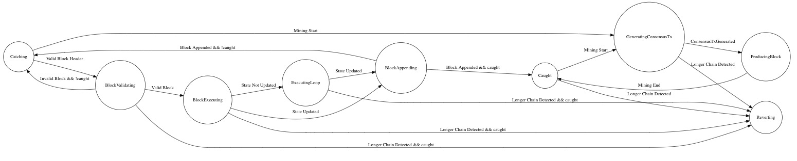
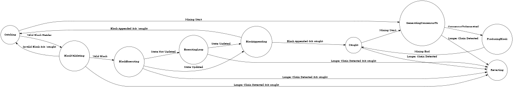

# The Graph of Synchronization FSM

`caught` is a boolean value whose defalt value is `false`.

```graphviz
digraph {
    rankdir = LR;
    size = "8,5"
    
    node [shape = circle];
    
    Catching -> BlockValidating [ label = "Valid Block Header" ];
    BlockValidating -> BlockExecuting [ label = "Valid Block" ];
    BlockValidating -> Catching [ label = "Invalid Block && !caught" ];
    BlockExecuting -> BlockAppending [ label = "State Updated" ];
    BlockAppending -> Catching [ label = "Block Appended && !caught" ];
    BlockAppending -> Caught [ label = "Block Appended && caught" ];
    Catching -> GeneratingConsensusTx [ label = "Mining Start" ];
    Caught -> GeneratingConsensusTx [ label = "Mining Start" ];
    GeneratingConsensusTx -> ProducingBlock [ label = "ConsensusTxGenerated" ];
    ProducingBlock -> Caught [ label = "Mining End" ];

    BlockExecuting -> ExecutingLoop [ label = "State Not Updated" ];
    ExecutingLoop -> BlockAppending [ label = "State Updated" ];

    Caught -> Reverting [ label = "Longer Chain Detected" ];
    GeneratingConsensusTx -> Reverting [ label = "Longer Chain Detected" ];
    BlockValidating -> Reverting [ label = "Longer Chain Detected && caught" ];
    BlockExecuting -> Reverting [ label = "Longer Chain Detected && caught" ];
    ExecutingLoop -> Reverting [ label = "Longer Chain Detected && caught" ];
}
```
