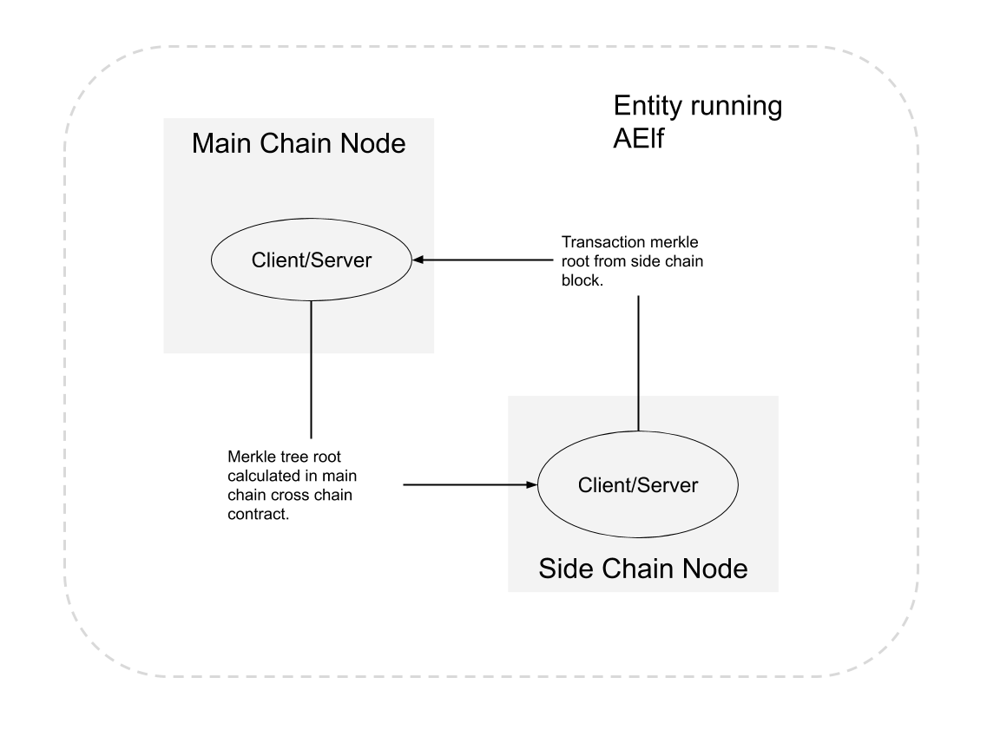
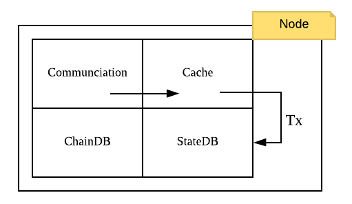

Overview
========

Conceptually a side chain node and main chain node are similar, they are
both independent blockchains, with their own peer-to-peer network and
possibly their own ecosystem. It is even possible to have this setup on
multiple levels. In terms of peer-to-peer networks, all side chains work
in parallel to each other but they are linked to a main chain node
through a cross-chain communication mechanism.

Through this link, messages are exchanged and indexing is performed to
ensure that transactions from the main-chain or other side chains are
verifiable in the side chain. Implementers can use AElf libraries and
frameworks to build chains.

One important aspect is the key role that the main chain plays, because
its main purpose is to index the side chains. Only the main chain
indexes data about all the side chains. Side chains are independent and
do not have knowledge about each other. This means that when they need
to verify what happened in other chains, they need the main chain as a
bridge to provide the cross chain verification information.

Node level architecture
-----------------------

In the current architecture, both the side chain node and the main chain
node has one server and exactly one client. This is the base for AElf's
two-way communication between main chain and side chains. Both the
server and the client are implemented as a node plugins (a node has a
collection of plugins). Interaction (listening and requesting) can start
when both the nodes have started.

The diagram above illustrates two nodes run by an entity: one main chain
node and one side chain node. Note that the nodes don't have to be in
the same physical location.

### Side chain lifetime

| Side chain lifetime involves the following steps. 1. Request side
  chain creation.
| 2. Wait for accept on main chain.
| 3. Start and initialize side chain and it will be indexed by main
  chain automatically.
| 4. It is allowed to do cross chain verification iff side chain is
  indexed correctly.

The next section describes what happens once the side chain node has
been started.

### Communication

When the side chain node starts it will initiate a number of different
communications, here are the main points of the protocol: 1. when the
side chain node is started for the first time it will request the main
chain node for a chain initialization context. 2. after initialization
the side chain is launched and will perform a handshake with main chain
node to signal that it is ready to be indexed. 3. during the indexing
process, the information of irreversible blocks will be exchanged
between side chain and main chain. The main chain will write the final
result in block which is calculated with the cross chain data from all
side chains. Side chain is also recording the data in contract from main
chain.

#### Cache

For effective indexing, a cache layer is used to store cross chain data
received from remote nodes, and make it available and correct. Cross
chain data is cached by chain id and block height with a count limit.
The cache layer can give the data if cached when the node needs it. So
cache layer decouples the communication part and node running logic.

#### Cross chain contract

Apart from the data in block, most cross chain data will be stored by
the cross chain contract. Cross chain data cached by the node is packed
in transaction during the mining process and the calculated result is
stored by the contract. Actually, the cross chain data in the block is
the side chain indexing result of calculations in this contract. Only
with data in this contract can cross chain verification work correctly.

#### Data flow

Conceptually the node is like described in the following diagram:

