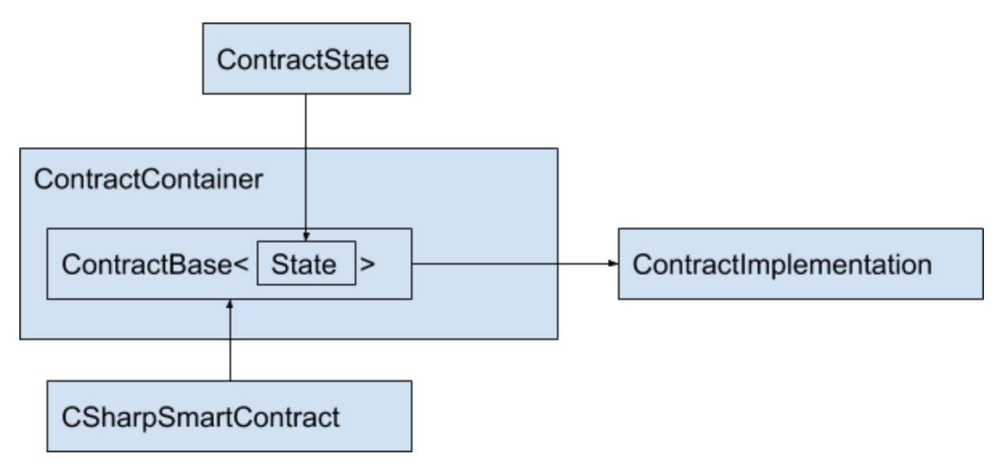

Contract Class Structure
========================

Below restrictions are put in place to simplify code checks during
deployment:

-  Only 1 inheritance is allowed from ``ContractBase`` which is
   generated by the contract plugin as a nested type in
   ``ContractContainer`` and only 1 inheritance will be allowed from
   ``CSharpSmartContract``. If there are multiple inheritances from
   ``ContractBase`` or ``CSharpSmartContract``, code deployment will
   fail.

-  Only 1 inheritance will be allowed from ``ContractState``. Similar to
   above, if there are multiple inheritance from
   ``AElf.Sdk.ContractState``, code check will fail.

-  The type inherited from ``ContractState`` should be the element type
   of ``CSharpSmartContract`` generic instance type, otherwise code
   check will fail.

   Contract Class Structure

Limitations on Field Usage
--------------------------

In Contract Implementation Class
~~~~~~~~~~~~~~~~~~~~~~~~~~~~~~~~

-  Initial value for non-readonly, non-constant fields is not allowed.
   (Applied to all static / non-static fields) The reason is, their
   value will be reset to 0 or null after first execution and their
   initial value will be lost.

Allowed:

::

   class MyContract : MyContractBase
   {
     int test;
     static const int test = 2;
   }

Not Allowed:

.. code:: diff

   class MyContract : MyContractBase
   {
   !  int test = 2;
   }

.. code:: diff

   class MyContract : MyContractBase
   {
     int test;

     public MyContract
     {
   !    test = 2;
     }
   }

-  Only primitive types, or one of below types are allowed for readonly
   / constant fields:

+---------------------------------+
| Type                            |
+=================================+
| All Primitive Types             |
+---------------------------------+
| ``Marshaller<T>``               |
+---------------------------------+
| ``Method<T, T>``                |
+---------------------------------+
| ``MessageParser<T>``            |
+---------------------------------+
| ``FieldCodec<T>``               |
+---------------------------------+
| ``MapField<T, T>``              |
+---------------------------------+
| ``ReadonlyCollection<T>``       |
+---------------------------------+
| ``ReadonlyDictionary<T, T>``    |
+---------------------------------+

\* T can only be primitive type

In Non-Contract Classes (For classes that don’t inherit from ``ContractBase<T>``)
~~~~~~~~~~~~~~~~~~~~~~~~~~~~~~~~~~~~~~~~~~~~~~~~~~~~~~~~~~~~~~~~~~~~~~~~~~~~~~~~~

-  Initial value for non-readonly, non-constant fields is not allowed
   for static fields. The reason is, their value will be reset to 0 or
   null after first execution and their initial value will be lost.

Allowed:

::

   class AnyClass
   {
     static int test;
   }

Not Allowed:

.. code:: diff

   class AnyClass
   {
   !  static int test = 2;
   }

::

   class AnyClass
   {
     static int test;

     public AnyClass
     {
   !    test = 2;
     }
   }

**Exception Case:** Fields with FileDescriptor types. This is due to
protobuf generated code. There are static fields ``FileDescriptor`` type
fields generated by protobuf code and these fields don’t have readonly
modifier. We allow such fields only if they are FileDescriptor type and
write access to these fields are only allowed from the constructor of
the type where descriptor field is declared.

Allowed:

::

   public class TestType
   {
     private static FileDescriptor test;

     public class TestType
     {
       test = ...
     }
   }

Not Allowed:

.. code:: diff

   public class TestType
   {
     private static FileDescriptor test;

     public TestType
     {
       test = ...
     }

   !  public void SetFromSomeWhereElse(FileDescriptor input)
   !  {
   !    test = input;
   !  }
   }

Accessing to set ``test`` field is restricted to its declaring type’s
constructor only.

-  Only below types are allowed for ``readonly`` / ``constant`` static
   fields:

+---------------------------------+
| Type                            |
+=================================+
| All Primitive Types             |
+---------------------------------+
| ``Marshaller<T>``               |
+---------------------------------+
| ``Method<T, T>``                |
+---------------------------------+
| ``MessageParser<T>``            |
+---------------------------------+
| ``FieldCodec<T>``               |
+---------------------------------+
| ``MapField<T, T>``              |
+---------------------------------+
| ``ReadonlyCollection<T>``       |
+---------------------------------+
| ``ReadonlyDictionary<T, T>``    |
+---------------------------------+

\* T can only be primitive type

**Exception Case:** If a type has a ``readonly`` field same type as
itself, it is only allowed if the type has no instance field.

This is to support Linq related generated types.

Allowed:

::

   public class TestType
   {
     private static readonly TestType test;

     private static int i;
   }

Not Allowed:

.. code:: diff

   public class TestType
   {
     private static readonly TestType test;

   !  private int i;
   }

In Contract State
~~~~~~~~~~~~~~~~~

In contract state, only below types are allowed:

+-----------------+
| Primitive Types |
+=================+
| ``BoolState``   |
+-----------------+
| ``Int32State``  |
+-----------------+
| ``UInt32State`` |
+-----------------+
| ``Int64State``  |
+-----------------+
| ``UInt64State`` |
+-----------------+
| ``StringState`` |
+-----------------+
| ``BytesState``  |
+-----------------+

+--------------------------------+
| Complex Types                  |
+================================+
| ``SingletonState<T>``          |
+--------------------------------+
| ``ReadonlyState<T>``           |
+--------------------------------+
| ``MappedState<T, T>``          |
+--------------------------------+
| ``MappedState<T, T, T>``       |
+--------------------------------+
| ``MappedState<T, T, T, T>``    |
+--------------------------------+
| ``MappedState<T, T, T, T, T>`` |
+--------------------------------+
| ``MethodReference<T, T>``      |
+--------------------------------+
| ``ProtobufState<T>``           |
+--------------------------------+
| ``ContractReferenceState``     |
+--------------------------------+
