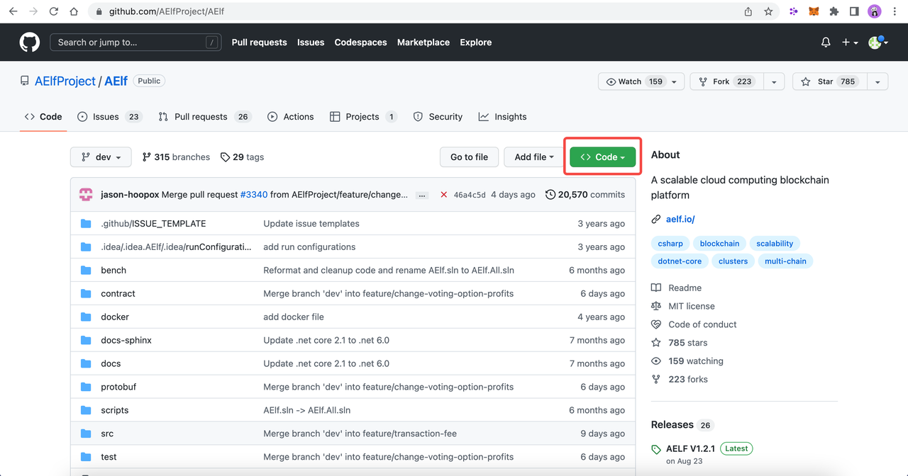
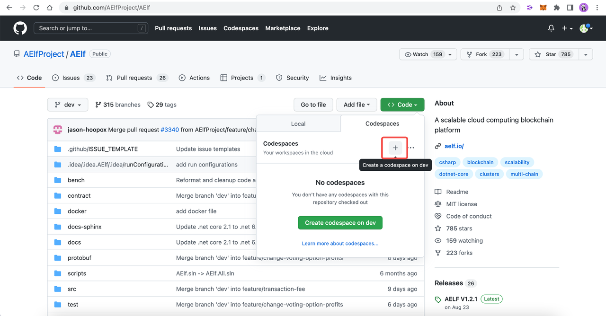

# Codespaces

A codespace is an instant development environment that's hosted in the cloud. It provides users with general-purpose programming languages and tooling through containers. You can install and set up the development environment in Codespaces. This will take 10-20 minutes.

## Basic Environment Configurations

1. Visit [AElfProject / AElf](https://github.com/AElfProject/AElf) via a browser.

2. Click the green **Code** button on the top right.

   

3. Select `Codespaces` and click +.

   

Then a new tab will be opened that shows the `Codespaces` interface. After the page is loaded, you will see:

- The left side displays all the content in this repo.

- The upper right side is where you can write code or view text.

- The lower right side is a terminal where you can build and run code (If the terminal doesn't open by default, you can click the hamburger menu on the top left and select Terminal -> New Terminal, or press control + shift + ` on your keyboard).

Currently, `Codespaces` have completed the configuration for part of the environments, yet there are some you need to manually configure.

At the time of writing, `Codespaces` have done the configuration for git and nodejs. You can type the following commands to check their versions:

```bash
# git version 2.25.1
git --version

# 8.19.2
npm --version
```

### Update Environment

Execute this command to update your environment:

```bash
  sudo apt-get update
```

The following output suggests successful update:

```bash
Fetched 25.0 MB in 3s (8,574 kB/s)
Reading package lists... Done
```

### Install .NET SDK

.NET SDK 7.0 is used in this repo. Hence, you need to reinstall v6.0 otherwise there will be building issues.

1. Execute this command to check if v7.0 is used:

   ```bash
   # 7.0.100
   dotnet --version
   ```

   If there is v7.0, execute this command to delete it:

   ```bash
   sudo rm -rf /home/codespace/.dotnet/*
   ```

2. Execute this command to reinstall v6.0:

```bash
wget https://packages.microsoft.com/config/ubuntu/22.04/packages-microsoft-prod.deb -O packages-microsoft-prod.deb

sudo dpkg -i packages-microsoft-prod.deb

rm packages-microsoft-prod.deb

sudo apt-get update && \

sudo apt-get install -y dotnet-sdk-6.0
```

3. Restart bash after the installation and execute this command to check if v6.0 is installed:

   ```bash
   # 6.0.403
   dotnet --version
   ```

   The following output suggests successful installation:

   ```bash
   6.0.403
   ```

### Install protoBuf

1. Execute this command to install protoBuf:

   ```bash
   curl -OL https://github.com/google/protobuf/releases/download/v21.9/protoc-21.9-linux-x86_64.zip
   unzip protoc-21.9-linux-x86_64.zip -d protoc3

   sudo mv protoc3/bin/* /usr/local/bin/

   sudo mv protoc3/include/* /usr/local/include/

   sudo chown ${USER} /usr/local/bin/protoc

   sudo chown -R ${USER} /usr/local/include/google
   ```

2. Execute this command to check if protoBuf is installed:

```bash
protoc --version
```

The following output suggests successful installation:

```bash
libprotoc 3.21.9
```

### Install Redis

1. Execute this command to install Redis:

```bash
sudo apt-get install redis -y
```

2. Execute this command to start a Redis instance and check if Redis is installed:

```bash
redis-server
```

The following output suggests Redis is installed and a Redis instance is started:

```bash
Server initialized
Ready to accept connections
```

## What's Next

If you have installed the above tools and frameworks, you can proceed with what interests you here. Read the following to learn about contract deployment and node running:

[Smart contract development](https://docs.aelf.io/en/latest/getting-started/smart-contract-development/index.html)

[Smart contract deployment](https://docs.aelf.io/en/latest/getting-started/smart-contract-development/index.html)

[Node](../../getting-started/developement-environment/node.md)
