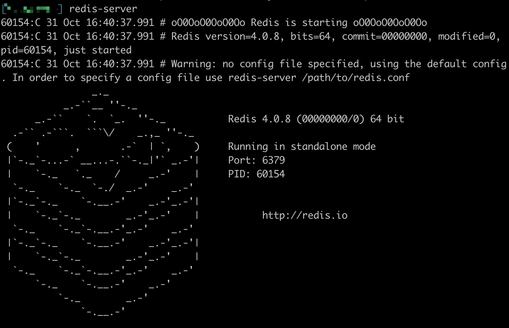
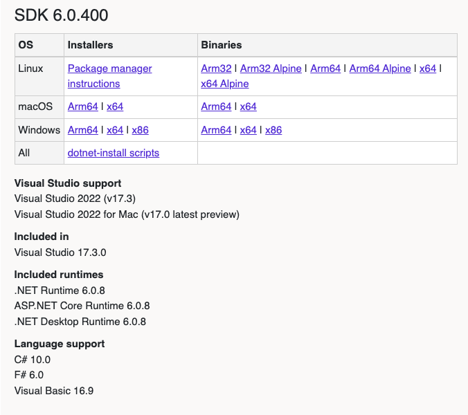

Dependencies
============

Before you jump in to the getting started and tutorials you'll need to install
the following tools and frameworks.

For most of these dependencies we provide ready-to-use command line
instructions. In case of problems or if you have more complex needs, we
provide the official link with full instructions.

This page is divided into two sections: the first concerns the common
dependencies that are needed for running a node. The second shows the
extra dependencies needed for building the sources and development tools.

Common dependencies
-------------------

### Pre-setup for Windows users

A convenient tool for Windows users is **Chocolatey** for installing
dependencies. Follow the installation instructions below (see here for
more details [Chocolatey installation](https://chocolatey.org/install)):

Open and [administrative
Powershell](https://www.digitalcitizen.life/ways-launch-powershell-windows-admin)
and enter the following commands:

``` powershell
Set-ExecutionPolicy AllSigned
or
Set-ExecutionPolicy Bypass -Scope Process

Set-ExecutionPolicy Bypass -Scope Process -Force; iex ((New-Object System.Net.WebClient).DownloadString('https://chocolatey.org/install.ps1'))
```

Later, **Chocolatey** can be very useful for installing dependencies on
Windows systems.

### Pre-setup for macOS users

It is highly recommended that you install **Homebrew (or simply Brew)**
to quickly and easily setup dependencies (see here for more details
[Homebrew install page](https://brew.sh/)). Open a terminal and execute
the following command:

``` bash
/usr/bin/ruby -e "$(curl -fsSL https://raw.githubusercontent.com/Homebrew/install/master/install)"
```

### Node js

Next install nodejs by following the instructions here (see here for
more details [Nodejs](https://nodejs.org/en/download/)):

On macOS:

``` bash
brew install node
```

On Windows:

``` bash
choco install nodejs
```

On Linux:

``` bash
sudo apt-get install nodejs
```

### Database

We currently support two key-value databases to store our nodes data:
**Redis** or **SSDB**. Both work well, it's your decision:

#### Redis (recommended for the tutorials):

Depending on your platform, enter one of the following commands (see
here for more details [Redis download page](https://redis.io/)):

On Windows:

``` bash
choco install redis-64
```

On macOS:

``` bash
brew install redis
```

On Linux:

``` bash
sudo apt install redis-server
```

To test the installation (all platforms) you can just open a terminal
and type `redis-server`. This will show you the servers welcome page as
well as the port it's listening on:



#### SSDB

Depending on your platform, enter one of the following commands (see
here for more details [SSDB](http://ssdb.io/?lang=en)):

NOTE: On a Windows machine we highly recommend you use Redis. This is an
extract from the official website:

    Do not run SSDB server on Windows system for a production environment. If you wish to stick with Windows system, please run a Linux virtual machine on Windows, and run SSDB server on that Linux.

On macOS:

``` bash
brew install ssdb
```

On Linux:

``` bash
wget --no-check-certificate https://github.com/ideawu/ssdb/archive/master.zip
unzip master
cd ssdb-master
make
# optional, install ssdb in /usr/local/ssdb
sudo make install
```

Building sources and development tools
--------------------------------------

You only need to follow this section if you
intend to build aelf from the sources available on Github or if you plan
on doing smart contract development. 

### Windows build tools

A dependency needed to build **AElf** from the command line under
Windows is **Visual Studio Build Tools**. The easiest way is to use the
**Visual Studio Installer**:

If you already have an edition of **Visual Studio** installed, open the
**Visual Studio Installer** and add the **Desktop development with C++**
workload:


If you don't have any of the Visual Studio editions installed:

-   you can download it here [Visual Studio Community
    Edition](https://visualstudio.microsoft.com/fr/downloads/?rr=https%3A%2F%2Fwww.google.com%2F)
    for free and after the installation add the **Desktop development
    with C++** workload.
-   or if you don't need or want a full blown installation of **Visual
    Studio**, you can download the build tools here: [Download
    Page](https://visualstudio.microsoft.com/downloads/#other). Scroll
    down and under the section *Tools for Visual Studio 2019* download
    the build tools for Visual Studio:


After the installation open **Visual Studio Installer**, locate and
install the *C++ build tools*.


### Git

If you want to run a node or use our custom smart contract environment,
at some point you will have to clone (download the source code) from
AElf's repository. For this you will have to use **Git** since we host
our code on GitHub.

Click the following link to download Git for your platform (see here for
more details [Getting Started - Installing
Git](https://git-scm.com/book/en/v2/Getting-Started-Installing-Git)):

On macOS:

``` bash
brew install git
```

On Windows:

``` bash
choco install git
```

On Linux:

``` bash
sudo apt install git-all
```

### Development framework - dotnet core sdk

Most of AElf is developed with dotnet core, so you will need to download
and install the .NET Core SDK before you start:

[Download .NET Core
3.1](https://dotnet.microsoft.com/download/dotnet-core/3.1)

For now AElf depends on version 3.1 of the SDK, on the provided link
find the download for your platform (for Windows and macOS the installer
for x64 is the most convenient if your platform is compatible - most are
these days), the page looks like this:



Wait for the download to finish, launch the installer and follow the
instructions (for AElf all defaults provided in the installer should be
correct).

To check the installation, you can open a terminal and run the `dotnet`
command. If everything went fine it will show you dotnet options for the
command line.

### Protobuf

Depending on your platform, enter one of the following commands (see
here for more details [Protobuf
Github](https://github.com/protocolbuffers/protobuf)):

On Windows, open a **Powershell** and enter the following commands:

``` bash
choco install protoc --version=3.11.4 -y
choco upgrade unzip -y
```

On Linux:

``` bash
# Make sure you grab 3.11.4 for protoc
curl -OL https://github.com/google/protobuf/releases/download/v3.11.4/protoc-3.11.4-linux-x86_64.zip

# Unzip
unzip protoc-3.11.4-linux-x86_64.zip -d protoc3

# Move protoc to /usr/local/bin/
sudo mv protoc3/bin/* /usr/local/bin/

# Move protoc3/include to /usr/local/include/
sudo mv protoc3/include/* /usr/local/include/

# Optional: change owner
sudo chown ${USER} /usr/local/bin/protoc
sudo chown -R ${USER} /usr/local/include/google
```

on macOS:

``` bash
# Make sure you grab 3.11.4 for protoc
curl -OL https://github.com/protocolbuffers/protobuf/releases/download/v3.11.4/protoc-3.11.4-osx-x86_64.zip

# Unzip
unzip protoc-3.11.4-osx-x86_64.zip -d protoc3

# Move protoc to /usr/local/bin/
sudo mv protoc3/bin/* /usr/local/bin/

# Move protoc3/include to /usr/local/include/
sudo mv protoc3/include/* /usr/local/include

# Optional: change owner
sudo chown ${USER} /usr/local/bin/protoc
sudo chown -R ${USER} /usr/local/include/google
```
