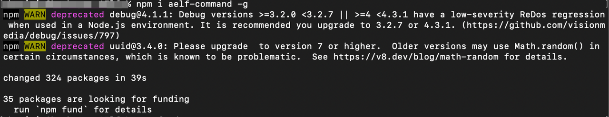

Node
====

If you already know something about aelf blockchain and want to get
deeply involved, you can proceed with the following and run your own
node.

If you are a beginner or you want to deploy contracts onto aelf, please
click
`here <https://docs.aelf.io/en/latest/getting-started/smart-contract-development/index.html>`__
to learn more.

**Why Should I Run a Node**

-  Full node: A full node stores the complete blockchain data and you
   can view all the info. It also enables you to deploy DApps and
   contracts on aelf or interact with its contracts.

-  BP: To run a full node that produces blocks, the node needs to
   participate in the election. If ranked among the top 2N+1 (N=8 in the
   first year and increases by 1 every year. Currently the threshold is
   17), it can get involved in the governance of aelf.

Next, we will show you how to deploy nodes.

Single Node
-----------

macOS
~~~~~

Follow this doc to run an aelf single node on a macOS device and this
will take around 20 minutes to complete.

Install aelf-command
^^^^^^^^^^^^^^^^^^^^

Execute this command to install aelf-command:

.. code:: bash

   npm i aelf-command -g

The following output suggests successful installation:

.. code:: bash

   + aelf-command@0.1.44
   added 314 packages from 208 contributors in 25.958s

Besides, you might see warnings like this due to differences in system
configuration. Please ignore it.

If it shows error ``Permission denied @ apply2files``, then there is a
permission issue. You can solve it using the following command and then
redo the installation with the above command:

.. code:: bash

   sudo chmod 755 /usr/local/lib/node_modules

Clone and Build aelf’s Code
^^^^^^^^^^^^^^^^^^^^^^^^^^^

Create a directory. This tutorial uses a directory on the desktop for
reference.

1. Execute this command to create a directory:

.. code:: bash

   mkdir ~/Desktop/Code

2. Execute this command to change the directory:

.. code:: bash

   cd ~/Desktop/Code

3. Execute this command to clone aelf’s code:

.. code:: bash

   git clone https://github.com/AElfProject/AElf.git

4. Execute this command to change to aelf’s directory:

.. code:: bash

   cd AElf

5. Execute this command to restore aelf’s files:

.. code:: bash

   dotnet restore AElf.All.sln

6. Execute this command to build aelf’s code (this will take several
   minutes):

.. code:: bash

   dotnet build AElf.All.sln

The following output suggests successful building:

.. code:: bash

    xx Warning(s)
       0 Error(s)

   Time Elapsed 00:15:59.77

If contract_csharp_plugin fails to be called, it may be because you
don’t have Rosetta 2 installed. Please execute this command and then
retry:

.. code:: shell

   /usr/sbin/softwareupdate --install-rosetta --agree-to-license

Create an aelf Account
^^^^^^^^^^^^^^^^^^^^^^

Execute this command:

.. code:: shell

   aelf-command create

An aelf account will be automatically created and you will see info
like:

.. code:: bash

   AElf [Info]: Your wallet info is :
   AElf [Info]: Mnemonic            : mirror among battle muffin cattle plunge tuition buzz hip mad surround recall
   AElf [Info]: Private Key         : 4bf625afea60e21aa5afcab5ea682b3dfb614941245698632d72a09ae13*****
   AElf [Info]: Public Key          : 04f9bb56a9eca921bd494e677307f0279c98f1d2ed6bdeaa6dd256878272eabd14e91ec61469d2a32ce5e63205930dabdc0b9f13fc80c1f4e31760618d182*****
   AElf [Info]: Address             : 21qciGwcaowwBttKMjMk86AW6WajhcodSHytY1vCyZb7p*****

You will then be asked whether you want the account data stored as a
json file. Enter ``y`` to confirm and the file will be stored in
``/Users/{username}/.local/share/aelf/keys/``.

Please make sure you remember the account data or the json file’s
location.

You will be required to set a password (referred to as \* here):

.. code:: bash

   Enter a password: ********
   Confirm password: ********

For the sake of convenience, you are encouraged to keep this Terminal on
the account info interface and open another Terminal to continue the
following.

Run a Single Node
^^^^^^^^^^^^^^^^^

A single node runs aelf blockchain on one node. It is usually used to
test the execution of contracts only.

1. Execute this command to start a Redis instance (skip this step if
   redis-server is already started):

.. code:: bash

   redis-server

2. Open another Terminal and execute this command to change to aelf’s
   directory:

.. code:: bash

   cd ~/Desktop/Code/AElf

3. Execute this command to change to the ``AElf.Launcher`` directory:

.. code:: bash

   cd src/AElf.Launcher

4. Modify the ``appsettings.json`` file: for novices, you can go to
   desktop -> Code -> AElf -> src -> AElf.Launcher and open the
   ``appsettings.json`` file in the editor to modify it (or, if you are
   familiar with Linux commands, you can run the
   ``vim appsettings.json`` command and modify the file in the
   command-line interface).

Find the account data you just created using ``aelf-command create``.

.. code:: bash

   AElf [Info]: Your wallet info is :
   AElf [Info]: Mnemonic            : mirror among battle muffin cattle plunge tuition buzz hip mad surround recall
   AElf [Info]: Private Key         : 4bf625afea60e21aa5afcab5ea682b3dfb614941245698632d72a09ae13*****
   AElf [Info]: Public Key          : 04f9bb56a9eca921bd494e677307f0279c98f1d2ed6bdeaa6dd256878272eabd14e91ec61469d2a32ce5e63205930dabdc0b9f13fc80c1f4e31760618d182*****
   AElf [Info]: Address             : 21qciGwcaowwBttKMjMk86AW6WajhcodSHytY1vCyZb7p*****

Fill in the ``NodeAccount`` and ``NodeAccountPassword`` under
``Account`` using the ``Address`` and ``password`` you set in
``appsettings.json``:

.. code:: bash

    "Account": {
       "NodeAccount": "",
       "NodeAccountPassword": ""
     }

It may look like this when you complete it:

.. code:: bash

    "Account": {
       "NodeAccount": "21qciGwcaowwBttKMjMk86AW6WajhcodSHytY1vCyZb7p*****",
       "NodeAccountPassword": "********"
     },

Fill in the ``InitialMineList`` under ``Consensus`` using Public Key:

.. code:: bash

   "Consensus": {
       "InitialMinerList": [],
       "MiningInterval": 4000,
       "StartTimestamp": 0,
       "PeriodSeconds": 604800,
       "MinerIncreaseInterval": 31536000
     }

It may look like this when you complete it (make sure the key is
bracketed):

.. code:: bash

   "Consensus": {
       "InitialMinerList": ["04f9bb56a9eca921bd494e677307f0279c98f1d2ed6bdeaa6dd256878272eabd14e91ec61469d2a32ce5e63205930dabdc0b9f13fc80c1f4e31760618d182*****"],
       "MiningInterval": 4000,
       "StartTimestamp": 0,
       "PeriodSeconds": 604800,
       "MinerIncreaseInterval": 31536000
     }

If the IP and port for Redis have been changed, you can modify them
under ``ConnectionStrings`` in ``appsettings.json`` (skip this step if
they are not changed):

.. code:: bash

   "ConnectionStrings": {
       "BlockchainDb": "redis://localhost:6379?db=1",
       "StateDb": "redis://localhost:6379?db=1"
   }

5. Execute ``dotnet run``:

.. code:: bash

   sudo dotnet run

The following output suggests successful execution:

.. code:: bash

   2022-11-29 16:07:44,554 [.NET ThreadPool Worker] INFO  AElf.Kernel.SmartContractExecution.Application.BlockExecutionResultProcessingService - Attach blocks to best chain, best chain hash: "f396756945d9bb883f81827ab36fcb0533d3c66f7062269700e49b74895*****", height: 177

If you want to check the node’s block height and other block info, you
can visit `this page <http://localhost:8000/swagger/index.html>`__ where
you can access the API docs and interact with this single node.

To shut the node down, please use control + c on your keyboard.

If you don’t want to save the data, you can execute this command to
delete all:

.. code:: shell

   redis-cli flushall

Linux and Codespaces
~~~~~~~~~~~~~~~~~~~~

Follow this doc to run an aelf single node in Linux and Codespaces and
this will take around 20 minutes to complete.

.. _install-aelf-command-1:

Install aelf-command
^^^^^^^^^^^^^^^^^^^^

Execute this command to install aelf-command:

.. code:: bash

   npm i aelf-command -g

The following output suggests successful installation:

.. code:: bash

   + aelf-command@0.1.44
   added 314 packages from 208 contributors in 25.958s

You might see warnings like this due to differences in system
configuration. Please ignore it:

.. _clone-and-build-aelfs-code-1:

Clone and Build aelf’s Code
^^^^^^^^^^^^^^^^^^^^^^^^^^^

Create a directory. This tutorial uses a directory on the desktop for
reference.

1. Execute this command to create a directory:

.. code:: bash

   mkdir ~/Desktop/Code

2. Execute this command to change the directory:

.. code:: bash

   cd ~/Desktop/Code

3. Execute this command to clone aelf’s code:

.. code:: bash

   git clone https://github.com/AElfProject/AElf.git

4. Execute this command to change to aelf’s directory:

.. code:: bash

   cd AElf

5. Execute this command to restore aelf’s files:

.. code:: bash

   dotnet restore AElf.All.sln

6. Execute this command to build aelf’s code (this will take several
   minutes):

.. code:: bash

   dotnet build AElf.All.sln

The following output suggests successful building:

.. code:: bash

    xx Warning(s)
       0 Error(s)

   Time Elapsed 00:15:59.77

.. _create-an-aelf-account-1:

Create an aelf Account
^^^^^^^^^^^^^^^^^^^^^^

Execute this command:

.. code:: shell

   aelf-command create

An aelf account will be automatically created and you will see info
like:

.. code:: bash

   AElf [Info]: Your wallet info is :
   AElf [Info]: Mnemonic            : mirror among battle muffin cattle plunge tuition buzz hip mad surround recall
   AElf [Info]: Private Key         : 4bf625afea60e21aa5afcab5ea682b3dfb614941245698632d72a09ae13*****
   AElf [Info]: Public Key          : 04f9bb56a9eca921bd494e677307f0279c98f1d2ed6bdeaa6dd256878272eabd14e91ec61469d2a32ce5e63205930dabdc0b9f13fc80c1f4e31760618d182*****
   AElf [Info]: Address             : 21qciGwcaowwBttKMjMk86AW6WajhcodSHytY1vCyZb7p*****

You will then be asked whether you want the account data stored as a
json file. Enter ``y`` to confirm and the file will be stored in
``/root/.local/share/aelf/keys/``.

Please make sure you remember the account data or the json file’s
location.

You will be required to set a password (referred to as \* here):

.. code:: bash

   Enter a password: ********
   Confirm password: ********

For the sake of convenience, you are encouraged to keep this Terminal on
the account info interface and open another Terminal to continue the
following.

.. _run-a-single-node-1:

Run a Single Node
^^^^^^^^^^^^^^^^^

A single node runs aelf blockchain on one node. It is usually used to
test the execution of contracts only.

1. Execute this command to start a Redis instance (skip this step if
   redis-server is already started):

.. code:: bash

   redis-server

2. Open another Terminal and execute this command to change to aelf’s
   directory:

.. code:: bash

   cd ~/Desktop/Code/AElf

3. Execute this command to change to the ``AElf.Launcher`` directory:

.. code:: bash

   cd src/AElf.Launcher

4. Modify the ``appsettings.json`` file: for novices, you can go to
   desktop -> Code -> AElf -> src -> AElf.Launcher and open the
   ``appsettings.json`` file in the editor to modify it (or, if you are
   familiar with Linux commands, you can run the
   ``vim appsettings.json`` command and modify the file in the
   command-line interface).

Find the account data you just created using ``aelf-command create``.

.. code:: bash

   AElf [Info]: Your wallet info is :
   AElf [Info]: Mnemonic            : mirror among battle muffin cattle plunge tuition buzz hip mad surround recall
   AElf [Info]: Private Key         : 4bf625afea60e21aa5afcab5ea682b3dfb614941245698632d72a09ae13*****
   AElf [Info]: Public Key          : 04f9bb56a9eca921bd494e677307f0279c98f1d2ed6bdeaa6dd256878272eabd14e91ec61469d2a32ce5e63205930dabdc0b9f13fc80c1f4e31760618d182*****
   AElf [Info]: Address             : 21qciGwcaowwBttKMjMk86AW6WajhcodSHytY1vCyZb7p*****

Fill in the ``NodeAccount`` and ``NodeAccountPassword`` under
``Account`` using the ``Address`` and ``password`` you set in
``appsettings.json``:

.. code:: bash

    "Account": {
       "NodeAccount": "",
       "NodeAccountPassword": ""
     }

It may look like this when you complete it:

.. code:: bash

    "Account": {
       "NodeAccount": "21qciGwcaowwBttKMjMk86AW6WajhcodSHytY1vCyZb7p*****",
       "NodeAccountPassword": "********"
     },

Fill in the ``InitialMineList`` under ``Consensus`` using Public Key:

.. code:: bash

   "Consensus": {
       "InitialMinerList": [],
       "MiningInterval": 4000,
       "StartTimestamp": 0,
       "PeriodSeconds": 604800,
       "MinerIncreaseInterval": 31536000
     }

It may look like this when you complete it (make sure the key is
bracketed):

.. code:: bash

   "Consensus": {
       "InitialMinerList": ["04f9bb56a9eca921bd494e677307f0279c98f1d2ed6bdeaa6dd256878272eabd14e91ec61469d2a32ce5e63205930dabdc0b9f13fc80c1f4e31760618d182*****"],
       "MiningInterval": 4000,
       "StartTimestamp": 0,
       "PeriodSeconds": 604800,
       "MinerIncreaseInterval": 31536000
     }

If the IP and port for Redis have been changed, you can modify them
under ``ConnectionStrings`` in ``appsettings.json`` (skip this step if
they are not changed):

.. code:: bash

   "ConnectionStrings": {
       "BlockchainDb": "redis://localhost:6379?db=1",
       "StateDb": "redis://localhost:6379?db=1"
   }

Save the changes and keep them in the ``AElf.Launcher`` directory.

5. Execute ``dotnet run``:

.. code:: bash

   sudo dotnet run

The following output suggests successful execution:

.. code:: bash

   2022-11-29 16:07:44,554 [.NET ThreadPool Worker] INFO  AElf.Kernel.SmartContractExecution.Application.BlockExecutionResultProcessingService - Attach blocks to best chain, best chain hash: "f396756945d9bb883f81827ab36fcb0533d3c66f7062269700e49b74895*****", height: 177

If you want to check the node’s block height and other block info, you
can visit `this page <http://localhost:8000/swagger/index.html>`__ where
you can access the API docs and interact with this single node.

To shut the node down, please use control + c on your keyboard.

If you don’t want to save the data, you can execute this command to
delete all:

.. code:: shell

   redis-cli flushall

Windows
~~~~~~~

Follow this doc to run an aelf single node on a Windows device and this
will take around 20 minutes to complete.

.. _install-aelf-command-2:

Install aelf-command
^^^^^^^^^^^^^^^^^^^^

Execute npm command to install aelf-command:

.. code:: bash

   npm i aelf-command -g

The following output suggests successful installation:

.. code:: bash

   + aelf-command@0.1.44
   added 314 packages from 208 contributors in 25.958s

You might see warnings like this due to differences in system
configuration. Please ignore it:

.. _clone-and-build-aelfs-code-2:

Clone and Build aelf’s Code
^^^^^^^^^^^^^^^^^^^^^^^^^^^

Create a directory. This tutorial uses a directory on the desktop for
reference.

1. Execute this command in cmd or PowerShell to create a directory:

.. code:: bash

   mkdir C:/Users/${username}/Desktop/Code

2. Execute this command to change the directory:

.. code:: bash

   cd C:/Users/${username}/Desktop/Code

3. Execute this command to clone aelf’s code:

.. code:: bash

   git clone https://github.com/AElfProject/AElf.git

4. Execute this command to change to aelf’s directory:

.. code:: bash

   cd AElf

5. Execute this command to restore aelf’s files:

.. code:: bash

   dotnet restore AElf.All.sln

6. Execute this command to build aelf’s code (this will take several
   minutes):

.. code:: bash

   dotnet build AElf.All.sln

The following output suggests successful building:

.. code:: bash

    xx Warning(s)
       0 Error(s)

   Time Elapsed 00:15:59.77

.. _create-an-aelf-account-2:

Create an aelf Account
^^^^^^^^^^^^^^^^^^^^^^

Execute this command:

.. code:: shell

   aelf-command create

An aelf account will be automatically created and you will see info
like:

.. code:: bash

   AElf [Info]: Your wallet info is :
   AElf [Info]: Mnemonic            : mirror among battle muffin cattle plunge tuition buzz hip mad surround recall
   AElf [Info]: Private Key         : 4bf625afea60e21aa5afcab5ea682b3dfb614941245698632d72a09ae13*****
   AElf [Info]: Public Key          : 04f9bb56a9eca921bd494e677307f0279c98f1d2ed6bdeaa6dd256878272eabd14e91ec61469d2a32ce5e63205930dabdc0b9f13fc80c1f4e31760618d182*****
   AElf [Info]: Address             : 21qciGwcaowwBttKMjMk86AW6WajhcodSHytY1vCyZb7p*****

You will then be asked whether you want the account data stored as a
json file. Enter ``y`` to confirm and the file will be stored locally.

Please make sure you remember the account data or the json file’s
location.

You will be required to set a password (referred to as \* here):

.. code:: bash

   Enter a password: ********
   Confirm password: ********

For the sake of convenience, you are encouraged to keep this cmd or
PowerShell on the account info interface and open another cmd or
PowerShell to continue the following.

.. _run-a-single-node-2:

Run a Single Node
^^^^^^^^^^^^^^^^^

A single node runs aelf blockchain on one node. It is usually used to
test the execution of contracts only.

1. Execute this command to start a Redis instance (skip this step if
   redis-server is already started):

.. code:: bash

   redis-server

2. Open another cmd or PowerShell and execute this command to change to
   aelf’s directory:

.. code:: bash

   cd C:/Users/${username}/Desktop/Code

3. Execute this command to change to the ``AElf.Launcher`` directory:

.. code:: bash

   cd src/AElf.Launcher

4. Modify the ``appsettings.json`` file: for novices, you can go to
   desktop -> Code -> AElf -> src -> AElf.Launcher and open the
   ``appsettings.json`` file in the editor to modify it (or you can run
   the ``start appsettings.json`` command and open the appsettings.json
   file in the editor).

Find the account data you just created using ``aelf-command create``.

.. code:: bash

   AElf [Info]: Your wallet info is :
   AElf [Info]: Mnemonic            : mirror among battle muffin cattle plunge tuition buzz hip mad surround recall
   AElf [Info]: Private Key         : 4bf625afea60e21aa5afcab5ea682b3dfb614941245698632d72a09ae13*****
   AElf [Info]: Public Key          : 04f9bb56a9eca921bd494e677307f0279c98f1d2ed6bdeaa6dd256878272eabd14e91ec61469d2a32ce5e63205930dabdc0b9f13fc80c1f4e31760618d182*****
   AElf [Info]: Address             : 21qciGwcaowwBttKMjMk86AW6WajhcodSHytY1vCyZb7p*****

Fill in the ``NodeAccount`` and ``NodeAccountPassword`` under
``Account`` using the ``Address`` and ``password`` you set in
``appsettings.json``:

.. code:: bash

    "Account": {
       "NodeAccount": "",
       "NodeAccountPassword": ""
     }

It may look like this when you complete it:

.. code:: bash

    "Account": {
       "NodeAccount": "21qciGwcaowwBttKMjMk86AW6WajhcodSHytY1vCyZb7p*****",
       "NodeAccountPassword": "********"
     },

Fill in the ``InitialMineList`` under ``Consensus`` using Public Key:

.. code:: bash

   "Consensus": {
       "InitialMinerList": [],
       "MiningInterval": 4000,
       "StartTimestamp": 0,
       "PeriodSeconds": 604800,
       "MinerIncreaseInterval": 31536000
     }

It may look like this when you complete it (make sure the key is
bracketed):

.. code:: bash

   "Consensus": {
       "InitialMinerList": ["04f9bb56a9eca921bd494e677307f0279c98f1d2ed6bdeaa6dd256878272eabd14e91ec61469d2a32ce5e63205930dabdc0b9f13fc80c1f4e31760618d182*****"],
       "MiningInterval": 4000,
       "StartTimestamp": 0,
       "PeriodSeconds": 604800,
       "MinerIncreaseInterval": 31536000
     }

If the IP and port for Redis have been changed, you can modify them
under ``ConnectionStrings`` in ``appsettings.json`` (skip this step if
they are not changed):

.. code:: bash

   "ConnectionStrings": {
       "BlockchainDb": "redis://localhost:6379?db=1",
       "StateDb": "redis://localhost:6379?db=1"
   }

Save the changes and keep them in the ``AElf.Launcher`` directory.

.. code:: bash

   "ConnectionStrings": {
       "BlockchainDb": "redis://localhost:6379?db=1",
       "StateDb": "redis://localhost:6379?db=1"
   }

5. Execute ``dotnet run``:

.. code:: bash

   sudo dotnet run

The following output suggests successful execution:

.. code:: bash

   2022-11-29 16:07:44,554 [.NET ThreadPool Worker] INFO  AElf.Kernel.SmartContractExecution.Application.BlockExecutionResultProcessingService - Attach blocks to best chain, best chain hash: "f396756945d9bb883f81827ab36fcb0533d3c66f7062269700e49b74895*****", height: 177

If you want to check the node’s block height and other block info, you
can visit `this page <http://localhost:8000/swagger/index.html>`__ where
you can access the API docs and interact with this single node.

To shut the node down, please use control + c on your keyboard.

If you don’t want to save the data, you can execute this command to
delete all:

.. code:: shell

   redis-cli flushall

Multi Nodes
-----------

.. _macos-1:

macOS
~~~~~

Follow this doc to run aelf multi-nodes on a macOS device and this will
take around 20 minutes to complete.

Run Multi-Nodes
^^^^^^^^^^^^^^^

This tutorial will guide you through how to run three nodes.

Publish aelf’s Code
'''''''''''''''''''

Create a directory. This tutorial uses a directory on the desktop for
reference.

1. Execute this command to create a directory:

.. code:: bash

   mkdir ~/Desktop/Out

2. Execute this command to change the directory:

.. code:: bash

   cd ~/Desktop/Code/AElf

3. Execute this command to publish aelf’s code (this will take several
   minutes):

.. code:: bash

   sudo dotnet publish AElf.All.sln /p:NoBuild=false --configuration Debug -o ~/Desktop/Out

Configure Three Nodes
'''''''''''''''''''''

1. Execute this command three times to create three accounts: A, B, and
   C.

.. code:: shell

   aelf-command create

Please make sure you remember their Public Keys and Addresses.

Create a directory for node configuration. This tutorial uses a
directory on the desktop for reference.

2. Execute this command to create a directory:

.. code:: bash

   mkdir ~/Desktop/Config

3. Execute this command to change the directory:

.. code:: bash

   cd ~/Desktop/Config

4. Execute this command to create three new directories: ``bp1``,
   ``bp2``, and ``bp3`` in the “Config” directory and create their
   respective “keys” directories.

.. code:: bash

   mkdir -p ~/Desktop/Config/bp1/keys

   mkdir -p ~/Desktop/Config/bp2/keys

   mkdir -p ~/Desktop/Config/bp3/keys

5. Copy account A, B, and C from
   ``/Users/{username}/.local/share/aelf/keys/`` to ``bp1/keys``,
   ``bp2/keys``, and ``bp3/keys`` respectively (If you can’t find
   ``.local``, you can use cmd + shift + g in Finder to designate the
   directories).

6. Execute this command to create ``appsettings.json`` files and
   ``appsettings.MainChain.MainNet.json`` files in directories ``bp1``,
   ``bp2``, and ``bp3``:

.. code:: bash

   cd ~/Desktop/Config/bp1;touch appsettings.json;touch appsettings.MainChain.MainNet.json

   cd ~/Desktop/Config/bp2;touch appsettings.json;touch appsettings.MainChain.MainNet.json

   cd ~/Desktop/Config/bp3;touch appsettings.json;touch appsettings.MainChain.MainNet.json

For ``appsettings.json``:

.. code:: json

   {
     "Logging": {
       "LogLevel": {
         "Default": "Debug"
       }
     },
     "AllowedHosts": "*",
     "CorsOrigins": "*",
     "ConnectionStrings": {
       "BlockchainDb": "redis://localhost:6379?db=1",
       "StateDb": "redis://localhost:6379?db=1"
     },
     "ChainId": "AELF",
     "IsMainChain" : true,
     "NetType": "MainNet",
     "Account": {
       "NodeAccount": "21qciGwcaowwBttKMjMk86AW6WajhcodSHytY1vCyZb7p*****",
       "NodeAccountPassword": "********"
     },
     "Network": {
       "BootNodes": [],
       "ListeningPort": 7001,
       "NetAllowed": "",
       "NetWhitelist": []
     },
     "Kestrel": {
       "EndPoints": {
         "Http": {
           "Url": "http://*:8001/"
         }
       }
     },
     "Runner": {
       "BlackList": [],
       "WhiteList": []
     },
     "DeployServiceUrl": "",
     "Consensus": {
       "InitialMinerList" : [
         "04884d9563b3b67a589e2b9b47794fcfb3e15fa494053088dd0dc8a909dd72bfd24c43b0e2303d631683acaed34acf87526dd489e3805211cba710d956718*****",
         "045670526219d73154847b1e9367be9af293601793c9f7e34a96336650c9c1104a4aac9aaee960af00e775dcd88048698629891b0617ab605e646ae78961c*****",
         "046a5913eae5fee3da9ee33604119f025a0ad45575dfed1257eff5da2c24e629845b1e1a131c5da8751971d545cc5c03826b3eb2b7109b5141679a1927338*****"
       ],
       "MiningInterval" : 4000,
       "StartTimestamp": 0,
       "PeriodSeconds": 120
     },
     "BackgroundJobWorker":{
       "JobPollPeriod": 1
     }
   }

For ``appsettings.MainChain.MainNet.json``:

.. code:: json

   {
       "ChainId": "AELF",
       "TokenInitial": {
           "Symbol": "ELF",
           "Name": "elf token",
           "TotalSupply": 1000000000,
           "Decimals": 2,
           "IsBurnable": true,
           "DividendPoolRatio": 0.2
       },
       "ElectionInitial": {
           "LockForElection": 100000,
           "TimeEachTerm": 2,
           "BaseTimeUnit": 2,
           "MinimumLockTime": 1,
           "MaximumLockTime": 2000
       }
   }

7. Modify the ``appsettings.json`` files in directory ``bp1``, ``bp2``,
   and ``bp3`` as instructed:

   1. Change the numbers following ``db=`` in ``BlockchainDb`` and
      ``StateDb`` under ``ConnectionStrings``:

      1. ``bp1``: redis://localhost:6379?db=1

      2. ``bp2``: redis://localhost:6379?db=2

      3. ``bp3``: redis://localhost:6379?db=3

   2. Replace ``NodeAccount`` and ``NodeAccountPassword`` under
      ``Account`` with ``Address`` and ``password`` in account A, B, and
      C.

   3. Fill in all three ``InitialMineList`` under ``Consensus`` using
      account A, B, and C’s ``Public Key``, keys separated with\ ``,``:

      .. code:: json

         "Consensus": {
             "InitialMinerList" : [
               "04884d9563b3b67a589e2b9b47794fcfb3e15fa494053088dd0dc8a909dd72bfd24c43b0e2303d631683acaed34acf87526dd489e3805211cba710d956718*****",
               "045670526219d73154847b1e9367be9af293601793c9f7e34a96336650c9c1104a4aac9aaee960af00e775dcd88048698629891b0617ab605e646ae78961c*****",
               "046a5913eae5fee3da9ee33604119f025a0ad45575dfed1257eff5da2c24e629845b1e1a131c5da8751971d545cc5c03826b3eb2b7109b5141679a1927338*****"
             ],

   4. In ``bp1``, ``BootNodes`` is blank and ``ListeningPort`` is 7001.
      In ``bp2``, ``BootNodes`` is ``127.0.0.1:7001`` (make sure to
      bracket it), and ``ListeningPort`` is 7002. In ``bp3``,
      ``BootNodes`` are ``127.0.0.1:7001`` and ``127.0.0.1:7002`` (make
      sure to bracket them and separate them with ``,``) and
      ``ListeningPort`` is 7003.

   5. Change the port numbers in ``Kestrel-EndPoints-Http-Url`` to 8001,
      8002, and 8003 respectively (to ensure there is no conflict of
      ports).

8. Execute this command to start a Redis instance:

.. code:: bash

   redis-server

Run Three Nodes
'''''''''''''''

In this tutorial, code is published in ``~/Desktop/Out`` and the three
nodes are configured in ``~/Desktop/Config``.

Use ``redis-server`` to start a Redis instance.

We recommend you open three new Terminals to monitor the nodes’
operation.

Execute this command to launch node 1:

.. code:: bash

   cd ~/Desktop/Config/bp1;dotnet ~/Desktop/Out/AElf.Launcher.dll

Execute this command to launch node 2:

.. code:: bash

   cd ~/Desktop/Config/bp2;dotnet ~/Desktop/Out/AElf.Launcher.dll

Execute this command to launch node 3:

.. code:: bash

   cd ~/Desktop/Config/bp3;dotnet ~/Desktop/Out/AElf.Launcher.dll

The three nodes run successfully if all Terminals show the following
output:

.. code:: bash

   2022-11-30 20:51:04,163 [.NET ThreadPool Worker] INFO  AElf.Kernel.Miner.Application.MiningService - Generated block: { id: "12f519e1601dd9f755a186b1370fd12696a8c080ea04465dadc*********2463", height: 25 }, previous: 5308de83c3585dbb4a097a9187a3b2f9b8584db4889d428484ca3e4df09e2860, executed transactions: 2, not executed transactions 0

To shut the nodes down, please use control + c on your keyboard.

If you don’t want to save the data, you can execute this command to
delete all:

.. code:: shell

   redis-cli flushall

.. _linux-and-codespaces-1:

Linux and Codespaces
~~~~~~~~~~~~~~~~~~~~

Follow this doc to run aelf multi-nodes in Linux and Codespaces and this
will take around 20 minutes to complete.

.. _run-multi-nodes-1:

Run Multi-Nodes
^^^^^^^^^^^^^^^

This tutorial will guide you through how to run three nodes.

.. _publish-aelfs-code-1:

Publish aelf’s Code
'''''''''''''''''''

Create a directory. This tutorial uses a directory on the desktop for
reference.

1. Execute this command to create a directory:

.. code:: bash

   mkdir ~/Desktop/Code

2. Execute this command to change the directory:

.. code:: bash

   cd ~/Desktop/Code/AElf

3. Execute this command to publish aelf’s code (this will take several
   minutes):

.. code:: bash

   sudo dotnet publish AElf.All.sln /p:NoBuild=false --configuration Debug -o ~/Desktop/Out

.. _configure-three-nodes-1:

Configure Three Nodes
'''''''''''''''''''''

1. Execute this command three times to create three accounts: A, B, and
   C.

.. code:: shell

   aelf-command create

Please make sure you remember their Public Keys and Addresses.

Create a directory for node configuration. This tutorial uses a
directory on the desktop for reference.

2. Execute this command to create a directory:

.. code:: bash

   mkdir ~/Desktop/Config

3. Execute this command to change the directory:

.. code:: bash

   cd ~/Desktop/Config

4. Execute this command to create three new directories: ``bp1``,
   ``bp2``, and ``bp3`` in the “Config” directory and create their
   respective “keys” directories.

.. code:: bash

   mkdir -p ~/Desktop/Config/bp1/keys

   mkdir -p ~/Desktop/Config/bp2/keys

   mkdir -p ~/Desktop/Config/bp3/keys

5. Copy account A, B, and C from ``/root/.local/share/aelf/keys/`` to
   ``bp1/keys``, ``bp2/keys``, and ``bp3/keys`` respectively (If you
   can’t find ``.local``, you can use cmd + shift + g in Finder to
   designate the directories).

6. Execute this command to create ``appsettings.json`` files and
   ``appsettings.MainChain.MainNet.json`` files in directories ``bp1``,
   ``bp2``, and ``bp3``:

.. code:: bash

   cd ~/Desktop/Config/bp1;touch appsettings.json;touch appsettings.MainChain.MainNet.json

   cd ~/Desktop/Config/bp2;touch appsettings.json;touch appsettings.MainChain.MainNet.json

   cd ~/Desktop/Config/bp3;touch appsettings.json;touch appsettings.MainChain.MainNet.json

Copy the following templates to each file:

For ``appsettings.json``:

.. code:: json

   {
     "Logging": {
       "LogLevel": {
         "Default": "Debug"
       }
     },
     "AllowedHosts": "*",
     "CorsOrigins": "*",
     "ConnectionStrings": {
       "BlockchainDb": "redis://localhost:6379?db=1",
       "StateDb": "redis://localhost:6379?db=1"
     },
     "ChainId": "AELF",
     "IsMainChain" : true,
     "NetType": "MainNet",
     "Account": {
       "NodeAccount": "21qciGwcaowwBttKMjMk86AW6WajhcodSHytY1vCyZb7p*****",
       "NodeAccountPassword": "********"
     },
     "Network": {
       "BootNodes": [],
       "ListeningPort": 7001,
       "NetAllowed": "",
       "NetWhitelist": []
     },
     "Kestrel": {
       "EndPoints": {
         "Http": {
           "Url": "http://*:8001/"
         }
       }
     },
     "Runner": {
       "BlackList": [],
       "WhiteList": []
     },
     "DeployServiceUrl": "",
     "Consensus": {
       "InitialMinerList" : [
         "04884d9563b3b67a589e2b9b47794fcfb3e15fa494053088dd0dc8a909dd72bfd24c43b0e2303d631683acaed34acf87526dd489e3805211cba710d956718*****",
         "045670526219d73154847b1e9367be9af293601793c9f7e34a96336650c9c1104a4aac9aaee960af00e775dcd88048698629891b0617ab605e646ae78961c*****",
         "046a5913eae5fee3da9ee33604119f025a0ad45575dfed1257eff5da2c24e629845b1e1a131c5da8751971d545cc5c03826b3eb2b7109b5141679a1927338*****"
       ],
       "MiningInterval" : 4000,
       "StartTimestamp": 0,
       "PeriodSeconds": 120
     },
     "BackgroundJobWorker":{
       "JobPollPeriod": 1
     }
   }

For ``appsettings.MainChain.MainNet.json``:

.. code:: json

   {
       "ChainId": "AELF",
       "TokenInitial": {
           "Symbol": "ELF",
           "Name": "elf token",
           "TotalSupply": 1000000000,
           "Decimals": 2,
           "IsBurnable": true,
           "DividendPoolRatio": 0.2
       },
       "ElectionInitial": {
           "LockForElection": 100000,
           "TimeEachTerm": 2,
           "BaseTimeUnit": 2,
           "MinimumLockTime": 1,
           "MaximumLockTime": 2000
       }
   }

7. Modify the ``appsettings.json`` files in directory ``bp1``, ``bp2``,
   and ``bp3`` as instructed:

   1. Change the numbers following ``db=`` in ``BlockchainDb`` and
      ``StateDb`` under ``ConnectionStrings``:

      1. ``bp1``: redis://localhost:6379?db=1

      2. ``bp2``: redis://localhost:6379?db=2

      3. ``bp3``: redis://localhost:6379?db=3

   2. Replace ``NodeAccount`` and ``NodeAccountPassword`` under
      ``Account`` with ``Address`` and ``password`` in account A, B, and
      C.

   3. Fill in all three ``InitialMineList`` under ``Consensus`` using
      account A, B, and C’s ``Public Key``, keys separated with\ ``,``:

      .. code:: json

         "Consensus": {
              "InitialMinerList" : [
            "04884d9563b3b67a589e2b9b47794fcfb3e15fa494053088dd0dc8a909dd72bfd24c43b0e2303d631683acaed34acf87526dd489e3805211cba710d956718*****",
            "045670526219d73154847b1e9367be9af293601793c9f7e34a96336650c9c1104a4aac9aaee960af00e775dcd88048698629891b0617ab605e646ae78961c*****",
            "046a5913eae5fee3da9ee33604119f025a0ad45575dfed1257eff5da2c24e629845b1e1a131c5da8751971d545cc5c03826b3eb2b7109b5141679a1927338*****"
          ],

   4. In ``bp1``, ``BootNodes`` is blank and ``ListeningPort`` is 7001.
      In ``bp2``, ``BootNodes`` is ``127.0.0.1:7001`` (make sure to
      bracket it), and ``ListeningPort`` is 7002. In ``bp3``,
      ``BootNodes`` are ``127.0.0.1:7001`` and ``127.0.0.1:7002`` (make
      sure to bracket them and separate them with ``,``) and
      ``ListeningPort`` is 7003.

   5. Change the port numbers in ``Kestrel-EndPoints-Http-Url`` to 8001,
      8002, and 8003 respectively (to ensure there is no conflict of
      ports).

8. Execute this command to start a Redis instance:

.. code:: bash

    redis-server

.. _run-three-nodes-1:

Run Three Nodes
'''''''''''''''

In this tutorial, code is published in ``~/Desktop/Out`` and the three
nodes are configured in ``~/Desktop/Config``.

Use ``redis-server`` to start a Redis instance.

We recommend you open three new Terminals to monitor the nodes’
operation.

Execute this command to launch node 1:

.. code:: bash

   cd ~/Desktop/Config/bp1;dotnet ~/Desktop/Out/AElf.Launcher.dll

Execute this command to launch node 2:

.. code:: bash

   cd ~/Desktop/Config/bp2;dotnet ~/Desktop/Out/AElf.Launcher.dll

Execute this command to launch node 3:

.. code:: bash

   cd ~/Desktop/Config/bp3;dotnet ~/Desktop/Out/AElf.Launcher.dll

The three nodes run successfully if all Terminals show the following
output:

.. code:: bash

   2022-11-30 20:51:04,163 [.NET ThreadPool Worker] INFO  AElf.Kernel.Miner.Application.MiningService - Generated block: { id: "12f519e1601dd9f755a186b1370fd12696a8c080ea04465dadc*********2463", height: 25 }, previous: 5308de83c3585dbb4a097a9187a3b2f9b8584db4889d428484ca3e4df09e2860, executed transactions: 2, not executed transactions 0

To shut the nodes down, please use control + c on your keyboard.

If you don’t want to save the data, you can execute this command to
delete all:

.. code:: shell

   redis-cli flushall

.. _windows-1:

Windows
~~~~~~~

Follow this doc to run aelf multi-nodes on a Windows device and this
will take around 20 minutes to complete.

.. _run-multi-nodes-2:

Run Multi-Nodes
^^^^^^^^^^^^^^^

This tutorial will guide you through how to run three nodes.

.. _publish-aelfs-code-2:

Publish aelf’s Code
'''''''''''''''''''

Create a directory. This tutorial uses a directory on the desktop for
reference.

1. Execute this command to create a directory:

.. code:: bash

   mkdir C:/Users/${username}/Desktop/Out

2. Execute this command to change the directory:

.. code:: bash

   cd C:/Users/${username}/Desktop/Code/AElf

3. Execute this command to publish aelf’s code (this will take several
   minutes):

Note: Be sure to replace ``${username}`` here with your user name.

.. code:: bash

   sudo dotnet publish AElf.All.sln /p:NoBuild=false --configuration Debug -o C:/Users/${username}/Desktop/Out

.. _configure-three-nodes-2:

Configure Three Nodes
'''''''''''''''''''''

1. Execute this command three times to create three accounts: A, B, and
   C.

.. code:: shell

   aelf-command create

Please make sure you remember their Public Keys and Addresses.

Create a directory for node configuration. This tutorial uses a
directory on the desktop for reference.

2. Execute this command to create a directory:

.. code:: bash

   mkdir C:/Users/${username}/Desktop/Config

3. Execute this command to change the directory:

.. code:: bash

   cd C:/Users/${username}/Desktop/Config

4. Execute this command to create three new directories: ``bp1``,
   ``bp2``, and ``bp3`` in the “Config” directory and create their
   respective “keys” directories.

.. code:: bash

   mkdir -p C:/Users/${username}/Desktop/Config/bp1/keys

   mkdir -p C:/Users/${username}/Desktop/Config/bp2/keys

   mkdir -p C:/Users/${username}/Desktop/Config/bp3/keys

5. Copy account A, B, and C from their json files to ``bp1/keys``,
   ``bp2/keys``, and ``bp3/keys`` respectively.

6. Execute this command to create ``appsettings.json`` files and
   ``appsettings.MainChain.MainNet.json`` files in directories ``bp1``,
   ``bp2``, and ``bp3``:

.. code:: bash

   cd C:/Users/${username}/Desktop/Config/bp1;touch appsettings.json;touch appsettings.MainChain.MainNet.json

   cd C:/Users/${username}/Desktop/Config/bp2;touch appsettings.json;touch appsettings.MainChain.MainNet.json

   cd C:/Users/${username}/Desktop/Config/bp3;touch appsettings.json;touch appsettings.MainChain.MainNet.json

Copy the following templates to each file:

For ``appsettings.json``:

.. code:: json

   {
     "Logging": {
       "LogLevel": {
         "Default": "Debug"
       }
     },
     "AllowedHosts": "*",
     "CorsOrigins": "*",
     "ConnectionStrings": {
       "BlockchainDb": "redis://localhost:6379?db=1",
       "StateDb": "redis://localhost:6379?db=1"
     },
     "ChainId": "AELF",
     "IsMainChain" : true,
     "NetType": "MainNet",
     "Account": {
       "NodeAccount": "21qciGwcaowwBttKMjMk86AW6WajhcodSHytY1vCyZb7p*****",
       "NodeAccountPassword": "********"
     },
     "Network": {
       "BootNodes": [],
       "ListeningPort": 7001,
       "NetAllowed": "",
       "NetWhitelist": []
     },
     "Kestrel": {
       "EndPoints": {
         "Http": {
           "Url": "http://*:8001/"
         }
       }
     },
     "Runner": {
       "BlackList": [],
       "WhiteList": []
     },
     "DeployServiceUrl": "",
     "Consensus": {
       "InitialMinerList" : [
         "04884d9563b3b67a589e2b9b47794fcfb3e15fa494053088dd0dc8a909dd72bfd24c43b0e2303d631683acaed34acf87526dd489e3805211cba710d956718*****",
         "045670526219d73154847b1e9367be9af293601793c9f7e34a96336650c9c1104a4aac9aaee960af00e775dcd88048698629891b0617ab605e646ae78961c*****",
         "046a5913eae5fee3da9ee33604119f025a0ad45575dfed1257eff5da2c24e629845b1e1a131c5da8751971d545cc5c03826b3eb2b7109b5141679a1927338*****"
       ],
       "MiningInterval" : 4000,
       "StartTimestamp": 0,
       "PeriodSeconds": 120
     },
     "BackgroundJobWorker":{
       "JobPollPeriod": 1
     }
   }

For ``appsettings.MainChain.MainNet.json``:

.. code:: json

   {
       "ChainId": "AELF",
       "TokenInitial": {
           "Symbol": "ELF",
           "Name": "elf token",
           "TotalSupply": 1000000000,
           "Decimals": 2,
           "IsBurnable": true,
           "DividendPoolRatio": 0.2
       },
       "ElectionInitial": {
           "LockForElection": 100000,
           "TimeEachTerm": 2,
           "BaseTimeUnit": 2,
           "MinimumLockTime": 1,
           "MaximumLockTime": 2000
       }
   }

7. Modify the ``appsettings.json`` files in directory ``bp1``, ``bp2``,
   and ``bp3`` as instructed:

   1. Change the numbers following ``db=`` in ``BlockchainDb`` and
      ``StateDb`` under ``ConnectionStrings``:

      1. ``bp1``: redis://localhost:6379?db=1

      2. ``bp2``: redis://localhost:6379?db=2

      3. ``bp3``: redis://localhost:6379?db=3

   2. Replace ``NodeAccount`` and ``NodeAccountPassword`` under
      ``Account`` with ``Address`` and ``password`` in account A, B, and
      C.

   3. Fill in all three ``InitialMineList`` under ``Consensus`` using
      account A, B, and C’s ``Public Key``, keys separated with\ ``,``:

      .. code:: json

         "Consensus": {
             "InitialMinerList" : [
               "04884d9563b3b67a589e2b9b47794fcfb3e15fa494053088dd0dc8a909dd72bfd24c43b0e2303d631683acaed34acf87526dd489e3805211cba710d956718*****",
               "045670526219d73154847b1e9367be9af293601793c9f7e34a96336650c9c1104a4aac9aaee960af00e775dcd88048698629891b0617ab605e646ae78961c*****",
               "046a5913eae5fee3da9ee33604119f025a0ad45575dfed1257eff5da2c24e629845b1e1a131c5da8751971d545cc5c03826b3eb2b7109b5141679a1927338*****"
             ],

   4. In ``bp1``, ``BootNodes`` is blank and ``ListeningPort`` is 7001.
      In ``bp2``, ``BootNodes`` is ``127.0.0.1:7001`` (make sure to
      bracket it), and ``ListeningPort`` is 7002. In ``bp3``,
      ``BootNodes`` are ``127.0.0.1:7001`` and ``127.0.0.1:7002`` (make
      sure to bracket them and separate them with ``,``) and
      ``ListeningPort`` is 7003.

   5. Change the port numbers in ``Kestrel-EndPoints-Http-Url`` to 8001,
      8002, and 8003 respectively (to ensure there is no conflict of
      ports).

8. Execute this command to start a Redis instance:

   .. code:: bash

      redis-server

.. _run-three-nodes-2:

Run Three Nodes
'''''''''''''''

In this tutorial, code is published in
``C:/Users/${username}/Desktop/Out`` and the three nodes are configured
in ``C:/Users/${username}/Desktop/Config``.

Use ``redis-server`` to start a Redis instance.

We recommend you open three new terminals to monitor the nodes’
operation.

Execute this command to launch node 1:

.. code:: bash

   cd ~/Desktop/Config/bp1;dotnet ~/Desktop/Out/AElf.Launcher.dll

Execute this command to launch node 2:

.. code:: bash

   cd ~/Desktop/Config/bp2;dotnet ~/Desktop/Out/AElf.Launcher.dll

Execute this command to launch node 3:

.. code:: bash

   cd ~/Desktop/Config/bp3;dotnet ~/Desktop/Out/AElf.Launcher.dll

The three nodes run successfully if all Terminals show the following
output:

.. code:: bash

   2022-11-30 20:51:04,163 [.NET ThreadPool Worker] INFO  AElf.Kernel.Miner.Application.MiningService - Generated block: { id: "12f519e1601dd9f755a186b1370fd12696a8c080ea04465dadc*********2463", height: 25 }, previous: 5308de83c3585dbb4a097a9187a3b2f9b8584db4889d428484ca3e4df09e2860, executed transactions: 2, not executed transactions 0

To shut the nodes down, please use control + c on your keyboard.

If you don’t want to save the data, you can execute this command to
delete all:

.. code:: shell

   redis-cli flushall
