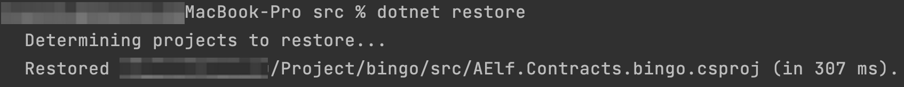
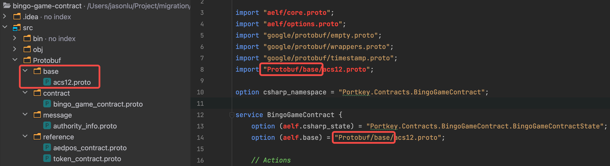

Setup
=====

AElf Tools is a MSBuild tool, which for creating and testing smart 
contracts. It takes care of including your contract files in the build
system and linking the appropriate development SDK. AElf Tools also
takes care of generating the csharp code from the proto definition.

This article will get you started with development on AElf Tools. It
contains the following items:
- how to install, build, and run template contract.
- how to run the Hello World contract tests.
- a brief presentation of AElf Tools.

Environment
-----------

IDE
^^^

Strictly speaking, you don’t need an IDE for this tutorial, but it is
highly recommended. If you don’t already have one you can try Visual
Studio Code (vscode) with the C# extension: - installation instructions
for vscode
`here <https://code.visualstudio.com/docs/setup/setup-overview>`__. -
working with C# extension
`here <https://code.visualstudio.com/docs/languages/csharp>`__.

You can, of course, use your favorite C# IDE, most of the steps
described here and in later articles do not need IDE support.

Install template of AElf Tools
^^^^^^^^^^^^^^^^^^^^^^^^^^^^^^

Open terminal and create a folder, go to this folder and type the following command.
This command will Install a template of AElf Tools into this folder.

.. code:: bash

   dotnet new install AElf.Contract.Template

This template contains the framework for smart contract development and testing 
as well as examples (some explained in this series of articles).

Build and run
-------------

Open the project
^^^^^^^^^^^^^^^^

Open vscode/Rider and open the **template-contract** folder. 
If asked to add some “required assets” say **yes** in vscode.
Or you can go to the template-contract/src folder in the terminal, 
and type "dotnet restore". There will restore some dependencies.
   

Note: you can find out more about vscode’s terminal
`here <https://code.visualstudio.com/docs/editor/integrated-terminal>`__.

Build and run
^^^^^^^^^^^^^^

As stated earlier, AElf Tools takes care of the C# code generation and
thus has a dependency on protobuf. So you need to create protobuf files
under the Protobuf folder first. Note that the import path, the path of proto
under the base/contract/message/reference folder needs to use the absolute path, 
the path of other imported proto doesn't need to do it. And don't need to add 
the configs of import proto to csproj file.
Like this:

   

The next step is to build project and generate C# code to ensure
everything is working correctly.

.. code:: bash

   # enter the folder that include .csproj file 
   cd src

   # build
   dotnet build

After build, and check the result. If have any errors, solve them according to error messages.

Run tests
^^^^^^^^^

AElf Tools makes it easy to write unit tests for your contracts. Here
we’ll take the tests of the template contract as an example.
To run the tests, navigate to the test folder.

.. code:: bash

   # enter the folder that include .csproj file 
   cd test

   # test
   dotnet test

The output should look somewhat like this, meaning that the tests have
successfully executed:

.. code:: bash

   Test Run Successful.
   Total tests: 1
        Passed: 1
    Total time: 2.8865 Seconds

At this point, you have successfully installed, built, and run
AElf template contract. You have also run the contract’s tests that are
included in template contract. Later articles will show you how to add a
contract and its tests.
