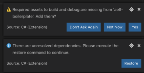

Setup
=====

AElf Boilerplate is the go-to environment for creating and testing smart
contracts. It takes care of including your contract files in the build
system and linking the appropriate development SDK. Boilerplate also
takes care of generating the csharp code from the proto definition.

This article will get you started with development on Boilerplate. It
contains the following items: - how to clone, build, and run AElf
Boilerplate. - how to run the Hello World contract tests. - a brief
presentation of Boilerplate.

Environment
-----------

IDE
^^^

Strictly speaking, you don’t need an IDE for this tutorial, but it is
highly recommended. If you don’t already have one you can try Visual
Studio Code (vscode) with the C# extension: - installation instructions
for vscode
`here <https://code.visualstudio.com/docs/setup/setup-overview>`__. -
working with C# extension
`here <https://code.visualstudio.com/docs/languages/csharp>`__.

You can, of course, use your favorite C# IDE, most of the steps
described here and in later articles do not need IDE support.

Clone the repository
^^^^^^^^^^^^^^^^^^^^

The following command will clone AElf Boilerplate into a
**aelf-boilerplate** folder with Boilerplate’s code inside it, open a
terminal and enter the following command:

.. code:: bash

   git clone https://github.com/AElfProject/aelf-boilerplate

The `boilerplate
repo <https://github.com/AElfProject/aelf-boilerplate>`__ contains a
framework for easy smart contract development as well as examples (some
explained in this series of articles).

Build and run
-------------

Open the project
^^^^^^^^^^^^^^^^

If not already done, open vscode and open the **aelf-boilerplate**
folder. If asked to add some “required assets” say **yes**. There may
also be some dependencies to restore: for all of them, choose
**Restore**.

Open vscode’s **Integrated Terminal** and build the project with the
following command. Note: you can find out more about vscode’s terminal
`here <https://code.visualstudio.com/docs/editor/integrated-terminal>`__.

Install script
^^^^^^^^^^^^^^

As stated earlier, Boilerplate takes care of the C# code generation and
thus has a dependency on protobuf. If you don’t already have it
installed, run the following script from withing the
**aelf-boilerplate** folder:

.. code:: bash

   # Mac or Linux
   sh chain/scripts/install.sh

   # Windows
   # open a PowerShell console as administrator
   chain/scripts/install.ps1

 If you prefer or have problems, you can refer to
the following guide to `manually
install <https://github.com/protocolbuffers/protobuf/blob/master/src/README.md>`__
protobuf on your system. 

.. _build-and-run-1:

Build and run
^^^^^^^^^^^^^

The next step is to build Boilerplate and all the contracts to ensure
everything is working correctly. Once everything is built, we’ll run
Boilerplate’s internal node.

.. code:: bash

   # enter the Launcher folder and build 
   cd chain/src/AElf.Boilerplate.Launcher/

   # build
   dotnet build

   # run the node 
   dotnet run --no-build bin/Debug/net6.0/AElf.Boilerplate.Launcher

 When running Boilerplate, you might see some
errors related to an incorrect password, to solve this, you need to
backup your ``data-dir/keys/`` folder and start with an empty keys
folder. Once you’ve cleaned the keys, stop and restart the node with the
``dotnet run`` command shown above. 

At this point, the smart contracts have been deployed and are ready to
be called (Boilerplate has a functioning API). You should see the node’s
logs in the terminal and see the node producing blocks. You can now stop
the node by killing the process (usually **control-c** or **ctrl-c** in
the terminal).

Run tests
^^^^^^^^^

Boilerplate makes it easy to write unit tests for your contracts. Here
we’ll take the tests of the Hello World contract included in Boilerplate
as an example. To run the tests, navigate to the
**AElf.Contracts.HelloWorldContract.Test** folder and run:

.. code:: bash

   cd ../../test/AElf.Contracts.HelloWorldContract.Test/
   dotnet test

The output should look somewhat like this, meaning that the tests have
successfully executed:

.. code:: bash

   Test Run Successful.
   Total tests: 1
        Passed: 1
    Total time: 2.8865 Seconds

At this point, you have successfully downloaded, built, and run
Boilerplate. You have also run the HelloWorld contract’s tests that are
included in Boilerplate. Later articles will show you how to add a
contract and its tests and add it to the deployment process.

More on Boilerplate
-------------------

Boilerplate is an environment that is used to develop smart contracts
and dApps. After writing and testing your contract on Boilerplate, you
can deploy it to a running AElf chain. Internally Boilerplate will run
an AElf node that will automatically have your contract deployed on it
at genesis.

Boilerplate is composed of two root folders: **chain** and **web**. This
series of tutorial articles focuses on contract development so we’ll
only go into the details of the **chain** part of Boilerplate. Here is a
brief overview of the folders:

.. raw:: html

   <!-- 
   ## chain  // root of the contract development folder
   ### src 
   ### contract 
   #### AElf.Contracts.HelloWorldContract
   ##### AElf.Contracts.HelloWorldContract.csproj
   ##### HelloWorldContract.cs
   ##### HelloWorldContractState.cs
   ##### ...
   ### protobuf 
   #### hello_world_contract.proto
   #### ...
   ### test 
   #### AElf.Contracts.HelloWorldContract.Test 
   ##### AElf.Contracts.HelloWorldContract.Test.csproj
   ##### HelloWorldContractTest.cs
   ### ...
   -->

::

   .
   └── chain 
       ├── src 
       ├── contract
       │   └── AElf.Contracts.HelloWorldContract
       │       ├── AElf.Contracts.HelloWorldContract.csproj
       │       ├── HelloWorldContract.cs
       │       ├── HelloWorldContractState.cs
       │       └── ...
       ├── protobuf
       │   ├── hello_world_contract.proto
       │   └── ...
       ├── test 
       │   └── AElf.Contracts.HelloWorldContract.Test
       │       ├── AElf.Contracts.HelloWorldContract.Test.csproj
       │       └── HelloWorldContractTest.cs
       └── ...

The hello world contract and its tests are split between the following
folders: - **contract**: this folder contains the csharp projects
(.csproj) along with the contract implementation (.cs files). -
**protobuf**: contains the .proto definition of the contract. -
**test**: contains the test project and files (basic xUnit test
project).

You can use this layout as a template for your future smart contracts.
Before you do, we recommend you follow through all the articles of this
series.

 You will also notice the **src** folder. This
folder contains Boilerplate’s modules and the executable for the node.


Next
----

You’ve just seen a short introduction on how to run a smart contract
that is already included in Boilerplate. The next article will show you
a complete smart contract and extra content on how to organize your code
and test files.

 All production contracts (contracts destined
to be deployed to a live chain) must go through a complete review
process by the contract author and undergo proper testing. It is the
author’s responsibility to check the validity and security of his
contract. The author should not simply copy the contracts contained in
Boilerplate; it’s the author’s responsibility to ensure the security and
correctness of his contracts. 
