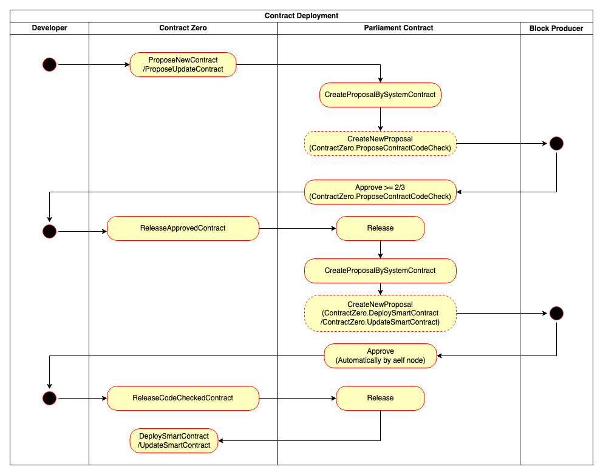

Deploying Updating Contracts(BP Approval Required)
==================================================

Contracts deployment/update can be done by 2 means: one is via aelf
explorer while the other is via aelf-command. Before you start
deploying/updating, please make sure that you have installed npm and
aelf-command. If you haven’t completed it, please follow the
`Deployment Environment <../../getting_started/smart_contracts/development_environment.html>`__ here. 

Overview
--------

In the following 3 situations, the contract updating process must be
initiated by the BP and the contracts can only be updated after
having obtained the BPs' approval.
1. Upgrading the system contracts on MainChain.
2. Upgrading the system contracts on exclusive SideChains.
3. Upgrading the system contracts on shared SideChains.

System contracts can only be deployed in the Genesis block. Once the
blockchain is launched, it will only support contract updates and new
system contract deployments will not be accepted. 
This document only describes the pipeline of contract deployment on
aelf Mainnet, that is, when ``ContractDeploymentAuthorityRequired`` is
true.

Deploy / Update through aelf Explorer
-------------------------------------

Notes: This doc only illustrates the procedure of contract deployment/
update on AElf Mainnet, that is, when
``ContractDeploymentAuthorityRequired`` is true. Please make sure that
you have created an AElf wallet and possessed around 100 ELF before
you start deploying/updating. When
``ContractDeploymentAuthorityRequired`` is false, you can directly
complete deployment and upgrade via ``DeploySmartContract`` and
``UpdateSmartContract`` in Contract Zero.

Click
`here <https://medium.com/aelfblockchain/tutorial-how-to-manage-contracts-with-aelf-explorer-v1-2-0-2dcc36b439d9>`__
to learn contract deployment through aelf Explorer.

Deploy / Update through aelf-command
------------------------------------

This section will walk you through the procedure of contract deployment
/ update through aelf-command. 

Developer: ProposeNewContract / ProposeUpdateContract
~~~~~~~~~~~~~~~~~~~~~~~~~~~~~~~~~~~~~~~~~~~~~~~~~~~~~

Contract Deployment
"""""""""""""""""""

-  The developer initiates the ``ProposeNewContract`` transaction.

-  A ``ProposeContractCodeCheck`` proposal will be created and the BPs
   will be asked to check the code.

-  If no less than 2/3 of BPs (rounding down) + 1 vote in favour of the
   proposal, the developer needs to manually release the approved
   proposal and the system will create a CodeCheck proposal for automatic
   code check. If the proposal is denied, the deployment will be
   terminated.

Contract Update
"""""""""""""""

-  The developer initiates the ``ProposeUpdateContract`` transaction.

-  A ``ProposeContractCodeCheck`` proposal will be created and the BPs
   will be asked to check the code.

-  If no less than 2/3 of BPs (rounding down) + 1 vote in favour of the
   proposal, the developer needs to manually release the approved
   proposal and the system will create a CodeCheck proposal for
   automatic code check. If the proposal fails, the update will be
   terminated.

BP: Parliament.Approve
~~~~~~~~~~~~~~~~~~~~~~

-  BPs manually approve the ProposeContractCodeCheck proposal, agreeing
   to check the contract code.

-  A proposal will be approved only if all the following conditions are
   met:

   -  No less than 2/3 (rounding down) + 1 of the total votes are in
      favour;
   
   -  No more than 10% of the total votes are against;
   
   -  No more than 10% of the total votes are abstention;
   
   -  At least 80% of the BPs participate in voting.
   

Developer: ReleaseApprovedContract
~~~~~~~~~~~~~~~~~~~~~~~~~~~~~~~~~~

-  If no less than 2/3 of BPs (rounding down) + 1 approve the proposal,
   the developer needs to initiate a ``ReleaseApprovedContract``
   transaction to release the proposal.

-  A CodeCheck proposal will be created for automatic code check, which
   is used to let BPs automatically check the code (an event will be
   raised and handled on-chain, and code check will be executed).

BP: Parliament.ApproveMultiProposals (automatic)
~~~~~~~~~~~~~~~~~~~~~~~~~~~~~~~~~~~~~~~~~~~~~~~~

-  BPs automatically complete the contract code check. If the code
   passes the check, an ``ApproveMultiProposals`` transaction will be
   initiated via the system, and that means the CodeCheck proposal is 
   approved. If the code fails to pass the check, the deployment/update
   will be terminated.

Developer: ReleaseCodeCheckedContract
~~~~~~~~~~~~~~~~~~~~~~~~~~~~~~~~~~~~~

-  The developer initiates the ``ReleaseCodeCheckedContract`` transaction
   to release the CodeCheck proposal. The ``DeploySmartContract``/
   ``UpdateSmartContractmethod`` will be executed and then contract
   deployment/update is done.
