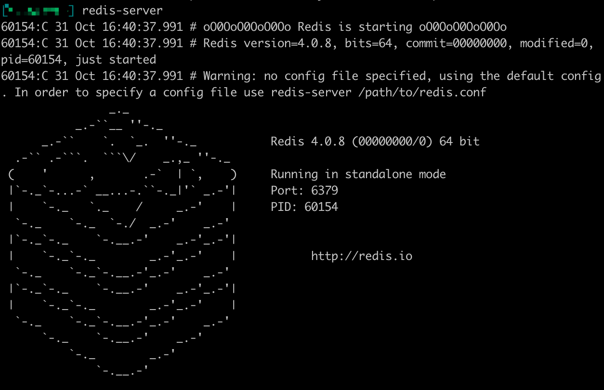

# Windows

## Configure Environment

You can install and set up the development environment on computers running Windows 10 or higher. This will take 10-20 minutes.

### Before You Start

Before you install and set up the development environment on a Windows device, please make sure that your computer meets these basic requirements:

- Operating system version is Windows 10 or higher.

- Broadband internet connection.

### Install Chocolatey (Recommended)

**Chocolatey** is an open-source package manager for Windows software that makes installation simpler, like Homebrew for Linux  and macOS. If you don't want to install it, please use the provided download links for each software to complete their installation.

1. Open **cmd** or **PowerShell** as administrator (Press Win + x).

2. Execute the following commands in order and enter y to install Chocolatey:

	```powershell
		Set-ExecutionPolicy AllSigned

		Set-ExecutionPolicy Bypass -Scope Process

		Set-ExecutionPolicy Bypass -Scope Process -Force; iex ((New-Object System.Net.WebClient).DownloadString('https://chocolatey.org/install.ps1'))

		Set-ExecutionPolicy RemoteSigned
	```

3. Execute this command to check if Chocolatey is installed:

	```powershell
		choco
	```
	The following output suggests successful installation:

	```
		Chocolatey vx.x.x
	```
	If it shows```The term 'choco' is not recognized as the name of a cmdlet, function, script file, or operable program```, then there is a permission issue with PowerShell. To solve it:

	+ **Right-click** the computer icon and select **Properties**.

	+ Click **Advanced** in **System Properties** and select **Environment Variables** on the bottom right.

	+ Check if the **ChocolateyInstall variable** is in **System variables**, and its default value is the Chocolatey installation path ```C:\Program Files\Chocolatey```. If you don't find it, click New System Variable to manually add it.

### Install Git

If you want to use our customized smart contract development environment or to run a node, you need to clone aelf's repo (download source code). As aelf's code is hosted on GitHub, you need to install **Git** first.

1. You can download Git through this link or execute this command in cmd or PowerShell:

	```powershell
		choco install git -y
	```

2. Execute this command to check if Git is installed:

	```powershell
		git --version
	```
	The following output suggests successful installation:

	```powershell
		git version xx.xx.xx
	```
	If it shows ```The term 'git' is not recognized as the name of a cmdlet, function, script file, or operable program```, you can:

	+ **Right-click** the computer icon and select **Properties**.
	+ Click **Advanced** in **System Properties** and select **Environment Variables** on the bottom right.
	+ Check if the Git variable is in **Path** in **System variables**, and its default value is the Git installation path ```C:\Program Files\git```. If you don't find it, click **New System Variable** to manually add it.

### Install .NET SDK

As aelf is mostly developed with .NET Core, you need to download and install .NET Core SDK (**Installers** - x64 recommended for Windows and macOS if compatible).
1. Download and install [.NET 6.0](https://dotnet.microsoft.com/en-us/download/dotnet/6.0) which is currently used in aelf's repo.

2. Please reopen cmd or PowerShell after the installation is done.

3. Execute this command to check if .NET is installed:
	```powershell
		dotnet --version
	```
	The following output suggests successful installation:
	```
		6.0.403
	```

### Install protoBuf

1. You can download protoBuf through this link or execute this command in cmd or PowerShell:
	```powershell
		choco install protoc --version=3.11.4 -y
	
		choco install unzip -y
	```
2. Execute this command to check if protoBuf is installed:

	```
		protoc --version
	```
	The following output suggests successful installation:

	```
		libprotoc 3.21.9
	```

### Install Redis

1. You can download Redis through MicroSoftArchive-Redis or execute this command in cmd or PowerShell:

  ```powershell
  	choco install redis-64 -y
  ```

2. Execute this command to start a Redis instance and check if Redis is installed:

  ```
  	memurai
  ```
  The following output suggests Redis is installed and a Redis instance is started:

  

### Install Nodejs

1. You can download Nodejs through Node.js or execute this command in cmd or PowerShell:

	```powershell
		choco install nodejs -y
	```

2. Execute this command to check if Nodejs is installed:
	```powershell
		npm --version
	```
	The following output suggests successful installation:

	```
		6.14.8
	```
	If it shows The term 'npm' is not recognized as the name of a cmdlet, function, script file, or operable program, you can:

	+ **Right-click** the computer icon and select **Properties**.

	+ Click **Advanced** in **System Properties** and select **Environment Variables** on the bottom right.

	+ Check if the Nodejs variable is in **Path** in **System variables**, and its default value is the Nodejs installation path ```C:\Program Files\nodejs```. If you don't find it, click **New System Variable** to manually add it.


## What's Next

If you have installed the above tools and frameworks, you can proceed with what interests you here. Read the following to learn about contract deployment and node running:

[Smart contract development](https://docs.aelf.io/en/latest/getting-started/smart-contract-development/index.html) 

[Smart contract deployment](https://docs.aelf.io/en/latest/getting-started/smart-contract-development/index.html)

[Node](/Development Environment/node/node.md)

