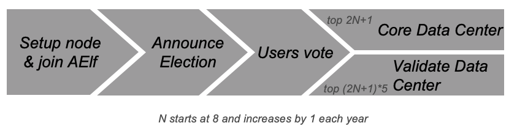
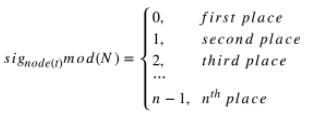
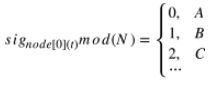

# Consensus

## Overview

The process of reaching consensus is an essential part of every blockchain, since its what determines which transactions get included in the block and in what order. A stable and efficient Block formation mechanism is the foundation of the AElf system. The operation and maintenance of AElf is more complicated than Bitcoin and Ethereum, because AElf Block formation requires the Main Chain to record information from Side Chains, and AElf is designed to provide cloud-based enterprise services in a more complex structure. In addition, miners need to update information from multiple parallel Chains. The Main Chain will adopt AEDPoS consensus to ensure high frequency and predictability of Block formation, which will improve user experience.

In an AElf blockchain, consensus protocol is split into two parts: election and scheduling. Election is the process that determines **who** gets to produce and scheduling decides on the **when**.

### Core Data Center

Core Data Centers aka Miners or Block Producers, act as members of parliament in the world of AElf blockchain.

The AElf blockchain delegates 2N+1 Core Data Centers. N starts with 8 and increases by 1 every year.

These nodes in the AElf system enforce all of consensus rules of AElf. The purpose of these delegated mining nodes is to enable transaction relay, transaction confirmation, packaging blocks and data transfer. As AElf adopts multi-Side Chain architecture, Core Data Centers have to work as miners for some Side Chains. 2N+1 nodes will go through a randomized order calculation each week.

All the Core Data Centers are elected by the ELF token hodlers. Electors can lock their ELF tokens to vote to one Validate Data Center, thus enhance the competitiveness of certain Validate Data Center in the election process.

### Validate Data Center

In the AElf blockchain, everyone can lock an amount of ELF tokens to announce himself joining the election. Among all the nodes who announced joining election, top (2N+1)*5 nodes will become Validate Data Center. N starts with 8 and increases by 1 every year.

## AEDPoS Process

### Round

The AElf blockchain is running along the timeline within processing units we call a “**round**”.

In a round, one node (Core Data Center) will produce one block each time, while one node will have one extra transaction at the end of the round.

Each mining node has three main properties in a specific round **t**:

* Private key, **in_node(t)**, which is a value inputted from the mining node and kept privately by the mining node itself in round **t**. It will become public after all block generations in round **t** are completed;
* Public key, **out_node(t)**, which is the hash value of **in_node(t)**. Every node in the aelf network can look up this value at any time;
* Signature, **sig_node(t)**, which is a value generated by the mining node itself in the first round. After the first round, it can only be calculated once the previous round is completed. It is used as the signature of this mining node in this round and it is also opened to public at all times like the **out_node(t)**.

### Main Processes

#### Pre-Verification

Before a node starts its block generation in round **(t+1)**, it has to have its status verified in round **t**. In round **(t+1)**, **in_node(t)** is already published as public, and **out_node(t)** can be queried at any time. So to verify the status of in round , other nodes can check **hash(in_node(t)) = out_node(t)**.

#### Order Calculation

In each round **N**, Core Data Centers have **(N+1)** block generation time slots, each time slot have 1 to 8 blocks generation based on current running status in the AElf blockchain. 

In the first round, the ordering of block generations as well as the signature (**sig**) for each node are totally arbitrary.

In the second round, the block generations are again arbitrarily ordered. However, from the second round, the signature will be calculated by **sig_node(t+1) = hash(in_node(t) + all_t)** where  here **node[i][t]**, means the node is processing the **i-th** transaction in round **t**.

From round 3, the ordering within a round is generated from the ordering and the node signature from the previous round.

In round **(t+1)**, we traverse the signature of nodes at round **t** in order. The ordering of a node in **(t+1)** is calculated by

For cases of conflict, i.e. results pointed to places which are not empty, we point the node to the next available place. If the node conflict is at the **n-th** place, we will find the available place from the first place.

The node that processes the one extra transaction is calculated from the signature of the node in first place of the previous round.

**sig_node[0][t]** is decided by:

* all the signatures from previous round **(t-1)**;
* the **in** value of itself in round **(t-1)**;
* which node generate the extra block. 

So it can only be calculated after the previous round **(t-1)** completed. Moreover, as it needs all the signatures from the previous round and the **in** value is input by each node independently, there is no way to control the ordering. The extra block generation is used to increase the randomness. In general, we create a random system that relies on extra inputs from outside. Based on the assumption that no node can know all other nodes’ inputs in a specific round, no one node could control the ordering.

If one node cannot generate a block in round **t**, it also cannot input **in** its for this round. In such a case, the previous **in** will be used. Since all mining nodes are voted to be reliable nodes, such a situation should not happen often. Even if this situation does happen, the above-mentioned strategy is more than sufficient at dealing with it.

Every node only has a certain time T seconds to process transactions. Under the present network condition, T=4 is a reasonable time consideration, meaning that every node only has 4 seconds to process transactions and submit the result to the network. Any delegate who fails to submit within 4 seconds is considered to be abandoning the block. If a delegate failed two times consecutively, there will be a window period calculated as W hours (W=2^N, N stands for the number of failure) for that node.

In the systematic design, aelf defines that only one node generates blocks within a certain period. Therefore, it is unlikely for a fork to happen in an environment where mining nodes are working under good connectivity. If multiple orphan node groups occur due to network problems, the system will adopt the longest chain since that is 19 the chain that most likely comes from the orphan node group with largest number of mining nodes. If a vicious node mines in two forked Blockchains simultaneously to attack the network, that node would be voted out of the entire network.

AEDPoS mining nodes are elected in a way that resembles representative democracy. The elected nodes decide how to hand out bonuses to the other mining nodes and stakeholders.

## Irreversible Block

todo