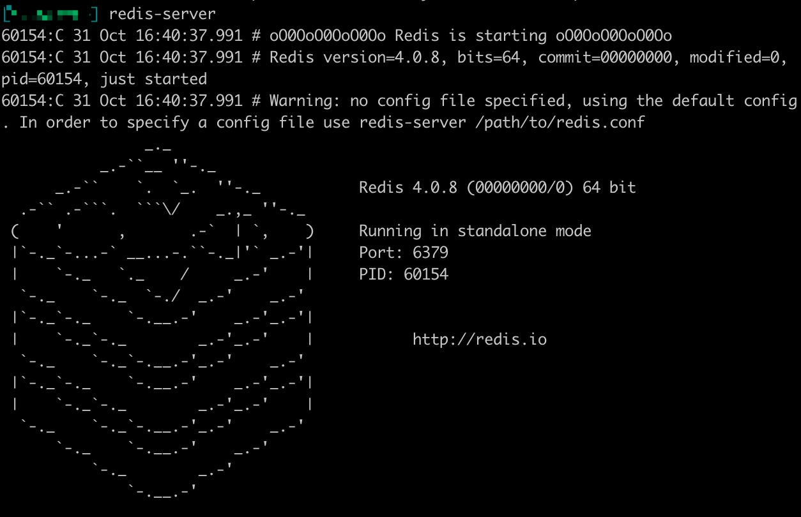

Development Environment
=======================

Before you get started with the tutorials, you need to install the
following tools and frameworks.

For most of these dependencies, we provide command line instructions for
macOS, Linux Ubuntu 18, and Windows. In case any problems occur or if
you have more complex needs, please leave a message on GitHub and we
will handle it ASAP.

macOS
-----

Configure Environment
~~~~~~~~~~~~~~~~~~~~~

You can install and set up the development environment on macOS
computers with either Intel or Apple M1 processors. This will take 10-20
minutes.

Before You Start
^^^^^^^^^^^^^^^^

Before you install and set up the development environment on a macOS
device, please make sure that your computer meets these basic
requirements:

-  Operating system version is 10.7 Lion or higher.

-  At least a 2Ghz processor, 3Ghz recommended.

-  At least 8 GB RAM, 16 GB recommended.

-  No less than 10 GB of available space.

-  Broadband internet connection.

**Support for Apple M1**

If you use a macOS computer with an Apple M1 chip, you need to install
Apple Rosetta. Open the Terminal on your computer and execute this
command,Please be patient while the command is executed.

.. code:: powershell

   /usr/sbin/softwareupdate --install-rosetta --agree-to-license

Install Homebrew
^^^^^^^^^^^^^^^^

In most cases, you should use Homebrew to install and manage packages on
macOS devices. If Homebrew is not installed on your local computer yet,
you should download and install it before you continue.

To install Homebrew:

1. Open Terminal.

2. Execute this command to install Homebrew:

   .. code:: bash

      /bin/bash -c "$(curl -fsSL https://raw.githubusercontent.com/Homebrew/install/HEAD/install.sh)"

3. Execute this command to check if Homebrew is installed:

   .. code:: bash

      brew --version

The following output suggests successful installation:

.. code:: bash

   Homebrew 3.3.1

   Homebrew/homebrew-core (git revision c6c488fbc0f; last commit 2021-10-30)

   Homebrew/homebrew-cask (git revision 66bab33b26; last commit 2021-10-30)

Environment Update
^^^^^^^^^^^^^^^^^^

Execute this command to update your environment:

.. code:: bash

   brew update

You will see output like this.

.. code:: bash

   You have xx outdated formula installed.
   You can upgrade it with brew upgrade
   or list it with brew outdated.

You can execute the following command to upgrade or skip to the
installation of Git.

.. code:: bash

   brew upgrade

Install Git
^^^^^^^^^^^

If you want to use our customized smart contract development environment
or to run a node, you need to clone aelf’s repo (download source code).
As aelf’s code is hosted on GitHub, you need to install **Git** first.

1. Execute this command in Terminal:

   .. code:: bash

      brew install git

2. Execute this command to check if Git is installed:

   .. code:: bash

      git --version

The following output suggests successful installation:

.. code:: bash

   git version xx.xx.xx

Install .NET SDK
^^^^^^^^^^^^^^^^

As aelf is mostly developed with .NET Core, you need to download and
install .NET Core SDK (Installers - x64 recommended for macOS devices
with Intel processors; Installers - Arm64 recommended for macOS devices
with M1 chips).

1. Download and install `.NET
   6.0 <https://dotnet.microsoft.com/en-us/download/dotnet/6.0>`__ which
   is currently used in aelf’s repo.

2. Please reopen Terminal after the installation is done.

3. Execute this command to check if .NET is installed:

   .. code:: bash

      dotnet --version

The following output suggests successful installation:

::

   6.0.403

Install protoBuf
^^^^^^^^^^^^^^^^

1. Execute this command to install protoBuf:

   .. code:: bash

      brew install protobuf

   If it shows error ``Permission denied @ apply2files``, then there is
   a permission issue. You can solve it using the following command and
   then redo the installation with the above command:

   .. code:: bash

      sudo chown -R $(whoami) $(brew --prefix)/*

2. Execute this command to check if protoBuf is installed:

   .. code:: bash

      protoc --version

The following output suggests successful installation:

.. code:: bash

   libprotoc 3.21.9

Install Redis
^^^^^^^^^^^^^

1. Execute this command to install Redis:

   .. code:: bash

      brew install redis

2. Execute this command to start a Redis instance and check if Redis is
   installed:

   .. code:: bash

      redis-server

The following output suggests Redis is installed and a Redis instance is
started:

Install Nodejs
^^^^^^^^^^^^^^

1. Execute this command to install Nodejs:

   .. code:: bash

      brew install node

2. Execute this command to check if Nodejs is installed:

   .. code:: bash

      npm --version

The following output suggests successful installation:

::

   6.14.8

Install aelf-command
^^^^^^^^^^^^^^^^^^^^

1. Execute this command to install aelf-command:

   ::

      npm i aelf-command -g

2. If it shows error ``Permission denied @ apply2files`` , then there is
   a permission issue. You can solve it using the following command and
   then redo the installation with the above command:

   ::

      sudo chmod 755 /usr/local/lib/node_modules

Create an aelf Account
^^^^^^^^^^^^^^^^^^^^^^

1. Execute this command:

   ::

      aelf-command create

   An aelf account will be automatically created and you will see info
   like:

   ::

      AElf [Info]: Your wallet info is :
      AElf [Info]: Mnemonic            : mirror among battle muffin cattle plunge tuition buzz hip mad surround recall
      AElf [Info]: Private Key         : 4bf625afea60e21aa5afcab5ea682b3dfb614941245698632d72a09ae13*****
      AElf [Info]: Public Key          : 04f9bb56a9eca921bd494e677307f0279c98f1d2ed6bdeaa6dd256878272eabd14e91ec61469d2a32ce5e63205930dabdc0b9f13fc80c1f4e31760618d182*****
      AElf [Info]: Address             : 21qciGwcaowwBttKMjMk86AW6WajhcodSHytY1vCyZb7p*****

2. You will then be asked whether you want the account data stored as a
   json file. Enter ``y`` to confirm and the file will be stored in
   ``/Users/{username}/.local/share/aelf/keys/``.

Please make sure you remember the account data or the json file’s
location.

3. You will be required to set a password (referred to as \* here):

   ::

      Enter a password: ********
      Confirm password: ********

   For the sake of convenience, you are encouraged to keep this Terminal
   on the account info interface and open another Terminal to continue
   the following.

Create and Run Boilerplate
^^^^^^^^^^^^^^^^^^^^^^^^^^

AElf - Boilerplate is mainly used to develop contracts on aelf
blockchain.

Clone Boilerplate Code to Local Computer
''''''''''''''''''''''''''''''''''''''''

This tutorial creates a directory ``BoilerplateTest`` on the desktop for
reference.

1. Execute this command to create a directory:

   ::

      mkdir ~/Desktop/BoilerplateTest

2. Execute this command to change the directory:

   ::

      cd ~/Desktop/BoilerplateTest

3. Execute this command to clone the Boilerplate’s code:

   ::

      git clone https://github.com/AElfProject/aelf-boilerplate

Create Boilerplate
''''''''''''''''''

1. Execute this command to change to the chain’s directory:

   ::

      # enter the folder
      cd aelf-boilerplate/chain

2. Execute this command to restore the Boilerplate’s files:

   ::

      # restore
      dotnet restore AElf.Boilerplate.sln

3. Execute this command to change to the Launcher’s directory:

   ::

      # enter the Launcher folder
      cd src/AElf.Boilerplate.Launcher/

4. Execute this command to build the Boilerplate’s code:

   ::

      # build
      dotnet build

   If it shows permission issues like ``permission denied`` or
   ``access denied``, you can add ``sudo`` to the front of the command
   to grant permissions.

5. Execute this command to modify the ``appsettings.json`` file, or you
   can go to
   ``Desktop > BoilerplateTest > aelf-boilerplate > chain > src > AElf.Boilerplate.Launcher``
   and open the ``appsettings.json`` file in the editor to modify it:

   ::

      vim appsettings.json

   Find the account data you just created using ``aelf-command`` create.

   ::

      AElf [Info]: Your wallet info is :
      AElf [Info]: Mnemonic            : mirror among battle muffin cattle plunge tuition buzz hip mad surround recall
      AElf [Info]: Private Key         : 4bf625afea60e21aa5afcab5ea682b3dfb614941245698632d72a09ae13*****
      AElf [Info]: Public Key          : 04f9bb56a9eca921bd494e677307f0279c98f1d2ed6bdeaa6dd256878272eabd14e91ec61469d2a32ce5e63205930dabdc0b9f13fc80c1f4e31760618d182*****
      AElf [Info]: Address             : 21qciGwcaowwBttKMjMk86AW6WajhcodSHytY1vCyZb7p*****

   Fill in ``NodeAccount`` and ``NodeAccountPassword`` under ``Account``
   using the ``Address`` and ``password`` you set:

   ::

      "Account": {
          "NodeAccount": "",
          "NodeAccountPassword": ""
      }

   It may look like this when you complete it:

   ::

      "Account": {
          "NodeAccount": "21qciGwcaowwBttKMjMk86AW6WajhcodSHytY1vCyZb7p*****",
          "NodeAccountPassword": "********"
      }, 

   Fill in the ``InitialMineList`` under ``Consensus`` using Public Key:

   ::

      "Consensus": {
          "InitialMinerList": [],
          "MiningInterval": 4000,
          "StartTimestamp": 0,
          "PeriodSeconds": 604800,
          "MinerIncreaseInterval": 31536000
      }

   It may look like this when you complete it (make sure to add ``""``):

   ::

      "Consensus": {
          "InitialMinerList": ["04f9bb56a9eca921bd494e677307f0279c98f1d2ed6bdeaa6dd256878272eabd14e91ec61469d2a32ce5e63205930dabdc0b9f13fc80c1f4e31760618d182*****"],
          "MiningInterval": 4000,
          "StartTimestamp": 0,
          "PeriodSeconds": 604800,
          "MinerIncreaseInterval": 31536000
      }

   This is an example of a single node. If you are setting up
   multi-nodes, make sure to separate the public keys with ``,``.

   If the IP and port for Redis have been changed, you can modify them
   under ``ConnectionStrings`` in ``appsettings.json`` (skip this step
   if they are not changed):

   ::

      "ConnectionStrings": {
          "BlockchainDb": "redis://localhost:6379?db=1",
          "StateDb": "redis://localhost:6379?db=1"
      }

Run Boilerplate
'''''''''''''''

Execute the ``dotnet run`` command:

::

   dotnet run --no-build bin/Debug/net6.0/AElf.Boilerplate.Launcher

The following output suggests successful launch:

::

   2022-11-29 16:07:44,554 [.NET ThreadPool Worker] INFO  AElf.Kernel.SmartContractExecution.Application.BlockExecutionResultProcessingService - Attach blocks to best chain, best chain hash: "f396756945d9bb883f81827ab36fcb0533d3c66f7062269700e49b74895*****", height: 177

If you want to check the node’s block height and other block info, you
can visit `this page <http://localhost:8000/swagger/index.html>`__ where
you can access the API docs and interact with this single node.

To shut the node down, please use control + c on your keyboard.

If you don’t want to save the data, you can execute this command to
delete all:

::

   redis-cli flushall

So far, you have successfully downloaded, created, and run Boilerplate.
In the following tutorial, you will learn how to add, test, and deploy a
contract.

Linux
-----

.. _configure-environment-1:

Configure Environment
~~~~~~~~~~~~~~~~~~~~~

You can install and set up the development environment on computers
running 64-bit Linux. This will take 10-20 minutes.

.. _before-you-start-1:

Before You Start
^^^^^^^^^^^^^^^^

Before you install and set up the development environment on a Linux
device, please make sure that your computer meets these basic
requirements:

-  Ubuntu 18.

-  Broadband internet connection.

Update Environment
^^^^^^^^^^^^^^^^^^

Execute this command to update your environment, Please be patient while
the command is executed:

.. code:: bash

   sudo apt-get update

The following output suggests successful update:

.. code:: bash

   Fetched 25.0 MB in 3s (8,574 kB/s)
   Reading package lists... Done

.. _install-git-1:

Install Git
^^^^^^^^^^^

If you want to use our customized smart contract development environment
or to run a node, you need to clone aelf’s repo (download source code).
As aelf’s code is hosted on GitHub, you need to install **Git** first.

1. Open the terminal.

2. Execute this command to install Git:

   .. code:: bash

      sudo apt-get install git -y

3. Execute this command to check if Git is installed:

   .. code:: bash

      git --version

The following output suggests successful installation:

.. code:: bash

   git version 2.17.1

.. _install-.net-sdk-1:

Install .NET SDK
^^^^^^^^^^^^^^^^

As aelf is mostly developed with .NET Core, you need to download and
install .NET Core SDK.

1. Execute the following commands to install .NET 6.0.

   1. Execute this command to download .NET packages:

      .. code:: bash

         wget https://packages.microsoft.com/config/ubuntu/22.04/packages-microsoft-prod.deb -O packages-microsoft-prod.deb

   2. Execute this command to unzip .NET packages:

      .. code:: bash

         sudo dpkg -i packages-microsoft-prod.deb

         rm packages-microsoft-prod.deb

   3. Execute this command to install .NET:

      .. code:: bash

         sudo apt-get update && \

         sudo apt-get install -y dotnet-sdk-6.0

2. Execute this command to check if .NET 6.0 is installed:

   .. code:: bash

      dotnet --version

The following output suggests successful installation:

::

   6.0.403

.. _install-protobuf-1:

Install protoBuf
^^^^^^^^^^^^^^^^

Before you start the installation, please check the directory you use
and execute the following commands to install.

1. Execute the following commands to install protoBuf.

   1. Execute this command to download protoBuf packages:

      .. code:: bash

         curl -OL https://github.com/google/protobuf/releases/download/v21.9/protoc-21.9-linux-x86_64.zip

   2. Execute this command to unzip protoBuf packages:

      ::

         unzip protoc-21.9-linux-x86_64.zip -d protoc3

   3. Execute these commands to install protoBuf:

      .. code:: bash

         sudo mv protoc3/bin/* /usr/local/bin/

         sudo mv protoc3/include/* /usr/local/include/

         sudo chown ${USER} /usr/local/bin/protoc

         sudo chown -R ${USER} /usr/local/include/google

      If it shows error ``Permission denied @ apply2files``, then there
      is a permission issue. You can solve it using the following
      command and then redo the installation with the above commands:

      .. code:: bash

         sudo chown -R $(whoami) $(brew --prefix)/*

2. Execute this command to check if protoBuf is installed:

   .. code:: bash

      protoc --version

The following output suggests successful installation:

::

   libprotoc 3.21.9

.. _install-redis-1:

Install Redis
^^^^^^^^^^^^^

1. Execute this command to install Redis:

   .. code:: bash

      sudo apt-get install redis -y

2. Execute this command to start a Redis instance and check if Redis is
   installed:

   ::

      redis-server

The following output suggests Redis is installed and a Redis instance is
started:

::

   Server initialized
   Ready to accept connections

You can open a new terminal and use redis-cli to start Redis command
line. The command below can be used to clear Redis cache (be careful to
use it):

::

   flushall

.. _install-nodejs-1:

Install Nodejs
^^^^^^^^^^^^^^

1. Execute these commands to install Nodejs:

   .. code:: bash

      curl -fsSL https://deb.nodesource.com/setup_14.x | sudo -E bash -

      sudo apt-get install -y nodejs

2. Execute this command to check if Nodejs is installed:

   .. code:: bash

      npm --version

The following output suggests successful installation:

::

   6.14.8

.. _install-aelf-command-1:

Install aelf-command
^^^^^^^^^^^^^^^^^^^^

1. Execute this command to install aelf-command:

   ::

      npm i aelf-command -g

2. If it shows error ``Permission denied @ apply2files`` , then there is
   a permission issue. You can solve it using the following command and
   then redo the installation with the above command:

   ::

      sudo chmod 755 /usr/local/lib/node_modules

.. _create-an-aelf-account-1:

Create an aelf Account
^^^^^^^^^^^^^^^^^^^^^^

1. Execute this command:

   ::

      aelf-command create

   An aelf account will be automatically created and you will see info
   like:

   ::

      AElf [Info]: Your wallet info is :
      AElf [Info]: Mnemonic            : mirror among battle muffin cattle plunge tuition buzz hip mad surround recall
      AElf [Info]: Private Key         : 4bf625afea60e21aa5afcab5ea682b3dfb614941245698632d72a09ae13*****
      AElf [Info]: Public Key          : 04f9bb56a9eca921bd494e677307f0279c98f1d2ed6bdeaa6dd256878272eabd14e91ec61469d2a32ce5e63205930dabdc0b9f13fc80c1f4e31760618d182*****
      AElf [Info]: Address             : 21qciGwcaowwBttKMjMk86AW6WajhcodSHytY1vCyZb7p*****

2. You will then be asked whether you want the account data stored as a
   json file. Enter ``y`` to confirm and the file will be stored in
   ``/Users/{username}/.local/share/aelf/keys/``.

Please make sure you remember the account data or the json file’s
location.

3. You will be required to set a password (referred to as \* here):

   ::

      Enter a password: ********
      Confirm password: ********

   For the sake of convenience, you are encouraged to keep this Terminal
   on the account info interface and open another Terminal to continue
   the following.

.. _create-and-run-boilerplate-1:

Create and Run Boilerplate
^^^^^^^^^^^^^^^^^^^^^^^^^^

AElf - Boilerplate is mainly used to develop contracts on aelf
blockchain.

.. _clone-boilerplate-code-to-local-computer-1:

Clone Boilerplate Code to Local Computer
''''''''''''''''''''''''''''''''''''''''

This tutorial creates a directory ``BoilerplateTest`` on the desktop for
reference.

1. Execute this command to create a directory:

   ::

      mkdir ~/Desktop/BoilerplateTest

2. Execute this command to change the directory:

   ::

      cd ~/Desktop/BoilerplateTest

3. Execute this command to clone the Boilerplate’s code:

   ::

      git clone https://github.com/AElfProject/aelf-boilerplate

.. _create-boilerplate-1:

Create Boilerplate
''''''''''''''''''

1. Execute this command to change to the chain’s directory:

   ::

      # enter the folder
      cd aelf-boilerplate/chain

2. Execute this command to restore the Boilerplate’s files:

   ::

      # restore
      dotnet restore AElf.Boilerplate.sln

3. Execute this command to change to the Launcher’s directory:

   ::

      # enter the Launcher folder
      cd src/AElf.Boilerplate.Launcher/

4. Execute this command to build the Boilerplate’s code:

   ::

      # build
      dotnet build

   If it shows permission issues like ``permission denied`` or
   ``access denied``, you can add ``sudo`` to the front of the command
   to grant permissions.

5. Execute this command to modify the ``appsettings.json`` file, or you
   can go to
   ``Desktop > BoilerplateTest > aelf-boilerplate > chain > src > AElf.Boilerplate.Launcher``
   and open the ``appsettings.json`` file in the editor to modify it:

   ::

      vim appsettings.json

   Find the account data you just created using ``aelf-command`` create.

   ::

      AElf [Info]: Your wallet info is :
      AElf [Info]: Mnemonic            : mirror among battle muffin cattle plunge tuition buzz hip mad surround recall
      AElf [Info]: Private Key         : 4bf625afea60e21aa5afcab5ea682b3dfb614941245698632d72a09ae13*****
      AElf [Info]: Public Key          : 04f9bb56a9eca921bd494e677307f0279c98f1d2ed6bdeaa6dd256878272eabd14e91ec61469d2a32ce5e63205930dabdc0b9f13fc80c1f4e31760618d182*****
      AElf [Info]: Address             : 21qciGwcaowwBttKMjMk86AW6WajhcodSHytY1vCyZb7p*****

   Fill in ``NodeAccount`` and ``NodeAccountPassword`` under ``Account``
   using the ``Address`` and ``password`` you set:

   ::

      "Account": {
          "NodeAccount": "",
          "NodeAccountPassword": ""
      }

   It may look like this when you complete it:

   ::

      "Account": {
          "NodeAccount": "21qciGwcaowwBttKMjMk86AW6WajhcodSHytY1vCyZb7p*****",
          "NodeAccountPassword": "********"
      }, 

   Fill in the ``InitialMineList`` under ``Consensus`` using Public Key:

   ::

      "Consensus": {
          "InitialMinerList": [],
          "MiningInterval": 4000,
          "StartTimestamp": 0,
          "PeriodSeconds": 604800,
          "MinerIncreaseInterval": 31536000
      }

   It may look like this when you complete it (make sure to add ``""``):

   ::

      "Consensus": {
          "InitialMinerList": ["04f9bb56a9eca921bd494e677307f0279c98f1d2ed6bdeaa6dd256878272eabd14e91ec61469d2a32ce5e63205930dabdc0b9f13fc80c1f4e31760618d182*****"],
          "MiningInterval": 4000,
          "StartTimestamp": 0,
          "PeriodSeconds": 604800,
          "MinerIncreaseInterval": 31536000
      }

   This is an example of a single node. If you are setting up
   multi-nodes, make sure to separate the public keys with ``,``.

   If the IP and port for Redis have been changed, you can modify them
   under ``ConnectionStrings`` in ``appsettings.json`` (skip this step
   if they are not changed):

   ::

      "ConnectionStrings": {
          "BlockchainDb": "redis://localhost:6379?db=1",
          "StateDb": "redis://localhost:6379?db=1"
      }

.. _run-boilerplate-1:

Run Boilerplate
'''''''''''''''

Execute the ``dotnet run`` command:

::

   dotnet run --no-build bin/Debug/net6.0/AElf.Boilerplate.Launcher

The following output suggests successful launch:

::

   2022-11-29 16:07:44,554 [.NET ThreadPool Worker] INFO  AElf.Kernel.SmartContractExecution.Application.BlockExecutionResultProcessingService - Attach blocks to best chain, best chain hash: "f396756945d9bb883f81827ab36fcb0533d3c66f7062269700e49b74895*****", height: 177

If you want to check the node’s block height and other block info, you
can visit `this page <http://localhost:8000/swagger/index.html>`__ where
you can access the API docs and interact with this single node.

To shut the node down, please use control + c on your keyboard.

If you don’t want to save the data, you can execute this command to
delete all:

::

   redis-cli flushall

So far, you have successfully downloaded, created, and run Boilerplate.
In the following tutorial, you will learn how to add, test, and deploy a
contract.

Windows
-------

.. _configure-environment-2:

Configure Environment
~~~~~~~~~~~~~~~~~~~~~

You can install and set up the development environment on computers
running Windows 10 or higher. This will take 10-20 minutes.

.. _before-you-start-2:

Before You Start
^^^^^^^^^^^^^^^^

Before you install and set up the development environment on a Windows
device, please make sure that your computer meets these basic
requirements:

-  Operating system version is Windows 10 or higher.

-  Broadband internet connection.

Install Chocolatey (Recommended)
^^^^^^^^^^^^^^^^^^^^^^^^^^^^^^^^

**Chocolatey** is an open-source package manager for Windows software
that makes installation simpler, like Homebrew for Linux and macOS. If
you don’t want to install it, please use the provided download links for
each software to complete their installation.

1. Open **cmd** or **PowerShell** as administrator (Press Win + x).

2. Execute the following commands in order and enter y to install
   Chocolatey, Please be patient while the command is executed:

   .. code:: powershell

      Set-ExecutionPolicy AllSigned

      Set-ExecutionPolicy Bypass -Scope Process

      Set-ExecutionPolicy Bypass -Scope Process -Force; iex ((New-Object System.Net.WebClient).DownloadString('https://chocolatey.org/install.ps1'))

      Set-ExecutionPolicy RemoteSigned

3. Execute this command to check if Chocolatey is installed:

   .. code:: powershell

      choco

The following output suggests successful installation:

::

   Chocolatey vx.x.x

If it
shows\ ``The term 'choco' is not recognized as the name of a cmdlet, function, script file, or operable program``,
then there is a permission issue with PowerShell. To solve it:

-  **Right-click** the computer icon and select **Properties**.

-  Click **Advanced** in **System Properties** and select **Environment
   Variables** on the bottom right.

-  Check if the **ChocolateyInstall variable** is in **System
   variables**, and its default value is the Chocolatey installation
   path ``C:\Program Files\Chocolatey``. If you don’t find it, click New
   System Variable to manually add it.

.. _install-git-2:

Install Git
^^^^^^^^^^^

If you want to use our customized smart contract development environment
or to run a node, you need to clone aelf’s repo (download source code).
As aelf’s code is hosted on GitHub, you need to install **Git** first.

1. You can download Git through this link or execute this command in cmd
   or PowerShell:

   .. code:: powershell

      choco install git -y

2. Execute this command to check if Git is installed:

   .. code:: powershell

      git --version

The following output suggests successful installation:

.. code:: powershell

   git version xx.xx.xx

If it shows
``The term 'git' is not recognized as the name of a cmdlet, function, script file, or operable program``,
you can:

-  **Right-click** the computer icon and select **Properties**.
-  Click **Advanced** in **System Properties** and select **Environment
   Variables** on the bottom right.
-  Check if the Git variable is in **Path** in **System variables**, and
   its default value is the Git installation path
   ``C:\Program Files\git``. If you don’t find it, click **New System
   Variable** to manually add it.

.. _install-.net-sdk-2:

Install .NET SDK
^^^^^^^^^^^^^^^^

As aelf is mostly developed with .NET Core, you need to download and
install .NET Core SDK (Installers - x64 recommended for Windows
devices).

1. Download and install `.NET
   6.0 <https://dotnet.microsoft.com/en-us/download/dotnet/6.0>`__ which
   is currently used in aelf’s repo.

2. Please reopen cmd or PowerShell after the installation is done.

3. Execute this command to check if .NET is installed:

   .. code:: powershell

      dotnet --version

   The following output suggests successful installation:

   ::

      6.0.403

.. _install-protobuf-2:

Install protoBuf
^^^^^^^^^^^^^^^^

1. You can download protoBuf through this link or execute this command
   in cmd or PowerShell:

   .. code:: powershell

      choco install protoc --version=3.11.4 -y

      choco install unzip -y

2. Execute this command to check if protoBuf is installed:

   ::

      protoc --version

The following output suggests successful installation:

::

   libprotoc 3.21.9

.. _install-redis-2:

Install Redis
^^^^^^^^^^^^^

1. You can download Redis through MicroSoftArchive-Redis or execute this
   command in cmd or PowerShell:

   .. code:: powershell

      choco install redis-64 -y

2. Execute this command to start a Redis instance and check if Redis is
   installed:

   ::

      memurai

The following output suggests Redis is installed and a Redis instance is
started:

.. figure:: img/windows_install_redis.png
   :alt: redis

.. _install-nodejs-2:

Install Nodejs
^^^^^^^^^^^^^^

1. You can download Nodejs through Node.js or execute this command in
   cmd or PowerShell:

   .. code:: powershell

      choco install nodejs -y

2. Execute this command to check if Nodejs is installed:

   .. code:: powershell

      npm --version

The following output suggests successful installation:

::

   6.14.8

If it shows The term ‘npm’ is not recognized as the name of a cmdlet,
function, script file, or operable program, you can:

-  **Right-click** the computer icon and select **Properties**.

-  Click **Advanced** in **System Properties** and select **Environment
   Variables** on the bottom right.

-  Check if the Nodejs variable is in **Path** in **System variables**,
   and its default value is the Nodejs installation path
   ``C:\Program Files\nodejs``. If you don’t find it, click **New System
   Variable** to manually add it.

.. _install-aelf-command-2:

Install aelf-command
^^^^^^^^^^^^^^^^^^^^

1. Execute this command to install aelf-command:

   ::

      npm i aelf-command -g

2. If it shows error ``Permission denied @ apply2files`` , then there is
   a permission issue. You can solve it using the following command and
   then redo the installation with the above command:

   ::

      sudo chmod 755 /usr/local/lib/node_modules

.. _create-an-aelf-account-2:

Create an aelf Account
^^^^^^^^^^^^^^^^^^^^^^

1. Execute this command:

   ::

      aelf-command create

   An aelf account will be automatically created and you will see info
   like:

   ::

      AElf [Info]: Your wallet info is :
      AElf [Info]: Mnemonic            : mirror among battle muffin cattle plunge tuition buzz hip mad surround recall
      AElf [Info]: Private Key         : 4bf625afea60e21aa5afcab5ea682b3dfb614941245698632d72a09ae13*****
      AElf [Info]: Public Key          : 04f9bb56a9eca921bd494e677307f0279c98f1d2ed6bdeaa6dd256878272eabd14e91ec61469d2a32ce5e63205930dabdc0b9f13fc80c1f4e31760618d182*****
      AElf [Info]: Address             : 21qciGwcaowwBttKMjMk86AW6WajhcodSHytY1vCyZb7p*****

2. You will then be asked whether you want the account data stored as a
   json file. Enter ``y`` to confirm and the file will be stored in
   ``/Users/{username}/.local/share/aelf/keys/``.

Please make sure you remember the account data or the json file’s
location.

3. You will be required to set a password (referred to as \* here):

   ::

      Enter a password: ********
      Confirm password: ********

   For the sake of convenience, you are encouraged to keep this Terminal
   on the account info interface and open another Terminal to continue
   the following.

.. _create-and-run-boilerplate-2:

Create and Run Boilerplate
^^^^^^^^^^^^^^^^^^^^^^^^^^

AElf - Boilerplate is mainly used to develop contracts on aelf
blockchain.

.. _clone-boilerplate-code-to-local-computer-2:

Clone Boilerplate Code to Local Computer
''''''''''''''''''''''''''''''''''''''''

This tutorial creates a directory ``BoilerplateTest`` on the desktop for
reference.

1. Execute this command to create a directory:

   ::

      mkdir ~/Desktop/BoilerplateTest

2. Execute this command to change the directory:

   ::

      cd ~/Desktop/BoilerplateTest

3. Execute this command to clone the Boilerplate’s code:

   ::

      git clone https://github.com/AElfProject/aelf-boilerplate

.. _create-boilerplate-2:

Create Boilerplate
''''''''''''''''''

1. Execute this command to change to the chain’s directory:

   ::

      # enter the folder
      cd aelf-boilerplate/chain

2. Execute this command to restore the Boilerplate’s files:

   ::

      # restore
      dotnet restore AElf.Boilerplate.sln

3. Execute this command to change to the Launcher’s directory:

   ::

      # enter the Launcher folder
      cd src/AElf.Boilerplate.Launcher/

4. Execute this command to build the Boilerplate’s code:

   ::

      # build
      dotnet build

   If it shows permission issues like ``permission denied`` or
   ``access denied``, you can add ``sudo`` to the front of the command
   to grant permissions.

5. Execute this command to modify the ``appsettings.json`` file, or you
   can go to
   ``Desktop > BoilerplateTest > aelf-boilerplate > chain > src > AElf.Boilerplate.Launcher``
   and open the ``appsettings.json`` file in the editor to modify it:

   ::

      vim appsettings.json

   Find the account data you just created using ``aelf-command`` create.

   ::

      AElf [Info]: Your wallet info is :
      AElf [Info]: Mnemonic            : mirror among battle muffin cattle plunge tuition buzz hip mad surround recall
      AElf [Info]: Private Key         : 4bf625afea60e21aa5afcab5ea682b3dfb614941245698632d72a09ae13*****
      AElf [Info]: Public Key          : 04f9bb56a9eca921bd494e677307f0279c98f1d2ed6bdeaa6dd256878272eabd14e91ec61469d2a32ce5e63205930dabdc0b9f13fc80c1f4e31760618d182*****
      AElf [Info]: Address             : 21qciGwcaowwBttKMjMk86AW6WajhcodSHytY1vCyZb7p*****

   Fill in ``NodeAccount`` and ``NodeAccountPassword`` under ``Account``
   using the ``Address`` and ``password`` you set:

   ::

      "Account": {
          "NodeAccount": "",
          "NodeAccountPassword": ""
      }

   It may look like this when you complete it:

   ::

      "Account": {
          "NodeAccount": "21qciGwcaowwBttKMjMk86AW6WajhcodSHytY1vCyZb7p*****",
          "NodeAccountPassword": "********"
      }, 

   Fill in the ``InitialMineList`` under ``Consensus`` using Public Key:

   ::

      "Consensus": {
          "InitialMinerList": [],
          "MiningInterval": 4000,
          "StartTimestamp": 0,
          "PeriodSeconds": 604800,
          "MinerIncreaseInterval": 31536000
      }

   It may look like this when you complete it (make sure to add ``""``):

   ::

      "Consensus": {
          "InitialMinerList": ["04f9bb56a9eca921bd494e677307f0279c98f1d2ed6bdeaa6dd256878272eabd14e91ec61469d2a32ce5e63205930dabdc0b9f13fc80c1f4e31760618d182*****"],
          "MiningInterval": 4000,
          "StartTimestamp": 0,
          "PeriodSeconds": 604800,
          "MinerIncreaseInterval": 31536000
      }

   This is an example of a single node. If you are setting up
   multi-nodes, make sure to separate the public keys with ``,``.

   If the IP and port for Redis have been changed, you can modify them
   under ``ConnectionStrings`` in ``appsettings.json`` (skip this step
   if they are not changed):

   ::

      "ConnectionStrings": {
          "BlockchainDb": "redis://localhost:6379?db=1",
          "StateDb": "redis://localhost:6379?db=1"
      }

.. _run-boilerplate-2:

Run Boilerplate
'''''''''''''''

Execute the ``dotnet run`` command:

::

   dotnet run --no-build bin/Debug/net6.0/AElf.Boilerplate.Launcher

The following output suggests successful launch:

::

   2022-11-29 16:07:44,554 [.NET ThreadPool Worker] INFO  AElf.Kernel.SmartContractExecution.Application.BlockExecutionResultProcessingService - Attach blocks to best chain, best chain hash: "f396756945d9bb883f81827ab36fcb0533d3c66f7062269700e49b74895*****", height: 177

If you want to check the node’s block height and other block info, you
can visit `this page <http://localhost:8000/swagger/index.html>`__ where
you can access the API docs and interact with this single node.

To shut the node down, please use control + c on your keyboard.

If you don’t want to save the data, you can execute this command to
delete all:

::

   memurai-cli flushall

So far, you have successfully downloaded, created, and run Boilerplate.
In the following tutorial, you will learn how to add, test, and deploy a
contract.

Codespaces
----------

A codespace is an instant development environment that’s hosted in the
cloud. It provides users with general-purpose programming languages and
tooling through containers. You can install and set up the development
environment in Codespaces. This will take 10-20 minutes. Please be
patient while the command is executed.

Basic Environment Configurations
~~~~~~~~~~~~~~~~~~~~~~~~~~~~~~~~

1. Visit `AElfProject / AElf <https://github.com/AElfProject/AElf>`__
   via a browser.

2. Click the green **Code** button on the top right.

   .. figure:: img/codespaces1.png
      :alt: codespaces1

3. Select ``Codespaces`` and click +.

   .. figure:: img/codespaces2.png
      :alt: codespaces2

Then a new tab will be opened that shows the ``Codespaces`` interface.
After the page is loaded, you will see:

-  The left side displays all the content in this repo.

-  The upper right side is where you can write code or view text.

-  The lower right side is a terminal where you can build and run code
   (If the terminal doesn’t open by default, you can click the hamburger
   menu on the top left and select Terminal -> New Terminal, or press
   control + shift + \` on your keyboard).

Currently, ``Codespaces`` have completed the configuration for part of
the environments, yet there are some you need to manually configure.

At the time of writing, ``Codespaces`` have done the configuration for
git and nodejs. You can type the following commands to check their
versions:

.. code:: bash

   # git version 2.25.1
   git --version

   # 8.19.2
   npm --version

.. _update-environment-1:

Update Environment
^^^^^^^^^^^^^^^^^^

Execute this command to update your environment:

.. code:: bash

   sudo apt-get update

The following output suggests successful update:

.. code:: bash

   Fetched 25.0 MB in 3s (8,574 kB/s)
   Reading package lists... Done

.. _install-.net-sdk-3:

Install .NET SDK
^^^^^^^^^^^^^^^^

.NET SDK 7.0 is used in this repo. Hence, you need to reinstall v6.0
otherwise there will be building issues.

1. Execute this command to check if v7.0 is used:

   .. code:: bash

      # 7.0.100
      dotnet --version

   If there is v7.0, execute this command to delete it:

   .. code:: bash

      sudo rm -rf /home/codespace/.dotnet/*

2. Execute this command to reinstall v6.0:

   .. code:: bash

      wget https://packages.microsoft.com/config/ubuntu/22.04/packages-microsoft-prod.deb -O packages-microsoft-prod.deb

      sudo dpkg -i packages-microsoft-prod.deb

      rm packages-microsoft-prod.deb

      sudo apt-get update && \

      sudo apt-get install -y dotnet-sdk-6.0

3. Restart bash after the installation and execute this command to check
   if v6.0 is installed:

   .. code:: bash

      # 6.0.403
      dotnet --version

The following output suggests successful installation:

.. code:: bash

   6.0.403

.. _install-protobuf-3:

Install protoBuf
^^^^^^^^^^^^^^^^

1. Execute this command to install protoBuf:

   .. code:: bash

      curl -OL https://github.com/google/protobuf/releases/download/v21.9/protoc-21.9-linux-x86_64.zip
      unzip protoc-21.9-linux-x86_64.zip -d protoc3

      sudo mv protoc3/bin/* /usr/local/bin/

      sudo mv protoc3/include/* /usr/local/include/

      sudo chown ${USER} /usr/local/bin/protoc

      sudo chown -R ${USER} /usr/local/include/google

2. Execute this command to check if protoBuf is installed:

   .. code:: bash

      protoc --version

The following output suggests successful installation:

.. code:: bash

   libprotoc 3.21.9

.. _install-redis-3:

Install Redis
^^^^^^^^^^^^^

1. Execute this command to install Redis:

   .. code:: bash

      sudo apt-get install redis -y

2. Execute this command to start a Redis instance and check if Redis is
   installed:

   .. code:: bash

      redis-server

The following output suggests Redis is installed and a Redis instance is
started:

.. code:: bash

   Server initialized
   Ready to accept connections

.. _install-aelf-command-3:

Install aelf-command
^^^^^^^^^^^^^^^^^^^^

Execute npm command to install aelf-command:

::

   npm i aelf-command -g

.. _create-an-aelf-account-3:

Create an aelf Account
^^^^^^^^^^^^^^^^^^^^^^

1. Execute this command:

   ::

      aelf-command create

   An aelf account will be automatically created and you will see info
   like:

   ::

      AElf [Info]: Your wallet info is :
      AElf [Info]: Mnemonic            : mirror among battle muffin cattle plunge tuition buzz hip mad surround recall
      AElf [Info]: Private Key         : 4bf625afea60e21aa5afcab5ea682b3dfb614941245698632d72a09ae13*****
      AElf [Info]: Public Key          : 04f9bb56a9eca921bd494e677307f0279c98f1d2ed6bdeaa6dd256878272eabd14e91ec61469d2a32ce5e63205930dabdc0b9f13fc80c1f4e31760618d182*****
      AElf [Info]: Address             : 21qciGwcaowwBttKMjMk86AW6WajhcodSHytY1vCyZb7p*****

2. You will then be asked whether you want the account data stored as a
   json file. Enter ``y`` to confirm and the file will be stored in
   ``/Users/{username}/.local/share/aelf/keys/``.

Please make sure you remember the account data or the json file’s
location.

3. You will be required to set a password (referred to as \* here):

   ::

      Enter a password: ********
      Confirm password: ********

   For the sake of convenience, you are encouraged to keep this Terminal
   on the account info interface and open another Terminal to continue
   the following.

.. _create-and-run-boilerplate-3:

Create and Run Boilerplate
^^^^^^^^^^^^^^^^^^^^^^^^^^

.. _create-boilerplate-3:

Create Boilerplate
''''''''''''''''''

As the code in the repo is legacy and the dependency files in
Boilerplate are older versions than the development environment’s, you
need to manually modify the versions of these files. Dependency files
locate in ``aelf-boilerplate\chain\src\AElf.Boilerplate.Launcher`` and
is named ``AElf.Boilerplate.Launcher.csproj``.

Part of the file content is as follows:

::

   ...
   <PropertyGroup>
       <OutputType>Exe</OutputType>
       <TargetFramework>netcoreapp3.1</TargetFramework>
       <ServerGarbageCollection>true</ServerGarbageCollection>
   </PropertyGroup>

   ...

   <ItemGroup>
       <PackageReference Include="AElf.ContractDeployer" Version="1.0.0" />
       <PackageReference Include="Volo.Abp.AspNetCore.Mvc" Version="3.1.0" />
       <PackageReference Include="Volo.Abp.Autofac" Version="1.1.2" />
       <FrameworkReference Include="Microsoft.AspNetCore.App" />
   </ItemGroup>

   ...

   <ItemGroup>
       <PackageReference Include="AElf.WebApp.Application.Chain" Version="1.0.0">
           <CopyToOutputDirectory>lib\netcoreapp3.1\*.xml</CopyToOutputDirectory>
           <PackageName>aelf.webapp.application.chain</PackageName>
       </PackageReference>
       <PackageReference Include="AElf.WebApp.Application.Net" Version="1.0.0">
           <CopyToOutputDirectory>lib\netcoreapp3.1\*.xml</CopyToOutputDirectory>
           <PackageName>aelf.webapp.application.net</PackageName>
       </PackageReference>
   </ItemGroup>
   ...

You need to edit ``Version=`` into:

::

   ...
   <PropertyGroup>
       <OutputType>Exe</OutputType>
       <TargetFramework>net6.0</TargetFramework>
       <ServerGarbageCollection>true</ServerGarbageCollection>
   </PropertyGroup>

   ...

   <ItemGroup>
       <PackageReference Include="AElf.ContractDeployer" Version="1.2.1" />
       <PackageReference Include="Volo.Abp.AspNetCore.Mvc" Version="5.2.2" />
       <PackageReference Include="Volo.Abp.Autofac" Version="5.2.2" />
       <FrameworkReference Include="Microsoft.AspNetCore.App" />
   </ItemGroup>

   ...

   <ItemGroup>
       <PackageReference Include="AElf.WebApp.Application.Chain" Version="1.2.1">
       </PackageReference>
       <PackageReference Include="AElf.WebApp.Application.Net" Version="1.2.1">
       </PackageReference>
   </ItemGroup> 

1. Execute this command to change to the chain’s directory:

   ::

      # enter the folder
      cd aelf-boilerplate/chain

2. Execute this command to restore the Boilerplate’s files:

   :: 

      # restore
      dotnet restore AElf.Boilerplate.sln

3. Execute this command to change to the Launcher’s directory:

   ::

      # enter the Launcher folder
      cd src/AElf.Boilerplate.Launcher/

4. Execute this command to build the Boilerplate’s code:

   ::

      # build
      dotnet build

   If it shows permission issues like “permission denied” or “access
   denied”, you can add sudo to the front of the command to grant
   permissions.

5. Execute this command to modify the ``appsettings.json`` file:

   ::

      vim appsettings.json

   Find the account data you just created using ``aelf-command create``.

   ::

      AElf [Info]: Your wallet info is :
      AElf [Info]: Mnemonic            : mirror among battle muffin cattle plunge tuition buzz hip mad surround recall
      AElf [Info]: Private Key         : 4bf625afea60e21aa5afcab5ea682b3dfb614941245698632d72a09ae13*****
      AElf [Info]: Public Key          : 04f9bb56a9eca921bd494e677307f0279c98f1d2ed6bdeaa6dd256878272eabd14e91ec61469d2a32ce5e63205930dabdc0b9f13fc80c1f4e31760618d182*****
      AElf [Info]: Address             : 21qciGwcaowwBttKMjMk86AW6WajhcodSHytY1vCyZb7p*****

   Fill in ``NodeAccount`` and ``NodeAccountPassword`` under ``Account``
   using the ``Address`` and ``password`` you set:

   ::

      "Account": {
          "NodeAccount": "",
          "NodeAccountPassword": ""
      }

   It may look like this when you complete it:

   ::

      "Account": {
          "NodeAccount": "21qciGwcaowwBttKMjMk86AW6WajhcodSHytY1vCyZb7p*****",
          "NodeAccountPassword": "********"
      }, 

   Fill in the ``InitialMineList`` under ``Consensus`` using Public Key:

   ::

      "Consensus": {
          "InitialMinerList": [],
          "MiningInterval": 4000,
          "StartTimestamp": 0,
          "PeriodSeconds": 604800,
          "MinerIncreaseInterval": 31536000
      }

   It may look like this when you complete it (make sure to add ``""``):

   ::

      "Consensus": {
         "InitialMinerList": ["04f9bb56a9eca921bd494e677307f0279c98f1d2ed6bdeaa6dd256878272eabd14e91ec61469d2a32ce5e63205930dabdc0b9f13fc80c1f4e31760618d182*****"],
          "MiningInterval": 4000,
          "StartTimestamp": 0,
          "PeriodSeconds": 604800,
          "MinerIncreaseInterval": 31536000
      }

   This is an example of a single node. If you are setting up
   multi-nodes, make sure to separate the public keys with ``,``.

   If the IP and port for Redis have been changed, you can modify them
   under ``ConnectionStrings`` in ``appsettings.json`` (skip this step
   if they are not changed):

   ::

      "ConnectionStrings": {
          "BlockchainDb": "redis://localhost:6379?db=1",
          "StateDb": "redis://localhost:6379?db=1"
      }

.. _run-boilerplate-3:

Run Boilerplate
'''''''''''''''

Execute the ``dotnet run`` command:

::

   dotnet run --no-build bin/Debug/net6.0/AElf.Boilerplate.Launcher

The following output suggests successful launch:

::

   2022-11-29 16:07:44,554 [.NET ThreadPool Worker] INFO  AElf.Kernel.SmartContractExecution.Application.BlockExecutionResultProcessingService - Attach blocks to best chain, best chain hash: "f396756945d9bb883f81827ab36fcb0533d3c66f7062269700e49b74895*****", height: 177

If you want to check the node’s block height and other block info, you
can visit `this page <http://localhost:8000/swagger/index.html>`__ where
you can access the API docs and interact with this single node.

To shut the node down, please use control + c on your keyboard.

If you don’t want to save the data, you can execute this command to
delete all:

::

   redis-cli flushall

So far, you have successfully downloaded, created, and run Boilerplate.
In the following tutorial, you will learn how to add, test, and deploy a
contract.
