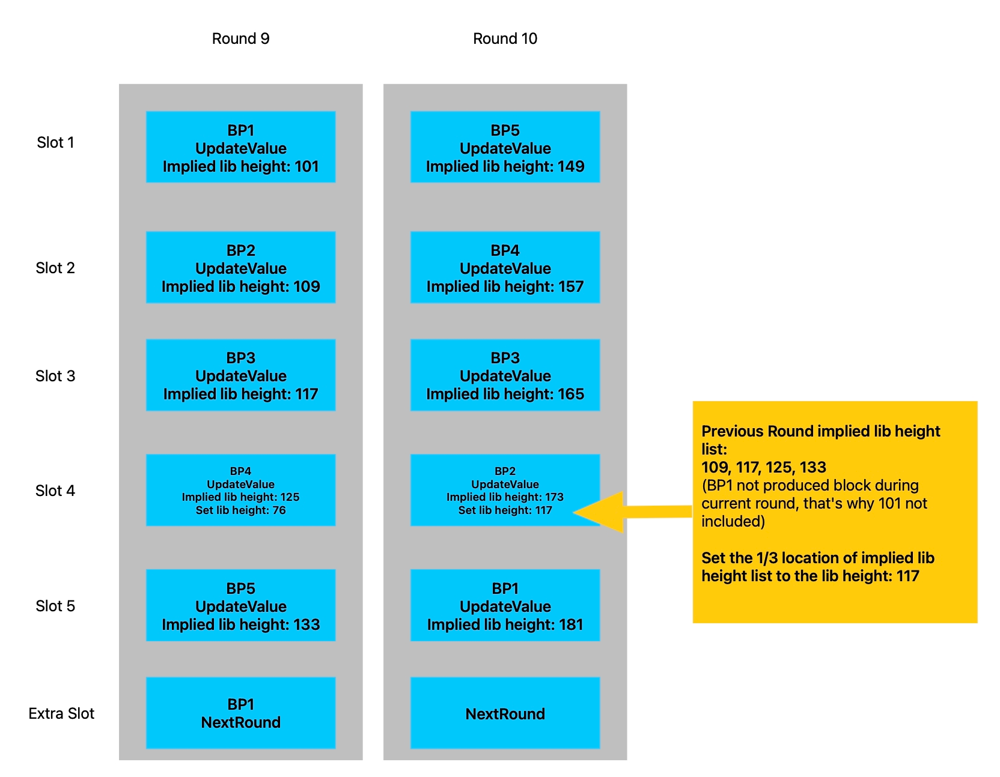

# Consensus Contract

## Overview

Among numerous consensus contracts, AElf has chosen DPoS consensus, 
which means that aelf's blocks will be packaged and broadcasted by a specific subset of nodes, 
which need to be determined through elections.

The introduction to the election section will be presented in another article.

In this article, we will discuss:

- Problems solved by blockchain consensus mechanism
- How AEDPoS Contract implemented
- What is the Last Irreversible Block
- Consensus scheduling in aelf nodes

## Problems solved by blockchain consensus mechanism

Briefly, the blockchain consensus module answers five questions:
1. When will a blockchain node produce blocks?
2. What information should be added to the block header for nodes that can produce blocks?
3. What transactions should be added to the block by nodes that can produce blocks?
4. When a node receives a block, 
what consensus information in the block header can be considered compliant?
5. When a node receives a block and the transactions in the block are executed, 
what kind of compliance should the state of the consensus contract change to?
   
## How AEDPoS Contract implemented

The five questions raised in the previous section are all answered by AEDPoS Contract via implementing interfaces defined in [acs4](https://docs.aelf.io/en/latest/reference/acs/acs4.html).

### GetConsensusCommand

The GetConsensusCommand interface is used to obtain information such as the time of the next production block for a public key.

In the implementation of AEDPoS, the input is only a public key, and the calling time of the interface implementation method is also used as a reference (which is actually an important input). 
In the AElf blockchain, when the system calls a read-only transaction internally, the context of contract execution is self-constructed. The calling time is generated by `DateTime.UtcNow` in C #'s built-in function library, 
which is then converted into the timestamp data type `Timestamp` provided by protobuf and passed into the context of contract execution.

```protobuf
rpc GetConsensusCommand (google.protobuf.BytesValue) returns (ConsensusCommand) {
    option (aelf.is_view) = true;
}

// ...

message ConsensusCommand {
    // Time limit of mining next block.
    int32 limit_milliseconds_of_mining_block = 1;
    // Context of Hint is diverse according to the consensus protocol we choose, so we use bytes.
    bytes hint = 2;
    // The time of arrange mining.
    google.protobuf.Timestamp arranged_mining_time = 3;
    // The expiration time of mining.
    google.protobuf.Timestamp mining_due_time = 4;
}
```

In fact, regardless of whether the transaction to be executed is a read-only transaction, the timestamp passed in by the current contract execution context can be obtained through Context. 
CurrentBlockTime in the contract code.

This section mainly explains how AEDPoS consensus implements GetConsensusCommand. 
Before that, I will briefly introduce the process of AEDPoS to readers who do not understand AElf consensus.
Or you can refer to [consensus protocol](../../protocol/consensus.md) to get more information.

#### AEDPoS Process

Assuming that the aelf main chain now elects 17 nodes through voting, we will call them BPs (Block Producers).

These BPs are obtained by directly selecting the top 17 candidates at a certain block height (or time point) through a national election. 
Each time the top 17 candidates are recounted and the BPs are reappointed, it is called a **Term**.

In each session, all BPs produce blocks in rounds. Each round has 17 + 1 time slots, and each BP randomly occupies one of the first 17 time slots. The last time slot is produced by the producer of the extra block in this round. The producer of the extra block will initialize the information of the next round based on the random number published by each BP in this round. After 18 time slots, the next round begins. This cycle continues.

The data structure of Round is as follows:

```protobuf
message Round {
    // The round number.
    int64 round_number = 1;
    // Current miner information, miner public key -> miner information.
    map<string, MinerInRound> real_time_miners_information = 2;
    // The round number on the main chain
    int64 main_chain_miners_round_number = 3;
    // The time from chain start to current round (seconds).
    int64 blockchain_age = 4;
    // The miner public key that produced the extra block in the previous round.
    string extra_block_producer_of_previous_round = 5;
    // The current term number.
    int64 term_number = 6;
    // The height of the confirmed irreversible block.
    int64 confirmed_irreversible_block_height = 7;
    // The round number of the confirmed irreversible block.
    int64 confirmed_irreversible_block_round_number = 8;
    // Is miner list different from the the miner list in the previous round.
    bool is_miner_list_just_changed = 9;
    // The round id, calculated by summing block producers’ expecting time (second).
    int64 round_id_for_validation = 10;
}

message MinerInRound {
    // The order of the miner producing block.
    int32 order = 1;
    // Is extra block producer in the current round.
    bool is_extra_block_producer = 2;
    // Generated by secret sharing and used for validation between miner.
    aelf.Hash in_value = 3;
    // Calculated from current in value.
    aelf.Hash out_value = 4;
    // Calculated from current in value and signatures of previous round.
    aelf.Hash signature = 5;
    // The expected mining time.
    google.protobuf.Timestamp expected_mining_time = 6;
    // The amount of produced blocks.
    int64 produced_blocks = 7;
    // The amount of missed time slots.
    int64 missed_time_slots = 8;
    // The public key of this miner.
    string pubkey = 9;
    // The InValue of the previous round.
    aelf.Hash previous_in_value = 10;
    // The supposed order of mining for the next round.
    int32 supposed_order_of_next_round = 11;
    // The final order of mining for the next round.
    int32 final_order_of_next_round = 12;
    // The actual mining time, miners must fill actual mining time when they do the mining.
    repeated google.protobuf.Timestamp actual_mining_times = 13;
    // The encrypted pieces of InValue.
    map<string, bytes> encrypted_pieces = 14;
    // The decrypted pieces of InValue.
    map<string, bytes> decrypted_pieces = 15;
    // The amount of produced tiny blocks.
    int64 produced_tiny_blocks = 16;
    // The irreversible block height that current miner recorded.
    int64 implied_irreversible_block_height = 17;
}
```

In the AEDPoS contract, there is a map structure, the key is a long type of RoundNumber, which is incremented from 1, and the value is the above-mentioned Round structure. 
Each block generated by BP will update the information of the current or next round to promote consensus and block production, 
and provide a basic basis for consensus verification.

#### Consensus Command
```protobuf
message ConsensusCommand {
    // Time limit of mining next block.
    int32 limit_milliseconds_of_mining_block = 1;
    // Context of Hint is diverse according to the consensus protocol we choose, so we use bytes.
    bytes hint = 2;
    // The time of arrange mining.
    google.protobuf.Timestamp arranged_mining_time = 3;
    // The expiration time of mining.
    google.protobuf.Timestamp mining_due_time = 4;
}
```

In the implementation of AEDPoS consensus, the Hint field provides a clear path for BP to produce the next type of block.
We provide a dedicated data structure for Hint, AElfConsensusHint.

```protobuf
message AElfConsensusHint {
    // The behaviour of consensus.
    AElfConsensusBehaviour behaviour = 1;
    // The round id.
    int64 round_id = 2;
    // The previous round id.
    int64 previous_round_id = 3;
}
```

The block type is included in the following AElfConsensusBehaviour:

```protobuf
enum AElfConsensusBehaviour {
    UPDATE_VALUE = 0;
    NEXT_ROUND = 1;
    NEXT_TERM = 2;
    NOTHING = 3;
    TINY_BLOCK = 4;
}
```

**UpdateValue** and **UpdateValue(WithoutPreviousInValue)** represents that the BP wants to produce an ordinary block in a certain round (understood in conjunction with the consensus module in the aelf white paper or the aelf system introduction). 

In these two behaviors, the consensus information that the BP focuses on updating includes the `in_value` (`previous_in_value`) of its previous round, the out_value generated in this round, and the password fragments of the in_value used to generate out_value in this round. 

(The BP will encrypt 16 password fragments with the public keys of in_value and other BPs, and other BPs can only decrypt them with their own private keys. When the decrypted fragments reach a certain number, the original in_value will be revealed. This is an application of shamir's secret sharing.) 

In addition, a timestamp that actually triggers block production behavior is added to the `actual_mining_times`. UpdateValueWithoutPreviousInValue The only difference between UpdateValue and the BP is that there is no need to publish the in_value (previous_in_value) of the previous round, because the current round is the first round or has just changed (and the BP is a

**NextRound** represents that the BP is an additional block producer for this round (or remedier - when the designated additional block producer is absent), and needs to initialize the next round of information. 
The next round of information includes the time slot arrangement of each BP and the additional block producer specified according to the rules for the next round.

**NextTerm** is similar to **NextRound**, except that it will recount the top 17 candidates in the election and initialize the next round of information based on the new BP.

**Nothing** is when found that the input public key is not a BP.

**TinyBlock** represents that the BP has just updated the consensus information, but its time slot has not yet passed, and it still has time to produce a few additional blocks. Currently, each time slot can produce up to 8 small blocks. The benefit of this is to improve the efficiency of block verification (eos does the same).

There is a time slot issue that needs special attention. Since AEDPoS chooses to generate the first round of consensus information (i.e. the time slots of all initial BPs) in the genesis block, 
and the genesis block should be completely consistent for each node, the consensus information of the first round has to be assigned to a unified time (otherwise the hash value of the genesis block will be inconsistent): 
now this time is 0:00 in 1970. This will cause the time slot of the first round to be extremely inaccurate, so special treatment will be done when obtaining the `ConsensusCommand` of the first round. 

#### GetConsensusBehaviour

In the AEDPoS Contract, in order for the `GetConsensusCommand` method to return ConsensusCommand, the AElfConsensusBehaviour will be obtained based on the input public key and call time. 
Then, the AElfConsensusBehaviour will be used to determine the next block time and other information.

The following figure briefly illustrates the implementation of this method, but lacks some details.
You can combine it with the code for more details if interested.


##### GetConsensusCommand - UpdateValue(WithoutPreviousInValue)

`AElfConsensusBehaviour.UpdateValueWithoutPreviousInValue`'s main function is to implement the [Commitment Scheme](https://en.wikipedia.org/wiki/Commitment_scheme), 
which only includes one _commit phase_ and does not include the _reveal phase_. 
The corresponding stage of the consensus mining process is the first round of each session 
(including the first session, which is when the chain just started), and BP tries to generate the first block of this round.

If it is currently in the first **Round** of the first **Term**, it is necessary to obtain 
the order of provided pubkey from `Round.real_time_miners_information`.
And the expected mining time will be `order * mining_interval` seconds later.
The `mining_interval` is 4000 milliseconds by default.

Otherwise, the `expected_mining_time` is read directly from the Round information, and ConsensusCommand is returned based on this.

##### GetConsensusCommand - UpdateValue

`AElfConsensusBehaviour.UpdateValue` consists of a _reveal phase_ in the Commitment Scheme and a new _commit phase_. 
The phase corresponding to the consensus mining process is the second round of each session and beyond, and BP attempts to generate the first block of this round.

Directly read the current round information in the BP pubkey corresponding to the `expected_mining_time` field.

##### GetConsensusCommand - NextRound

`AElfConsensusBehaviour.NextRound` will generate the order and corresponding time slots of each BP in the next round according to the information published by each BP in this round, 
and advance the RoundNumber by one number.

For the BP designated as the extra block producer in this round, 
the extra block generation time slot of this round can be directly read.

Otherwise, in order to prevent the designated additional block producer from dropping or producing blocks on another fork (which may occur in the case of network instability), 
all other BPs will also receive a different time slot for producing additional blocks. 
These BPs will immediately reset their schedulers after synchronizing to any additional block produced by a BP, so there is no need to worry about conflicts.

For the first round of special treatment with `AElfConsensusBehaviour.UpdateValue (WithoutPreviousInValue)`.

##### GetConsensusCommand - NextTerm

`AElfConsensusBehaviour.NextTerm` will re-select 17 BPs based on the current election results to generate information for the first round of the new term. 

The information is the quite similar to `AElfConsensusBehaviour.NextRound` in the first round of the first term.

##### GetConsensusCommand - TinyBlock

`AElfConsensusBehaviour.TinyBlock` occurs in two scenarios:
1. The current BP is the producer of additional blocks from the previous round. 
After producing blocks containing one NextRound transaction, it needs to continue producing up to 7 blocks in the same time slot.
2. BP has just produced blocks containing UpdateValue transactions and needs to continue producing up to 7 blocks in the same time slot.

The basic judgment logic is that if the current BP is a block containing UpdateValue transactions that have been produced in this round, 
that is, case 2, combined with the current BP being the producer of additional blocks in the previous round, a time slot with a length of 4000ms is cut into 8 smaller time slots of 500ms for allocation; 
otherwise, for the above case 1, a reasonable smaller time slot is directly allocated based on the number of small blocks that have been produced.

#### GetConsensusExtraData

Consensus Extra Data is stored in the ExtraData field in the Block Header. 
This field is used to store information that various parts of the aelf system can use to assist in completing block verification. 
Consensus Extra Data is the data used to assist in completing consensus information verification. 
Because it is stored in the block header, it is used to help all nodes receiving the block **quickly verify** the consensus information before executing transactions in the block. 
If the consensus information contained in the block header is incorrect, then the transaction in this block does not need to be executed and can be discarded directly.

In the process of producing blocks, BP obtains the Consensus Extra Data to be set in the block header through the `GetConsensusExtraData` method of the AEDPoS contract.

The parameter of this method is a binary array. 
Different consensus mechanisms can customize their own parameter types and deserialize them in the method implementation. 
As for the AEDPoS implementation, the parameter is a `AElfConsensusTriggerInformation` structure.

```protobuf
message AElfConsensusTriggerInformation {
    // The miner public key.
    bytes pubkey = 1;
    // The InValue for current round.
    aelf.Hash in_value = 2;
    // The InValue for previous round.
    aelf.Hash previous_in_value = 3;
    // The behaviour of consensus.
    AElfConsensusBehaviour behaviour = 4;
    // The encrypted pieces of InValue.
    map<string, bytes> encrypted_pieces = 5;
    // The decrypted pieces of InValue.
    map<string, bytes> decrypted_pieces = 6;
    // The revealed InValues.
    map<string, aelf.Hash> revealed_in_values = 7;
}
```

In the AEDPoS implementation, the return value is a `AElfConsensusHeaderInformation` structure:

```protobuf
message AElfConsensusHeaderInformation {
    // The sender public key.
    bytes sender_pubkey = 1;
    // The round information.
    Round round = 2;
    // The behaviour of consensus.
    AElfConsensusBehaviour behaviour = 3;
}
```

The acquisition of Consensus Extra Data is first based on the `AElfConsensusTriggerInformation` behaviour field, and different consensus behaviors will generate different block header information.

For example, in `UpdateValue`, the `InValue` of the previous round will be made public, and the `OutValue` of this round will be announced; 
in `TinyBlock`, the number of small blocks corresponding to BP in the Round information of this round will only be increased by one; 
in `NextRound` and `NextTerm`, new Round information will be generated, the difference is that the latter will retrieve the MinerList (Election Contract's `TryToGetVictories` method).

Finally, in order to prevent the returned `AElfConsensusHeaderInformation` instance from being too large, the data related to `SecretSharing` will be deleted, and this part of the data does not need to be included in the block header for verification.

#### GenerateConsensusTransactions

This method is used to assist BP in generating Consensus System Transactions to be included in newly produced blocks.

The imported parameter is `GetConsensusExtraData` and `AElfConsensusTriggerInformation`, which have already discussed before.

The return value is `TransactionList`.

```protobuf
message TransactionList {
    // Consensus system transactions.
    repeated aelf.Transaction transactions = 1;
}
```

`UpdateValue`, `TinyBlock`, `NextRound`, `NextTerm` transactions are generated depending on the behaviour.

After these transactions are executed, the consensus data in StateDb, such as Round structure data, will be modified.

At the same time, these transactions will be prioritized as system transactions and packaged into the upcoming blocks.

### ValidateConsensusBeforeExecution

This method is used to verify whether the Consensus Extra Data in BlockHeader is correct.
- The imported parameter is parsed into AElfConsensusHeaderInformation structure: extraData.
- Take the consensus information of the current round in StateDb: baseRound;
- Before verification, fill the baseRound with Round information from extraData.
- Construct validation context structure ConsensusValidationContext;
- Do three basic verifications:
    - **MiningPermissionValidationProvider**: Is Sender in the Miner List?
    - **TimeSlotValidationProvider**: The current time is not in the time slot of Sender (get the time slot according to Round information);
    - **ContinuousBlocksValidationProvider**: To place a BP generate too many consecutive blocks at once (no more than 8).
- Add validation based on consensus behavior:
    - UpdateValue：
        - **UpdateValueValidationProvider**: Verify Out Value and Previous In Value information;
        - **LibInformationValidationProvider**: Verify whether the lib information is correct.
    - NextRound：
        - **NextRoundMiningOrderValidationProvider**: Verify whether the BP block sequence in the newly generated round is correct;
        - **RoundTerminateValidationProvider**: Whether the newly generated Round information is correct;
    - NextTerm：
        - **RoundTerminateValidationProvider**: whether the newly generated Round information is correct.

#### ValidateConsensusAfterExecution

This method is used to verify whether the execution result is consistent with Consensus Extra Data after the execution of the consensus system transaction (that is, the transaction generated by the `GenerateConsensusTransactions` method).

We will also check if the information in this round has been modified. 
If it has been modified, whether the modification is appropriate. 
(For example, if there is a BP replacement in this round, there will be modifications. At this time, we will verify whether the replacement result is correct.)


## Last Irreversible Block

### Definition of LIB

Irreversible block:

In any blockchain, the newly generated block has the possibility of being reversed. 
A new block needs to undergo a certain amount of confirmation, that is, some subsequent blocks are generated on the blockchain to ensure that it is valid and that other network participants have agreed on the validity of the block. 
Once a block has been confirmed enough, it is considered irreversible, that is, it is impossible to change or revoke the transaction content.

The consensus mechanism of aelf will select a past block as the latest irreversible block (Last Irreversable Block) through double confirmation. 
The information of this block will be recorded in the Chain structure in ChainDb.

That is, two properties in the `Chain` data structure: `last_irreversible_block_hash` and `last_irreversible_block_height`.

```protobuf
{
  "ChainId": "tDVV",
  "Branches": {
    "21a6058fe1419042c6a9f780734fab175694052f966667b992a151af5d65d751": 17122469
  },
  "NotLinkedBlocks": {},
  "LongestChainHeight": 17122469,
  "LongestChainHash": "21a6058fe1419042c6a9f780734fab175694052f966667b992a151af5d65d751",
  "GenesisBlockHash": "564892c8e1cddfb2ddd27e06992324f16fc833e5152bfd95e01b0f4971677131",
  "GenesisContractAddress": "2dtnkWDyJJXeDRcREhKSZHrYdDGMbn3eus5KYpXonfoTygFHZm",
  "LastIrreversibleBlockHash": "a5678d99ccda03b861d1c63fde7ce27ec484c74f1cc349119e08ac86b3ac5aea",
  "LastIrreversibleBlockHeight": 17122160,
  "BestChainHash": "21a6058fe1419042c6a9f780734fab175694052f966667b992a151af5d65d751",
  "BestChainHeight": 17122469
}
```

### Generation of LIB

During the block production process, BP hints at the current height as LIB by observing the filling status of the time slots in the last two rounds. 
If the filling status of the time slots is ideal, the height of the last block (`UpdateValue`) will be hinted at when the BP block is produced.

- If in a time slot, the corresponding BP has produced at least one block, we say that the time slot has been filled.

When the progress of this round exceeds 2/3, on the premise that the number of hints is sufficient, 
take one-third of the position of the LIB implied by the previous round and this round have all produced blocks, 
and set it to the latest LIB.

BPs will attempt to set up LIB during the execution of `UpdateValue` transactions.

AElf node will start the process of setting LIB after the AEDPoS Contract throws the event `IrreversibleBlockFound`.

The confirmation of LIB means that the block of aelf blockchain has got the manuscript ready. 
Blocks before the height of LIB (< LIB height) are irreversible blocks.

### Calculation of LIB

Assuming that current aelf network has 5 bps.

In Round 9:
- BP1 produced block from 101 (UpdateValue) to 108
  - implies that the LIB height is 101
- BP2 produced block from 109 (UpdateValue) to 116
  - implies that the LIB height is 109
- BP3 produced block from 117 (UpdateValue) to 124
  - implies that the LIB height is 117
- BP4 produced block from 125 (UpdateValue) to 132
  - implies that the LIB height is 125 - assuming the LIB height is set to 84
- BP5 produced block from 133 (UpdateValue) to 140
  - implies that the LIB height is 133
- BP1 as the EBP, produced block from 141(NextRound) to 148
  - not implies LIB height

In Round 10:
- BP5 produced block from 149 (UpdateValue) to 156 
- implies that the LIB height is 149
- BP4 produced block from 157 (UpdateValue) to 164
  - implies that the LIB height is 157
- BP3 produced block from 165 (UpdateValue) to 172
  - implies that the LIB height is 165
- BP2 produced block from 173 (UpdateValue) to 180
  - implies that the LIB height is 173 (the progress of this round is more than 2/3)

  - It will be carried out in the 197th block.
    - The nodes that have produced blocks in this round are BP2, BP3, BP4, BP5. The height implied in the previous round was 109,117,125,133. 
    - The nodes that have produced blocks in this round + the previous round are (BP2, BP3, BP4, BP5) 4 > = BP quantity (5) * 2/3 + 1 == > returns LIBHeight = 117

    - Node throws log:
> Finished calculation of lib height: 117
New lib height: 117

Throw event: `IrreversibleBlockFound`, trigger IrreversibleBlockFoundLogEventProcessor
Modify `last_irreversible_block_hash` and `last_irreversible_block_height` data in Chain


- BP1 produced block from 181 (UpdateValue) to 188
  - implies that the LIB height is 181
- BP5 as the EBP, produced block from 189(NextRound) to 196



Block confirmation time:

- Height 85 After the block is produced, it is set to an irreversible block at height 173, 89 blocks, which takes about 44.5 seconds
- Height 117 is set as an irreversible block after block production to height 173, 67 blocks, which takes about 33.5 seconds

## AElf Consensus Schedule

### Trigger of consensus mechanism

Trigger consensus mechanism means call `GetConsensusCommand` method to get next mining information and set a related event that will be executed in the future.
There are a total of **four** types of logic that trigger the consensus mechanism. 

Multiple effective triggering of consensus will not cause bugs: 
for example, after completing one trigger, the consensus module informs the aelf BP node that blocks can be produced after 10s (via `GetConsensusCommand` method), 
and triggers again after 2s. 
The consensus module will inform the node that blocks can be produced after 8s and reset the time scheduler. 
If triggered again after 4s, the consensus may inform the node that blocks can be produced after 20s, 
which is possible in the current implementation (occurring in the complement logic of the extra time slot).

This section will list all four types of logic of triggering consensus schedule.

#### Trigger consensus mechanism when node starts

Code: `BlockchainNodeContextService.StartAsync`.

During the startup of the aelf node, the presence of the consensus module appears after confirming that there is a Chain-type data in the local ChainDb.

Before this, the node probes whether the Chain structure can be obtained in ChainDb. 
If it can, roll back to lib and start synchronizing blocks based on lib. If not, it means that ChainDb was empty before. At this point, the node's mission is to construct a Genesis block based on the AElf. Blockchains. * project they choose, and then initialize the Chain structure and put it into ChainDb.

#### Trigger consensus mechanism after completing block synchronization

Code: `FullBlockchainService.SetBestChain`.

1. The node receives a block from the network, completes verification, execution, and re-verification, and the block is about to be confirmed and synchronized locally. 
At this time, it attempts to set the BestChain information to the Chain structure.
Then trigger the consensus mechanism.
   - For example: GrpcServerService.BlockBroadcastStream -> BlockReceivedEvent -> BlockReceivedEventHandler.HandleEventAsync -> BlockSyncService.SyncByBlockAsync -> EnqueueAttachBlockJob -> BlockSyncAttachService.AttachBlockWithTransactionsAsync, put the logic of validating block to the UpdateChainQueue -> BlockAttachService.AttachBlockAsync -> BlockExecutionResultProcessingService.ProcessBlockExecutionResultAsync -> FullBlockchainService.SetBestChain
2. The node has produced a block by itself, but still needs to complete verification, execution, and re-verification before it can be synchronized to the local.
   - For example: ConsensusService.- > ConsensusRequestMiningEventData - > ConsensusRequestMiningEventHandler. HandleEventAsync - > After generating the block (whether successful or failed)

#### Re-trigger the consensus mechanism after an exception occurs during the block generation process

Code: `ConsensusRequestMiningEventHandler.HandleEventAsync`.

If somehow failed to generate block, aelf node will try to trigger consensus mechanism again.

#### Re-trigger consensus mechanism after consensus verification fails

Code:
- `ConsensusService.ValidateConsensusBeforeExecutionAsync`
- `ConsensusService.ValidateConsensusAfterExecutionAsync`

If the consensus information verification fails, aelf node will try to trigger consensus mechanism again.

### Time scheduling for block production

There are currently two implementations of time scheduling (implementing the `IConsensusScheduler` interface), **Rx.Net** and **FluentScheduler**.

The aelf MainNet now is using the Rx.Net implementation.

The `IConsensusScheduler` interface provides two methods:
- `NewEvent`, with countdown milliseconds and a structure containing the instructions needed for block generation: `ConsensusRequestMiningEventData`
- `CancelCurrentEvent`, used to cancel the block production task that is currently in countdown.

Calling `NewEvent` will mount a timed task for producing blocks and enter the countdown.
When the countdown is complete, a `ConsensusRequestMiningEventData` event is published for `ConsensusRequestMiningEventHandler` to handle.