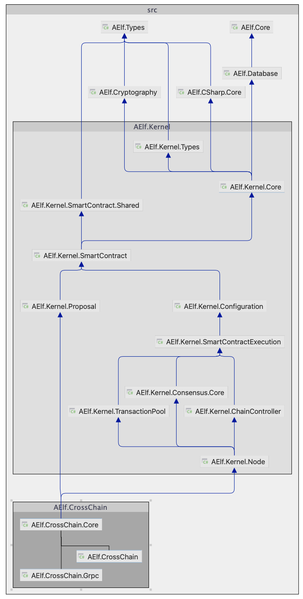
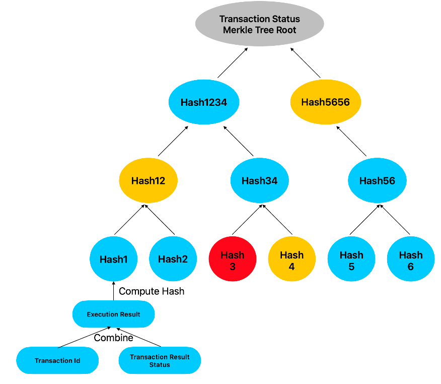
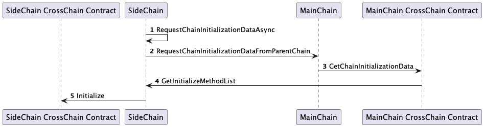
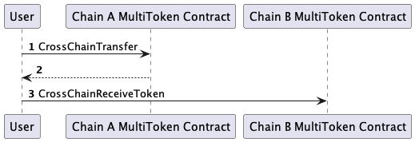

# CrossChain Contract

## Overview

Unlike other blockchain ecosystem, aelf blockchain has a built-in cross chain mechanism.

We have designed a structure of **MainChain**-**SideChains**, where a MainChain can have multiple SideChains.
The MainChain can act as a data center, regularly indexing the cross chain information generated by its SideChains, 
and then submitting the cross chain information of any SideChain to all other SideChains. 

This way, not only can cross chain interaction occur between the MainChain and its SideChains, but also between its SideChains with the help of the MainChain.

In addition, each SideChain can also serve as the MainChain, serving as the data center for the next level of SideChains.

In this article, we will discuss:

- Modules for implementing cross chain mechanism
- Cross chain mechanism technical foundation
- The process of initializing a SideChain
- The process of cross chain token transfer
- Merkle Path generation

## Modules for implementing cross chain mechanism

Cross chain mechanism on aelf is a very independent module, 
and there was a requirement in the initial design: 
assuming that aelf nodes are unaware of their ability of cross-chain indexing and verification. 
The structuring of aelf code is better as a result, but it also increases the complexity of cross chain modules to some extent.



`AElf.CrossChain.Core` is responsible for the core implementation logic of the cross chain mechanism, including:

- New SideChain creation.
- Cross chain indexing.
- Cross chain indexing related transactions' generation.

In order to ensure that communication between the MainChain and SideChains does not affect communication between aelf nodes, 
we have specifically implemented a GRpc module for cross chain communication, that is `AElf.CrossChain.Grpc`.

In addition, we all know that the modification of blockchain status (StateDb) requires the execution of transactions. 
The interfaces for these transactions are defined in [acs7](https://docs.aelf.io/en/latest/reference/acs/acs7.html).

**CrossChain Contract**, which is the focus of this article's upcoming discussion, 
is responsible for implementing these interfaces.

## Cross chain mechanism technical foundation

As explained in [this](https://aelf-ean.readthedocs.io/en/latest/architecture/cross-chain/crosschain-verification.html) document, 
we use **Merkle Tree** to achieve cross chain validation.

Every piece of information that needs to be transmitted from the MainChain to SideChains, or from a SideChain to the MainChain and other SideChains, 
will serve as a leaf node and participate in building the Merkle Tree.

This transmission process is completed through the `AElf.CrossChain.Grpc` module mentioned above.
Which means that the MainChain node must be able to establish GRpc connections with all the SideChains nodes.
This is similar to the **Merged Mining**:
The nodes elected on the MainChain will also be responsible for block production on all SideChains.

In the implementation of the aelf cross chain mechanism, the leaf nodes of Merkle Tree are composed of two entities:

- TransactionId
- TransactionResultStatus

`TransactionId` is computed from a `Transaction` entity.
And `TransactionResultStatus` is an enum value, here's the definition:

```protobuf
enum TransactionResultStatus {
    // The execution result of the transaction does not exist.
    NOT_EXISTED = 0;
    // The transaction is in the transaction pool waiting to be packaged.
    PENDING = 1;
    // Transaction execution failed.
    FAILED = 2;
    // The transaction was successfully executed and successfully packaged into a block.
    MINED = 3;
    // When executed in parallel, there are conflicts with other transactions.
    CONFLICT = 4;
    // The transaction is waiting for validation.
    PENDING_VALIDATION = 5;
    // Transaction validation failed.
    NODE_VALIDATION_FAILED = 6;
}
```

Regardless of the execution result of a transaction, 
its related information will be condensed into the hash value calculated by these two data, 
which will be used as leaf nodes to construct the Merkle Tree.

Subsequently, the **Merkle Tree Root** will be transmitted to the SideChain or MainChain through the GRpc module.



Finally, on another chain,
**Merkle Path** can be used to verify that the information of a certain transaction exists and has been successfully executed by the user.

Taking the above image as an example, transactions are executed in the MainChain, the verification process happens in the SideChain.
The Merkle Path to validate the existence and successful execution of the transaction represented using `Hash3` is:
`[Hash3, Hash4, Hash12, Hash5656, Root]`.
(Hash3 = `Hash(TransactionId, TransactionResultStatus.Mined)`)

If the Merkle Path is successfully validated and the `Root` does exist within the SideChain CrossChain Contract, 
then the code following the validation logic can be executed in the SideChain.

## The process of initializing a SideChain



## The process of cross chain token transfer



