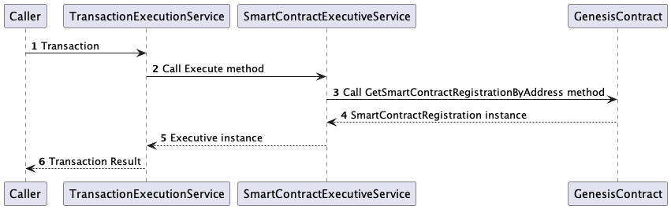
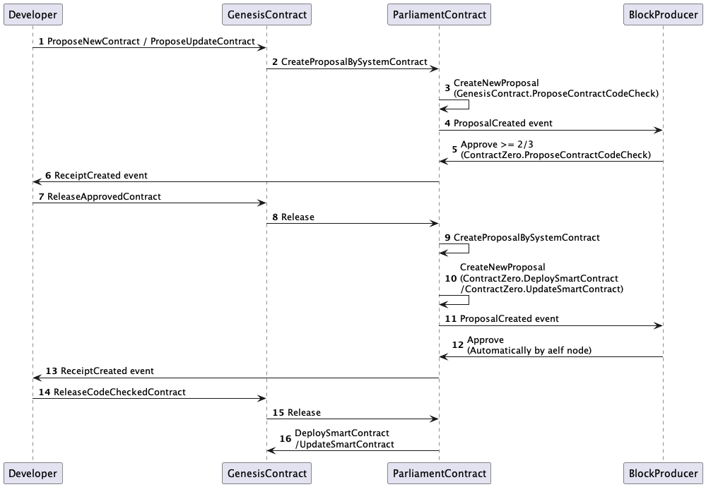
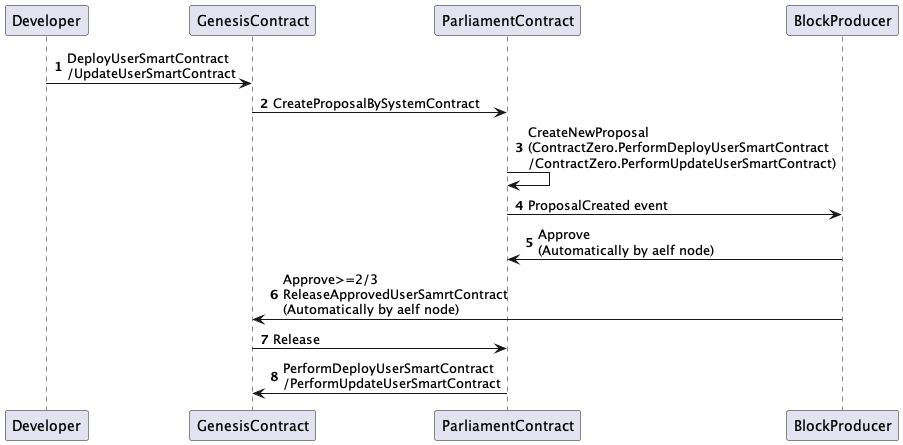

# Genesis Contract

## Overview

Genesis Contract, also known as the Zero Contract, is mainly used to deploy and maintain smart contracts running on the aelf blockchain.

This contract will be deployed first when aelf blockchain launched so that it can be used to deploy other smart contracts.

To achieve this purpose, the Genesis Contract implements the following methods defined in [acs0](https://docs.aelf.io/en/latest/reference/acs/acs0.html):

```protobuf
service ACS0 {
    // Deploy a system smart contract on chain and return the address of the system contract deployed.
    rpc DeploySystemSmartContract (SystemContractDeploymentInput) returns (aelf.Address) {
    }
    
    // Deploy a smart contract on chain and return the address of the contract deployed.
    rpc DeploySmartContract (ContractDeploymentInput) returns (aelf.Address) {
    }
    
    // Update a smart contract on chain.
    rpc UpdateSmartContract (ContractUpdateInput) returns (aelf.Address) {
    }
    
    // and others.
    // ...
}
```

Therefore, developers can deploy (and update) their own smart contracts by interacting with the Genesis Contract.

In this article, we will discuss:

- Implementation of deploy and update contracts
- How the contract will be loaded to the smart contract execution environment
- The current process of deploying and updating aelf smart contracts
- Other details of the Genesis Contract

## `SmartContractRegistration` and `ContractInfo`

There is a critical data structure defined in `aelf/core.proto`, called SmartContractRegistration:

```C#
message SmartContractRegistration {
    // The category of contract code(0: C#).
    sint32 category = 1;
    // The byte array of the contract code.
    bytes code = 2;
    // The hash of the contract code.
    Hash code_hash = 3;
    // Whether it is a system contract.
    bool is_system_contract = 4;
    // The version of the current contract.
    int32 version = 5;
    // The version of the contract.
    string contract_version = 6;
    // The address of the current contract.
    Address contract_address = 7;
    // Indicates if the contract is the user contract.
    bool is_user_contract = 8;
}
```
Smart Contract code is stored in the `code` field.

However, each `SmartContractRegistration` entity is not a one-to-one correspondence with the contract, and its storage structure is:

```C#
public MappedState<Hash, SmartContractRegistration> SmartContractRegistrations { get; set; }
```

The `SmartContractRegistration` entity can be fetched by the hash value of the contract code.
It is only written once when deploying the contract.

The data structure that corresponds one-to-one with contracts is called `ContractInfo`.
Structure `ContractInfo` is defined in [acs0](https://docs.aelf.io/en/latest/reference/acs/acs0.html).

```C#
message ContractInfo
{
    // The serial number of the contract.
    int64 serial_number = 1;
    // The author of the contract is the person who deployed the contract.
    aelf.Address author = 2;
    // The category of contract code(0: C#).
    sint32 category = 3;
    // The hash of the contract code.
    aelf.Hash code_hash = 4;
    // Whether it is a system contract.
    bool is_system_contract = 5;
    // The version of the current contract.
    int32 version = 6;
    string contract_version = 7;
    // Indicates if the contract is the user contract.
    bool is_user_contract = 8;
}
```

We use the MappedState to store related instances.

```C#
public MappedState<Address, ContractInfo> ContractInfos { get; set; }
```

From the `code_hash` field of `ContractInfo`, it is not difficult to guess:

1. When trying to retrieve the contract code, the `code_hash` of ContractInfo is first read, and then the contract code itself is read from the `State.SmartContractRegistrations` mapped state.
2. Upgrading a contract on aelf is replacing the `code_hash` of `ContractInfo`.

## Deploy and update contracts

To deploy a smart contract to aelf, developers need to interact with the `DeploySmartContract` or `DeployUserSmartContract` defined by [acs0](https://docs.aelf.io/en/latest/reference/acs/acs0.html) and implemented by the Genesis Contract.
The differences between these two methods will be explained later.

When executing the deployment method, the contract code will be stored in the StateDb through the structure we mentioned before: `SmartContractRegistration`.
More specifically, it is the `code` field.

If developer's smart contract is written by C#, the `category` should be `0`.
The execution environment will select which runtime to load the contract code into based on the `category` field.

And the `code_hash` is a unique identifier for the contract code.
For C# smart contract, the code hash is calculated by the Genesis Contract during deployment.

After the contract code is saved in StateDb, another field is used to store the relevant information of the contract.
The structure is also mentioned before:  `ContractInfo`.
There is a `code_hash` field defined in this structure, make it possible to use `GetContractInfo` method to get the contract information of provided contract address,
then use `GetSmartContractRegistrationByCodeHash` method to get contract code via contract code hash.
In addition, the contract code can also be obtained through method `GetSmartContractRegistrationByAddress`.

As for updating the contract code, the contract information (`ContractInfo`) can be directly modified through method `UpdateSmartContract`,
then aelf smart contract execution environment can obtain the new contract code via new contract hash from the Genesis Contract in the future.

## Execution of contract code

Although the execution process of the contract is unrelated to the Genesis Contract.
Developers may be concerned about how their contract code will be consumed in the future after deployment.
Therefore, here are some brief explanations.



As shown in the above figure, assuming that the contract code has been stored in the Genesis Contract.
When a caller tries to call a method of the contract, within the aelf node, the corresponding `SmartContractRegistration` will be obtained from the Genesis Contract, the contract code will be extracted, encapsulated as an Executive type, for the contract execution environment to call. 
After completing the call, return the transaction result to the caller.

Upgrading the contract will change the `SmartContractRegistration` obtained during the above process, so it is feasible to upgrade the deployed contract in aelf.

## Calculation of contract address

The contract address is calculated through a field that increases with the number of contract deployments.

```C#
public Int64State ContractSerialNumber { get; set; }
```

Its calculation process is located in the `DeploySmartContract` method:

```C#
var contractAddress = AddressHelper.BuildContractAddress(Context.ChainId, serialNumber);
```

- The contract address of each chain of aelf is different.
- The contract address is not related to the contract code, but only to the order in which it is deployed on this chain.
  - Therefore, when testing newly written contracts in `aelf-boilerplate` or `aelf-developer-tools`, the new contract always has a fixed address.

After the 1.6.0 version, Salt is added to the imported parameter of the deployment/upgrade contract. The contract address is calculated by using the Deployer address of the deployment account and the hash value Salt.

```C#
var contractAddress = AddressHelper.ComputeContractAddress(deployer, salt);
```

- Deploying contracts with the same account and using the same Salt can make the contract address of each chain of aelf the same.

## Contract deployment and update process

### Deploy contract with audit



The current pipeline starts with Propose, which generates a parliamentary proposal.
When more than 2/3 of the BPs agree to deploy/update, a new proposal is released to request code inspection.
Finally, after the code audition is passed, the real contract deployment/upgrade will be achieved through the proposal of releasing the code inspection.

### Deploy contract without audit



Developers send deployment/update user contract transactions, generate a parliamentary CodeCheck proposal, and when more than 2/3 of the BPs conduct code checks and pass, achieve real contract deployment/upgrade through the proposal of automatically releasing code checks.

### Contract deployment and upgrade new version number

When upgrading a contract, check the contract version information
- If the contract version is less than or equal to the original contract version, the upgrade contract transaction fails
  The old version of the contract only has a version number after being upgraded.
- If the version number is increasing, the upgrade contract transaction is successful.

In the updateSmartContract method, increase the version number judgment:

```C#
var contractInfo = Context.UpdateSmartContract(contractAddress, reg, null, info.ContractVersion);
Assert(contractInfo.IsSubsequentVersion,
    $"The version to be deployed is lower than the effective version({info.ContractVersion}), please correct the version number.");
```

## Contract error message

`DeployUserSmartContract` method:
- No permission. Trying to deploy a smart contract to an aelf private sidechain, and the transaction sender is not in the allowlist.
- contract code has already been deployed before. Contract code deployed.
- Already proposed. Duplicate deployment request.

`UpdateUserSmartContract` method:
- No permission. The transaction sender is not the contract author.
- Code is not changed. The contract code has not changed since deployment or the previous update.
- The version to be deployed is lower than the effective version({currentVersion}), please correct the version number. The updated contract version number is too low.
- Already proposed. Duplicate deployment request.

## Usage
Check the `deploy` command of [aelf-command](https://docs.aelf.io/en/latest/reference/cli/methods.html#deploy-deploy-a-smart-contract).