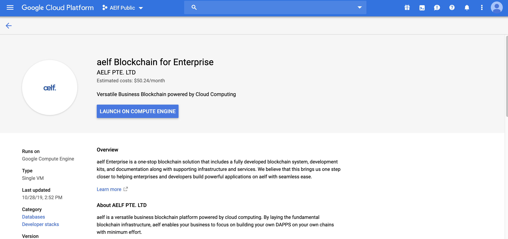
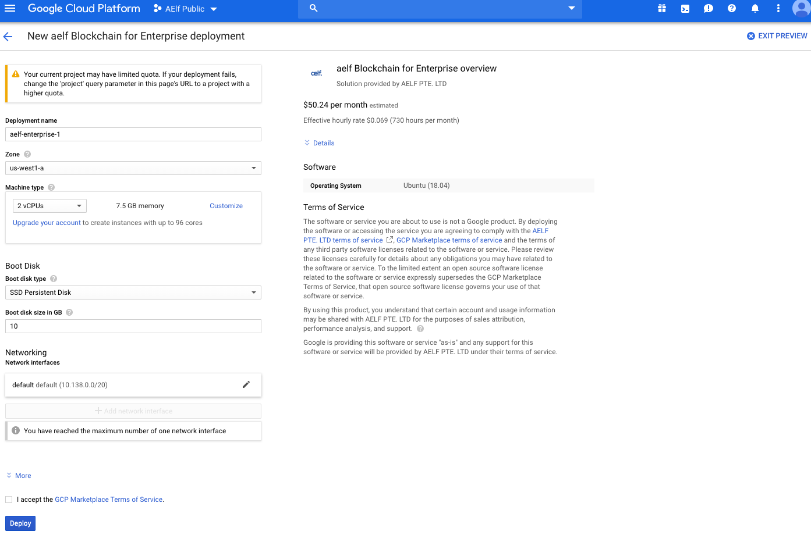
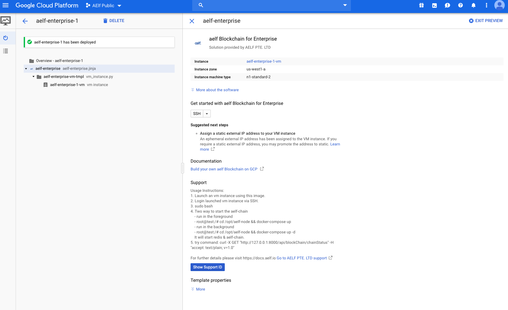
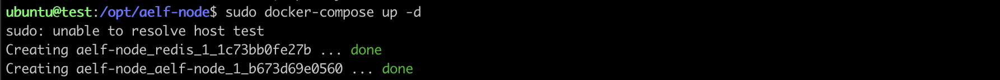

Getting started with Google cloud
=================================

This guide will run you through the steps required to run an AElf node
on Google cloud (click the images for a more detailed view).

First go to the [Google Cloud Market
Place](https://console.cloud.google.com/marketplace) and search for
"aelf blockchain for enterprise", find the image and select it, this
will direct you to the image's page.



Click on the "LAUNCH ON COMPUTE ENGINE". This should bring you to the
following deployment page:



You can keep the default settings, they are sufficient to get started.
If you're satisfied with the settings, just click "DEPLOY" (bottom left
of the page).

This will bring you to the deployment page (wait a short moment for the
instance to load), when finished you should see deployment information
about the instance:



Next, login to the launched VM instance via SSH. To start the easiest
way is to login to the instance directly from this deployment page. To
do this click the SSH drop down and select "Open in browser window":


After loading the session, you'll get a shell to the deployed instance
where you can run the chain itself.

First you'll need to execute `sudo bash` to elevate your privileges.
Next, start the chain with one of the following commands (for this
tutorial we'll use the second method): - either run it in the
foreground: -`bash root@test:/# cd /opt/aelf-node && docker-compose up`
- or run it in the background:
-`bash root@test:/# cd /opt/aelf-node && docker-compose up -d`

These commands will start redis and an AElf node (the command prints
'done' when finished).



Finally to verify that the node is correctly working, enter the
following command that will send an http request to the node in order to
get the current status of the chain:

``` bash
curl -X GET "http://127.0.0.1:8001/api/blockChain/chainStatus" -H "accept: text/plain; v=1.0"
```


If everything is working normally you should be able to see the chain
increase by repeating the last command.
