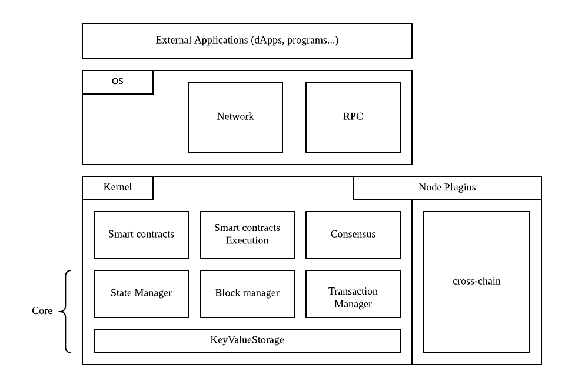

## Design principles:

The above diagram shows the conceptual structure of the node and the separation between OS and Kernel.

### OS

The OS layer implements the application and infrastructure layer for the network. It also implements the high level handlers for network events and job, like for example synchronizing the chain in reaction to a block announcement. The OS layer also contains the RPC implementation for the exposed API.

### Kernel

The kernel contains the smart contract and execution primitives and definitions. The kernel also defines the components necessary for accessing the blockchains data. Various managers will use the storage layer to access the underlying database.

The kernel also defines the notion of plugins. The diagram show that the side chain modules are implemented as plugins.

## Structure of the project:

To help follow AElf’s structure this section will present you with an overview of the solution.

Conceptually, AElf is built on two main layers: OS and Kernel. The OS contains the high level definition for a node and the endpoints like RPC and p2p, whereas the kernel mainly contains logic and definitions for smart contracts and consensus. 

AElf has a native runtime for smart contracts which is implemented in C# and for contracts written in C#. The implementation is the aelf.Runtime.Csharp.* projects.

A big part of AElf is the side chain framework. It is mainly implemented in the AElf.CrossChain namespace and defines the main abstractions in the **core** project and an implementation with grpc in the AElf.Crosschain.Grpc project.

The AElf.Test solution folder contains all the tests, coverage of the main functional aspects must be at a maximum to ensure the quality of our system.

Finally there are other projects that implement either libraries we use, like the crypto library and others for infrastructure like the database library, that are not as important but are still worth looking into. 

### Jobs and event handlers

Event handlers implement the logic that reacts to external in internal events. They are in a certain sense the higher levels of the application (they are called by the framework in purely domain agnostic way). An event handler, mostly using other services will influence the state of the chain.

### Modules

We currently base our architecture on modules that get wired together at runtime. Any new module must inherit **AElfModule**. 

Give the need to implement a new module, it usually follows the following steps:
1. Write the event handler or the job.
2. implement the interface and create manager or infrastructure layer interface that is needed.
3. implement the infrastructure layer interface in the same project in it do not need add dependency.
4. implement the infrastructure layer interface in another project, if it need third party dependency, for example, you can add GRPC / MongoDB / MySQL in the new project.

**Example**: the p2p network module.

The networking code is defined amongst 2 modules: **CoreOSAElfModule** and **GrpcNetworkModule**. The OS core defines the application service (used by other components of the node) and also implements it since it is application/domain logic. Whereas the infrastructure layer (like the server endpoint), is defined in the OS core modules but is implemented in another project that relies on a third party - gRPC in this case.

### Testing

When writing a new component, event handler, method...It’s important for AElf’s quality to consider the corresponding unit test. As said previously we have a solution-wide test folder where we place all the tests.