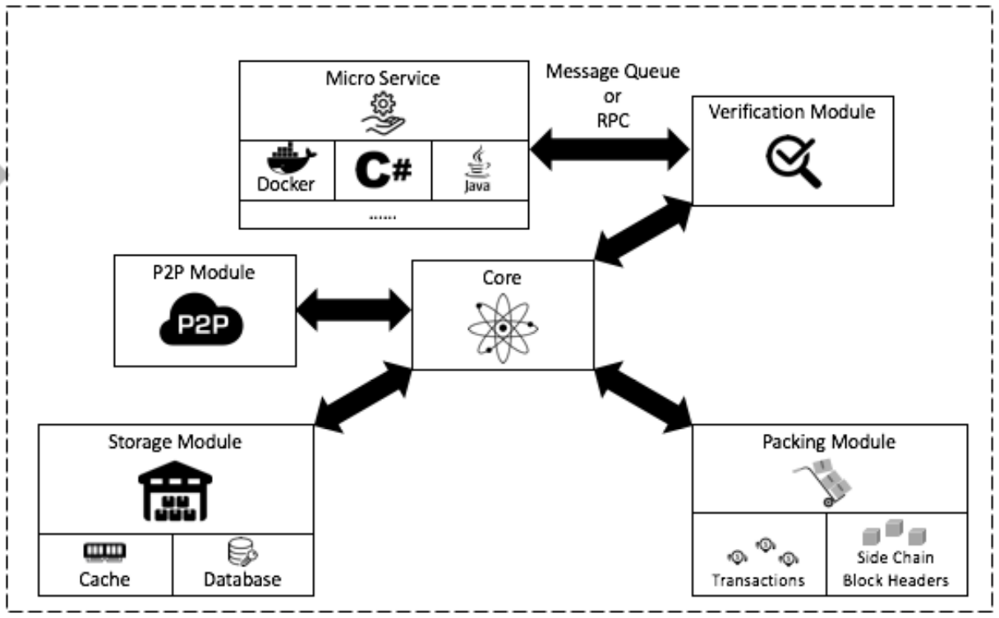

## Smart contract architecture

Smart contracts in AElf are spread across the Kernel, the runtim and the SDK. The kernel defines the fundamental components and infrastructure associated with smart contracts. It also defines the abstractions for execution. Smart contract also heavily rely on the runtime modules and the sdk project.

### Smart contract interactions

* bridge context and host
* contract and chain interactions
* executive
* smart contract context

### Runtime

### Sdk

Smart contracts, along with the blockchains data, form the heart of a blockchain system. They define through some predefined logic how and according to what rules the state of the blockchain is modified. 
A smart contract is a collection of methods that each act upon a certain set of state variables.

The logic contained in smart contracts is triggered by transactions. If a user of the blockchain wants to modify some state, he needs to build a transaction that will call a specific methods on some contract. When the transaction is included in a block and this block is executed, the modifications will be executed.

Smart contracts a part of what makes dApps possible. They implement part of the buisness layer: the part that gets included in the blockchain.

What follows in this section will give you a general overview of how AElf implements smart contracts. The other sections will walk you through different notions more specifically.

## Architecture overview

In AElf, Smart Contracts are defined like micro-services. This makes Smart Contracts independent of specific programming language. This implies for example that our Consensus Protocol essentially becomes a service, because it is defined through Smart Contract.

  

As showed in the diagram above, smart contracts functionality is defined within the kernel. The kernel defines the fundamental components and infrastructure associated with defining smart contracts as a service:
* SDK abstracts - high level entities that provide hook for smart contract services to interact with the chain.
* Execution - high level primitives defined for execution

### Chain interactions

Smart contract need to interact with the chain and have access to contexutal information. For this AElf defines a bridge and a bridge host. Usually the programming SDK corresponding to specific language will implement features to communicate with/through the bridge.

One of the major functionalities provided by the bridge is the ability to provide contextual information to the smart contract being executed. Here are a few:
* the **Self** field represents the address of the current contract being called.
* the **Sender** is the address that sent the transaction that executed the contract and **TransactionId** which is the ID of the transaction.

The bridge also exposes extra functionality:
* contracts can fire **Events** which are in a way similar to logging.
* contracts can call a method on another contract in a read-only manner. Any state change will not be persisted to the blockchain.
* send inline - this actually creates a transaction to call another method. As opposed to call the changes to the state - if any - will be persisted. 

#### State 

The main point of a smart contract is to read and/or modify state. The language SDKs implement state helpers and through the bridge's **StateProvider**. 

### Runtime and execution

When a block's transactions are executed, every transaction will generate a trace. Amongst other things, it contains:
* the return value of the called method, this can be anything defined in protobuf format and is deefined in the service definition.
* error outputs, if execution encountered a problem.
* the results from inner calls in **InlineTraces** field.
* the **Logs** field will contain the events launched from the called method.

### Sdk

AElf comes with a native C# SDK that give smart contract developpers the necessary tools to develop smart contracts in C#. It contains helpers to communcate with the bridge. By using the SDK you can also take advantage of the type infrastructure defined in the library:
* ContractState: an interface that is implemented by a classes that are destined to be containers for state field.
* MappedState: a base type that defines **collections** a key-value mapping, generic subclasses are available to enable multi-key scenarios.
* SingletonState: this defines **non-collection** types with a 

Any developer or company can develop an sdk and a runtime for a specific languages by creating an adapter to communicate with the bridge through gRPC.
