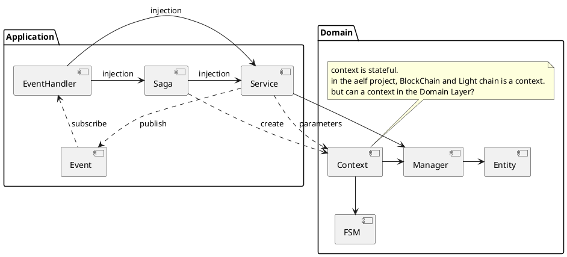
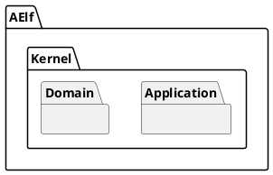

Hello

```puml
@startuml

package "Application" {
  [Service]
  [Event]
  [Saga]
  


  [Saga] -> [Service] : injection

  [EventHandler] <.. [Event] : subscribe

  [EventHandler] -> [Saga] : injection
  [EventHandler] -> [Service] : injection

  [Service] ..> [Event] : publish
}

package "Domain" {
  [Manager]
  [Context]

  [Entity]

  [FSM]


  [Saga] ..> [Context] : create
  [Service] ..> [Context] : parameters
  [Context] -down-> [FSM]
  [Context] -> [Manager] 


  [Service] -down-> [Manager]

  [Manager] -> [Entity]

note top of [Context]
  context is stateful.
  in the aelf project, BlockChain and Light chain is a context.
  but can a context in the Domain Layer?
end note
}


@enduml
```
AELF project

```puml
@startuml

package "AElf.Kernel.Application" {
}

package "AElf.Kernel.Domain" {
}


@enduml
```