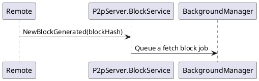
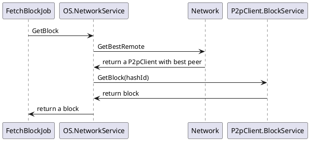
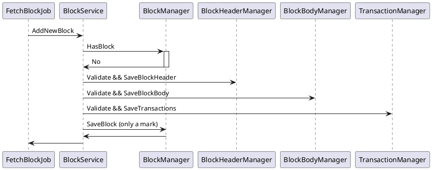

```puml
@startuml
Remote -> P2pServer.BlockService : NewBlockGenerated(blockHash)
P2pServer.BlockService  -> BackgroundManager : Queue a fetch block job
@enduml
```

```puml
@startuml

FetchBlockJob -> OS.NetworkService : GetBlock 

OS.NetworkService -> Network : GetBestRemote 

Network -> OS.NetworkService : return a P2pClient with best peer

OS.NetworkService -> P2pClient.BlockService : GetBlock(hashId)

P2pClient.BlockService -> OS.NetworkService : return block

OS.NetworkService -> FetchBlockJob : return a block

@enduml
```

```puml
@startuml

FetchBlockJob -> BlockService : AddNewBlock

BlockService -> BlockManager: HasBlock

    activate BlockManager

    BlockManager -> BlockService : No
    deactivate BlockManager

BlockService -> BlockHeaderManager : Validate && SaveBlockHeader

BlockService -> BlockBodyManager : Validate && SaveBlockBody

BlockService -> TransactionManager : Validate && SaveTransactions

BlockService -> BlockManager : SaveBlock (only a mark) 
BlockManager -> BlockService
BlockService -> FetchBlockJob
@enduml
```