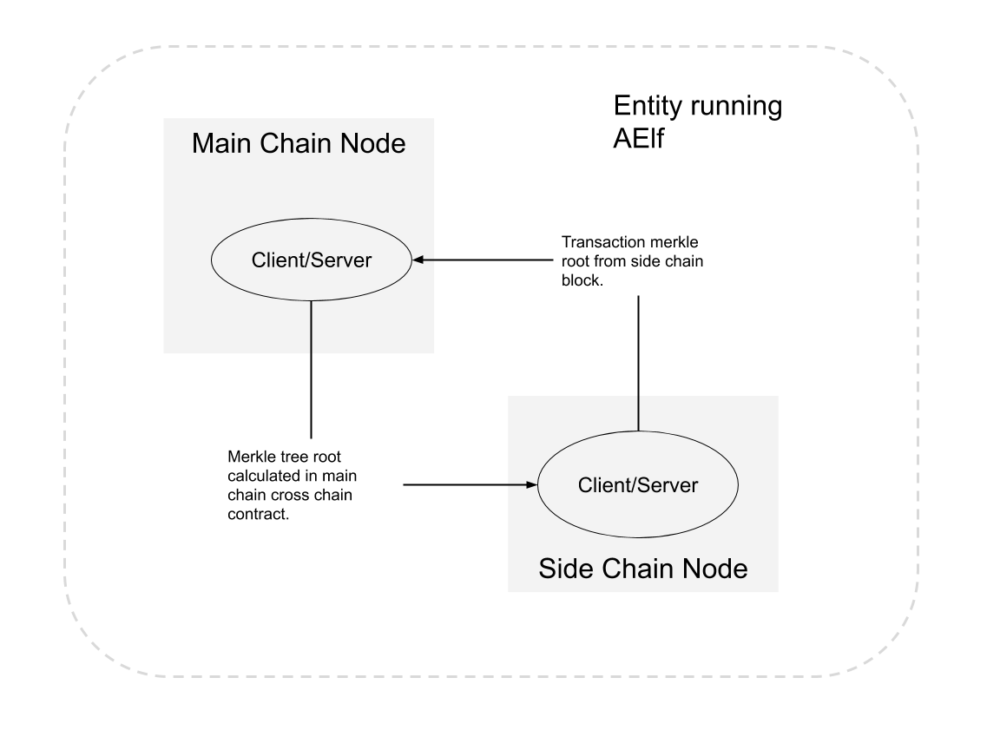
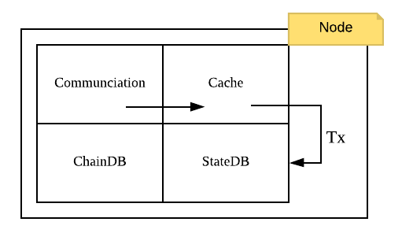

## Overview

Conceptually a side chain node and main chain node are similar, they are both independent blockchains, with their own peer-to-peer network and possibly their own ecosystem. It is even possible to have this setup on multiple levels. In terms of peer-to-peer networks, all side chains work in parallel to each other but they are linked to a main chain node through a cross-chain communication mechanism.

Through this link, messages are exchanged and indexing is performed to ensure that transactions from the mainchain or other side chains are verifiable in the side chain. Implementers can use AElf libraries and frameworks to build chains.

One important aspect is the key role that the main chain plays, because its main purpose is to index the side chains. Only the main chain indexes data about all the side chains. Side chains are independent and do not have knowledge about each other. This means that when they need to verify what happened in other chains, they need the main chain as a bridge to provide the cross chain verification information. 

## Node level architecture

In the current architecture, both the side chain node and the main chain node has one server and exactly one client. This is the base for AElfs two-way communication between main chain and side chains. Both the server and the client are implemented as a node plugins (a node has a collection of plugins). Interaction (listening and requesting) can start when both the nodes have started.

    

The diagram above illustrates two nodes run by an entity: one main chain node and one side chain node. Note that the nodes don't have to be in the same physical location. 

#### Side chain lifetime

Side chain lifetime involves the following steps.
1. Request side chain creation.
2. Wait for accept on main chain.
3. Start and initialize side chain and it will be indexed by main chain automatically.
4. It is allowed to do cross chain verification iff side chain is indexed correctly.

The next section describes what happens once the side chain node has been started.

#### Communication

1. It is going to request main chain node for chain initialization context when the side chain is first time started then initialized. 
2. After initialization the side chain is launched and handshake with main chain node to tell it is ready to be indexed.
3. During indexing process, the information of irreversible blocks will be exchanged between side chain and main chain. Main chain will write the final result in block which is calculated with the cross chain data from all side chains. Side chain is also recording the data in contract from main chain.

### Cache

For effective indexing, cache layer is used to store cross chain data received from remote nodes, and make it available and correct. Cross chain data is cached by chain id and  block height with a count limit. The cache layer can give the data if cached when the node needs. So cache layer decouples communication part and node running logic.

### Cross chain contract

Apart from the data in block, most cross chain data will be stored by cross chain contract. Cross chain data cached by the node is packed in transaction during mining process and calculated result is stored by the contract. Actually, the cross chain data in block is the result of calculation in this contract. Only with data in this contract can cross chain verification work correctly.

### Data flow
Conceptually the node is like described in the following diagram:

    

