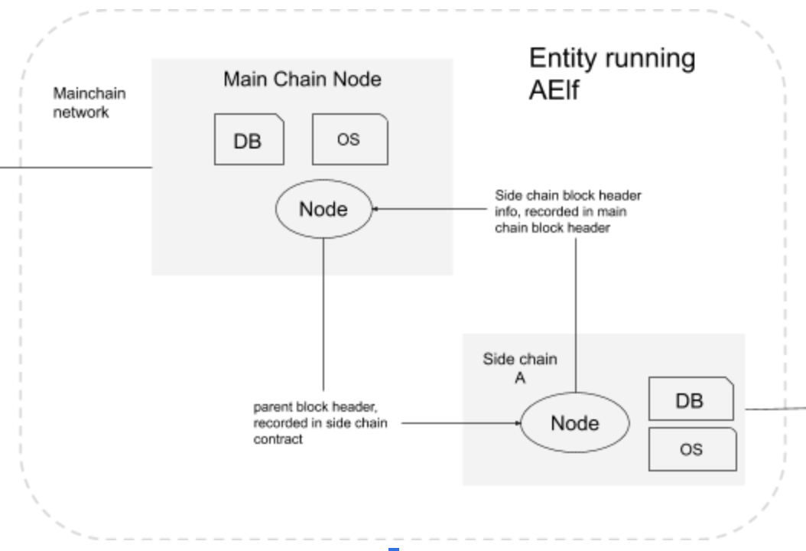

## Overview

Conceptually a side chain node and mainchain node are similar, they are both independent blockchains, with their own peer-to-peer network and possibly their own ecosystem. It is even possible to have this setup on multiple levels. In terms of peer-to-peer networks, all side chains work in parallel to each other but they are linked to a mainchain node through a cross-chain communication mechanism.

Through this link, messages are exchanged and indexing is performed to ensure that transactions from the mainchain or other side chains are verifiable in the sidechain. Implementers can use AElf libraries and frameworks to build chains.

One important aspect is the key role that the mainchain plays, because its main purpose is to index the side chains. Side chains are independent and do not have knowledge about each other. This means that when they need to verify information, they need the mainchain to provide the information. Only the mainchain indexes data about all the sidechains.

## Node level architecture

In the current architecture, both the side chain node and the main chain node has one server and exactly one client. This is the base for AElfs two-way communication between mainchain and side chains. Both the server and the client are implemented as a node plugins (a node has a collection of plugins). Interaction (listening and requesting) can start when both the nodes have started.

    

The diagram above illustrates two nodes run by an entity: one main chain node and one side chain node. Note that the nodes don't have to be in the same physical location. 

#### Side chain creation

The following steps are necessary to create a side chain.
1. Start a mainchain node - the process of creating and indexing a side chain is initiated on the mainchain.
2. Approve tokens to cross chain contract.
3. Wait for accept.
4. start a side chain node.

The next section describes what happens once the side chain node has been started.

#### Connection and messages

Conceptually the node is like described in the following diagram:

    

Explain components.

Explain what start to happen when the node starts.

