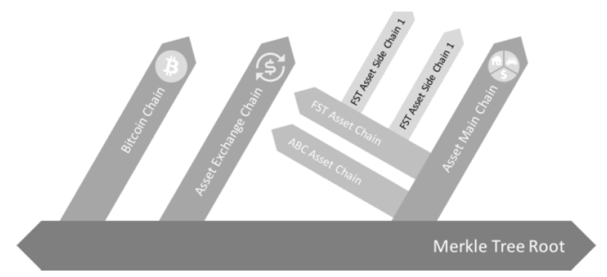

## introduction

One of the major issues with current blockchain systems is scalability. Mainly because of **congestion problems** of current blockchains, the problem is that when a single chain needs to sequentially order and process transactions, in the event of a popular dApp taking up a lot of resources, it has negative side effects on other dApps.

This is why AElf side chains were introduced in the initial design. It’s envisioned that one sidechain is responsible for handling one or more similar business scenarios, distributing different tasks on multiple chains and improving the overall processing efficiency.

The main idea is that the sidechains are **independent** and **specialized** to ensure that the dapps running on them can perform efficiently and smoothly. A network link will exist between mainchain node and sidechain nodes, but the communication is indirectly done through what's called a Merkle root.

    

The diagram above illustrates the conceptual idea behind side chains.

Side chains are isolated but still need a way to interact with each other. for this AElf introduces a communication mechanism through **merkle roots** and **indexing** to enable cross chain verification scenarios.

The following sections of this documentation will give you an overview of the architecture of AElfs side chains. There will also be a guide explaining how to set up a mainchain and a side chain node.

