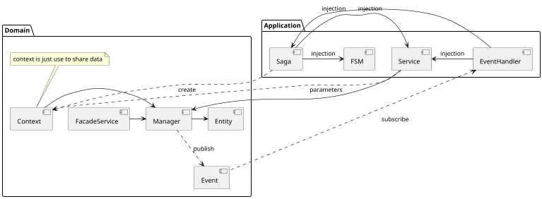
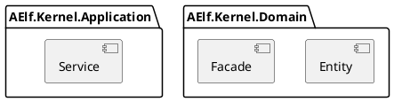
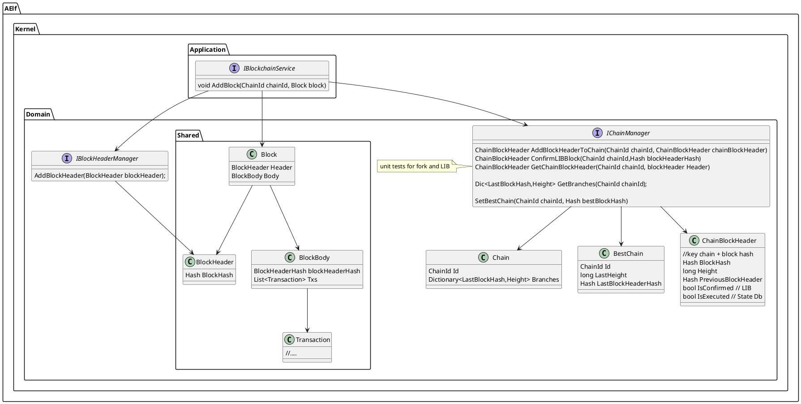
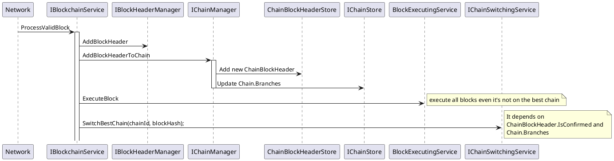

Hello


AELF project









```puml
left to right direction

class StateKey{
  ByteString Key
  Hash BlockHash
}
note right: protobuf


class BestChainState{
  Hash Key
  StateVersion Current // contains in the protobuf object
}
note left: Key: State.Key

class StateVersion{
  Hash StateKey
  long BlockHeight
  Hash BlockHash

  Hash OriginBlockHash // where the origin state is

  byte[] Value
}
note right: Key: State.Key + Block.Hash

class BlockStateSet{
  //key: BaseBlockHash-CurrentBlockHash
  Hash PreviousHash 
  Hash BlockHeight
  long BlockHash
  Dic<string key, StateVersion> Changes
}

class BlockTransactionExecutingChangesSet{
  int Version
  Dic<string key, StateVersion> Writes
  Dic<string key, StateVersion> Reads
}

note left: Provider will load the BaseBlockHash-PreviousBlockHash changes. \n if it's best chain, it will create an empty one.

class StateManager{
  StateVersion GetStateVersion(Hash blockHash,Hash key)
  StateVersion GetBestChainState(Hash key)
  StateVersion SetState(Hash key,Hash blockHash, long blockHeight, byte[] Value)
}


State *- StateVersion : map many >


```

"TB", "LR", "BT", "RL"

```puml
digraph g {
size="15,!";
 margin=0;

graph [
rankdir = "BT"
];

node [
fontsize = "16"
shape = "ellipse"
];
edge [
];

"node0" [
label = "<f0> StateVersion | <f1> BlockHeight: 50 | <f2> BlockHash : A | <f3> Value: 1 | <f4> PreviousBlockHash : null"
shape = "record"
];

"node1" [
label = "<f0> StateVersion | <f1> BlockHeight: 100 | <f2> BlockHash : B | <f3> Value: 2 | <f4> PreviousBlockHash : A"
shape = "record"
];

"node2" [
label = "<f0> StateVersion | <f1> BlockHeight: 170 | <f2> BlockHash : C | <f3> Value: 3 | <f4> PreviousBlockHash : B"
shape = "record"
];

"node3" [
label = "<f0> StateVersion | <f1> BlockHeight: 180 | <f2> BlockHash : D | <f3> Value: 4 | <f4> PreviousBlockHash : B"
shape = "record"
];

"node4" [
label = "<f0> BestChainState | <f1> CurrentStateVersion"
shape = "record"
];


"node1":f4 -> "node0":f2 

"node2":f4 -> "node1":f2 

"node3":f4 -> "node1":f2 

"node4":f4 -> "node1":f0 


}
```

```csharp
// Hash B is the best chain.
StateManager.GetBestChainState(key).Current.Value == 2
StateManager.GetStateVersion(key,"A").Value == 1
StateManager.GetStateVersion(key,"B").Value == 2

StateManager.GetStateVersion(key,"C").Value == 3
StateManager.GetStateVersion(key,"D").Value == 4
StateManager.SetStateVersion(key,"E",200).Value == 5

StateManager.GetStateVersion(key,"D").PreviousBlockHash == StateManager.GetStateVersion(key,"C").BlockHash 

```


```puml
digraph g {
size="15,!";
 margin=0;

graph [
rankdir = "BT"
];

node [
fontsize = "16"
shape = "ellipse"
];
edge [
];

"seq0" [
label = "<f0> SEQ | <f1> 1 "
shape = "record"
];

"grp0" [
label = "<f0> Tx Grp | <f1> Txs "
shape = "record"
];
grp0 -> seq0:f1

"grp1" [
label = "<f0> Tx Grp | <f1> Txs "
shape = "record"
];
grp1 -> seq0:f1


"seq1" [
label = "<f0> SEQ | <f1> 2 "
shape = "record"
];

"grp3" [
label = "<f0> Tx Grp | <f1> Txs "
shape = "record"
];
grp3 -> seq1:f1

"seq2" [
label = "<f0> SEQ | <f1> 3 "
shape = "record"
];

seq0 -> seq1 -> seq2


}
```


Some basic defines
```csharp

//protobuf class
public class ChainId{
  public string ChainPrefix{get;set;}
}

public class LoadChainRequest{
  public Guid SagaId{get;set;}
  public ChainId ChainId{get;set;}
}

```


One way is to define a initialize method in IBlockChain, the problem is in some scenes, the initialize method may be call more than one time.but it is okay, because chainID is not status, ChainInfo will be loaded from DB by ChainInfoManager. 
```csharp

//registered as scoped
interface IBlockChain{
  void Initialize(ChainId Id);
  //other methods...
}

//protobuf entity
public class ChainInfo{
  public ChainID ChainID{get;set;}
  public long CurrentHeight{get;set;}
  public Hash CurrentBlockHash{get;set;}
  //.....
}

public class Blockchain: IBlockChain{

  ChaiId _chainId;

  public BlockChain(ChainInfoManager chainInfoManager){
    //...
  }


  void Initialize(ChainId Id){
    if(_chainID=!null && _chainID!=Id)
      throw new Exception("Invalid");
    _chainID = Id;
  }

  Task DoSomethingAsync(){
    var chainInfo = await _chainInfoManager.GetAsync(_chainId);
    //....
  }
}


public class OneApplicationService{

  private IBlockChain _blockchain;

  public Task OneRequest(RequestDto input){
    _blockchain.initialize(input.ChainId);
    _blockchain.XXX();
    //....
  }
}

//usage in service layer
public class OneSaga{
  
  //can implement as saga data manager. _chainId is a saga data.
  private ChainId _chainId;
  private SagaId _sagaId;

  //inject 
  private ISmartContractDeployService _smartContractDeployService;

  private IBlockChain _blockchain;

  public OneSaga(IBlockChain blockchain /*, ...*/){
    _blockchain = blockchain;
    
    /*...*/
  }

  //maybe in base class
  public OneSaga(SagaId id){
    _sagaId=id;
    OnSagaLoadAsync();
  }

  protected Task LoadSagaDataAsync(){
    _chainId = await GetSagaDataAsync(_sagaId, "_chainId");
    blockchain.Initialize(_chainId);
  }

  protected Task SaveSagaDataAsync(){
    await SetSagaDataAsync(_sagaId,"_chainID",_chainId);
  }

  //Here block chain logic begins

  //in the first saga request to 
  public Task LoadChainAsync(LoadChainRequest request){
    _sagaId = _chainId = request.ChainId;
    blockchain.Initialize(request.ChainId);
  }

  public Task DeploySmartContractAsync(SmartContractDeployRequest request){

    //_smartContractDeployService.XXX()
    //...
  }

}

```


The other way, inject chainContext, chainContext was injected as scoped.
so maybe we need to override scoped factory to make sure when we get the context in nest we can get the same context.

But when we saw IBlockChain, we may not see anything about chainID. It's not a good choice for me.
```csharp
using(var scope = provider.BeginScope()){
    var chainContext1= scope.GetService<ChainContext>();
  using(var scope2 = scop.BeginScope()){
    var chainContext2= scope.GetService<ChainContext>();

    //chainContext1 should equal to chainContext2
  }

}
```

```csharp

//registered as scoped
interface IBlockChain{
  //other methods...
}

//registered as scoped
public class ChainContext{

  //chainID should can only be set once.
  public ChainId ChainId{get;set;}
}

public class Blockchain: IBlockChain{

  ChaiId _chainId;

  //inject chain context
  public BlockChain(ChainContext chainContext, ChainContextManager chainContextManager){
    //...
  }


  void Initialize(ChainId Id){
    if(_chainID=!null && _chainID!=Id)
      throw new Exception("Invalid");
    _chainID = Id;
  }

  Task DoSomethingAsync(){
    var chainInfo = await _chainInfoManager.GetAsync(chainContext.ChainId);
    //....
  }
}


public class OneApplicationService{

  private IBlockChain _blockchain;
  private ChainContext _chainContext;

  public Task OneRequest(RequestDto input){
    
    _chainContext.ChainId = input.ChainId;

    _blockchain.XXX(input.other);
    //....
  }
}

//usage in service layer
public class OneSaga{
  
  //can implement as saga data manager. _chainId is a saga data.
  private ChainContext _chainContext;
  private SagaId _sagaId;

  //inject 
  private ISmartContractDeployService _smartContractDeployService;

  private IBlockChain _blockchain;

  public OneSaga(IBlockChain blockchain /*, ...*/){
    _blockchain = blockchain;
    
    /*...*/
  }

  //maybe in base class
  public OneSaga(SagaId id){
    _sagaId=id;
    LoadSagaDataAsync();
  }

  protected Task LoadSagaDataAsync(){
    _chainContext.ChainId = await GetSagaDataAsync(_sagaId, "_chainId");

  }

  protected Task SaveSagaDataAsync(){
    await SetSagaDataAsync(_sagaId,"_chainID",_chainId);
  }

  //Here block chain logic begins

  //in the first saga request to 
  public Task LoadChainAsync(LoadChainRequest request){
    _sagaId = _chainContext.ChainId = request.ChainId;
  }

  public Task DeploySmartContractAsync(SmartContractDeployRequest request){

    //_smartContractDeployService.XXX()
    //...
  }

}

```

The third way, pass chainId by parameters.
