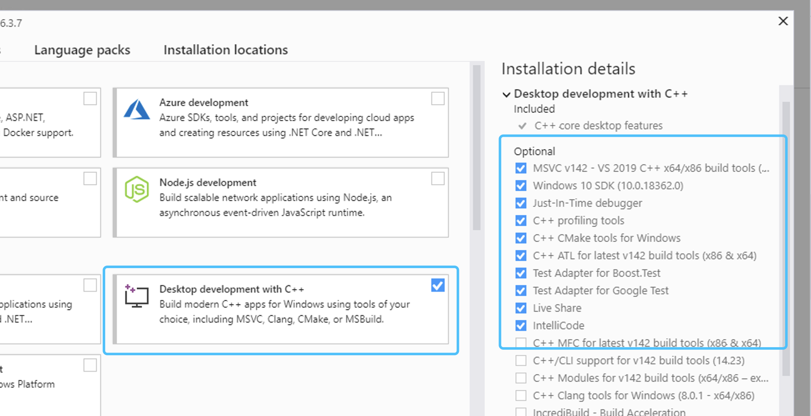
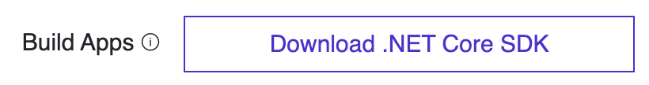
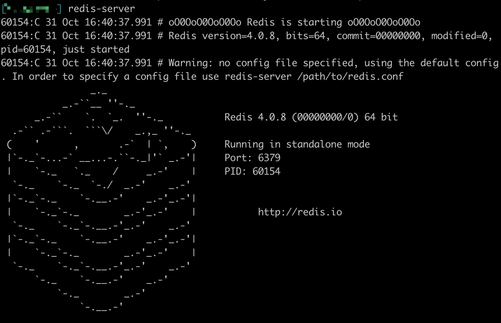

## Pre-requisites 

Before you jump in to the guides and tutorials you'll need to install the following tools and frameworks.

# Pre-setup for Windows users

A convenient tool for Windows users is **Chocolatey** for installing dependencies. Open this link and follow the installation instructions:

[**Chocolatey installation**](https://chocolatey.org/install)

Later, Chocolatey can be very useful for installing dependencies like **Git** and **Protobuf**.
Another consideration is to download and install **Visual Studio Community** with **Desktop development with C++**:

[**Visual Studio Community Edition**](https://visualstudio.microsoft.com/fr/downloads/?rr=https%3A%2F%2Fwww.google.com%2F)

<p align="center">
    
</p>

The reason is that this install already includes most dependencies needed to build AElf.

# Pre-setup for macOS users

It is highly recommended that you install **Homebrew (or simply Brew)** to quickly and easily setup dependencies:

[**Homebrew install page**](https://brew.sh/)

# Git

If you want to run a node or use our custom smart contract environment, at some point you will have to clone (download the source code) from AElf's repository. For this you will have to use **Git** since we host our code on GitHub.

Click the following link to download Git for your platform (the link provides Chocolatey and Brew packages to use):

[**Getting Started - Installing Git**](https://git-scm.com/book/en/v2/Getting-Started-Installing-Git)

# Node js

Next install nodejs by following the instructions here:

[**Nodejs**](https://nodejs.org/en/download/).

# Development framework - dotnet core sdk

Most of AElf is developed with dotnet core, so you will need to download and install the .NET Core SDK before you start:

[**Download .NET Core 2.2**](https://dotnet.microsoft.com/download/dotnet-core/2.2)

For now AElf depends on version 2.2 of the SDK, on the provided link find the download for your platform (for Windows and macOS the installer for x64 is the most convenient if your platform is compatible - most are these days), the page looks like this: 

<p align="center">
    
</p>

Wait for the download to finish and follow the instructions: for AElf all defaults provided in the installer should be correct.

To check the installation, you can open a terminal and run the ``dotnet`` command. If everything went fine it will show you dotnet options for the command line.

# Database

We currently support two key-value databases to store our nodes data: **Redis** or **SSDB**. Both work well, it's your decision:

## Redis (recommended fo the tutorials): 

[**Redis download page** (sources)](https://redis.io/)

- On Windows we recommend you use the Chocolatey package for Redis: [**Redis Chocolatey Package**](https://chocolatey.org/packages/redis-64#dependencies).
- On macOS, open a terminal and use Brew:  ```brew install redis```


To test the installation (all platforms) you can just open a terminal and type ```redis-server```. This will show you the servers welcome page as well as the port it's listening on:

<p align="center">
    
</p>

## SSDB: 

[**SSDB**](http://ssdb.io/?lang=en) 

- On macOS you can use Brew : ```brew install ssdb```

# Protobuf

You also need to install protobuf compiler https://developers.google.com/protocol-buffers/.

