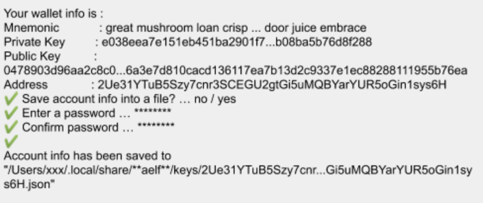

# How to join the testnet

There’s two ways to run a AElf node: you can either use Docker (recommended method) or run the binaries available on Github. Before you jump into the guides and tutorials you'll need to install the following tools and frameworks. For most of these dependencies we provide ready-to-use command line instructions. In case of problems or if you have more complex needs, we provide more information in the [Environment setup](../tutorials/setup/setup.md) section of this GitBook.

## Setup the database

We currently support two key-value databases to store our nodes data: Redis and SSDB, but for the testnet we only provide snapshots for SSDB. We will configure two SSDB instances, one for chain database and one for the state database (run these on different machines for better performances). 

### Install SSDB

Enter the following commands (see here for more details [SSDB](http://ssdb.io/?lang=en)):


```bash
>> wget --no-check-certificate https://github.com/ideawu/ssdb/archive/master.zip
>> unzip master
>> cd ssdb-master
>> make
# optional, install ssdb in /usr/local/ssdb
>> sudo make install
```

### Import the snapshot data

After you’ve finished setting up the database, download the latest snapshots. The following gives you the template for the download URL, but you have to specify the snapshot date. We recommend you get the latest: 

Restore the chain database from snapshot:
```bash
>> mkdir chaindb-snapshot
>> cd chaindb-snapshot
>> wget https://aelf-node.s3-ap-southeast-1.amazonaws.com/snapshot/testnet/aelf-testnet-mainchain-chaindb-20191114.tar.gz
>> tar xvzf aelf-testnet-mainchain-chaindb-20191114.tar.gz
>> stop your chain database instance (ssdb server)
>> cp -r aelf-testnet-mainchain-chaindb-20191114/* /path/to/install/chaindb/ssdb/var/
>> start your chain database instance
>> enter ssdb console(ssdb-cli) to verify the imported data

```

Restore the state database from snapshot:
```bash
>> mkdir statedb-snapshot
>> cd statedb-snapshot
>> wget https://aelf-node.s3-ap-southeast-1.amazonaws.com/snapshot/testnet/aelf-testnet-mainchain-statedb-20191114.tar.gz
>> tar xvzf aelf-testnet-mainchain-statedb-20191114.tar.gz
>> stop your state database instance (ssdb server)
>> cp -r aelf-testnet-mainchain-chaindb-20191114/* /path/to/install/ssdb/var/
>> start your state database instance
>> enter ssdb console(ssdb-cli) to verify the imported data
```

## Node configuration

### Generating the nodes account

First you need to install the aelf-command package. Open a terminal and enter the following command to install aelf-command:

```bash
>> npm i -g aelf-command
```

After installing the package, you can use the following command to create an account/key-pair:
```bash
>> aelf-command create
```

The command prompts for a password, enter it and don't forget it. The output of the command should look something like this:

<p align="center">
  
</p>

In the next steps of the tutorial you will need the Public Key and the Address for the account you just created. You'll notice the last line of the commands output will show you the path to the newly created key. The aelf directory is the data directory (datadir) and this is where the node will read the keys from.

Note that a more detailed section about the CLI can be found command line interface.

### Prepare node configuration

```bash
>> cd /tmp/ && wget https://github.com/AElfProject/AElf/releases/download/v0.8.2/aelf-testnet-mainchain.zip
>> unzip aelf-testnet-mainchain.zip
>> mv aelf-testnet-mainchain /opt/aelf-node
```

Update the appsetting.json file with your account. This will require the information printed during the creation of the account. Open the appsettings.json file and edit the following sections.

The account/key-pair associated with the node we are going to run:
```json
"Account": {
    "NodeAccount": "2Ue31YTuB5Szy7cnr3SCEGU2gtGi5uMQBYarYUR5oGin1sys6H",
    "NodeAccountPassword": "********"
},
```

Note that if your Redis server is on another host listening on a different port than the default, you will also have to configure the connection strings (port/db number):

```json
"ConnectionStrings": {
    "BlockchainDb": "ssdb://your chain database server ip address:port",
    "StateDb": "ssdb://your state database server ip address:port"
  },
```

Next add the testnet mainchain nodes as peer (bootnode peers):

```json
"Network": {
    "BootNodes": [
        "13.210.243.191:6800"
    ],
    "ListeningPort": 6800,
    "NetAllowed": "",
    "NetWhitelist": []
},
```

Note: if your infrastructure is behind a firewall you need to open the P2P listening port of the node.
You also need to configure your listening ip and port for the side chain connections:

```json
"CrossChain": {
    "Grpc": {
        "LocalServerPort": 5000,
        "LocalServerHost": "your server ip address",
        "ListeningHost": "0.0.0.0"
    }
},
```

## Running a full node with Docker

To run the node with Docker, enter the following commands:
```bash
>> docker pull aelf/node:testnet-v0.8.2
>> cd /opt/aelf-node
>> sh aelf-node.sh start aelf/node:testnet-v0.8.2
```

to stop the node you can run:
```bash
>> sh aelf-node.sh stop
```

## Running a full node with the binary release

Most of AElf is developed with dotnet core, so to run the binaries you will need to download and install the .NET Core SDK before you start: Download .NET Core 3.0. For now AElf depends on version 3.0 of the SDK, on the provided link find the download for your platform, and install it.

Get the latest release with the following commands:
```bash
>> cd /tmp/ && wget https://github.com/AElfProject/AElf/releases/download/v0.8.2/aelf-v0.8.2.zip
>> unzip aelf-v0.8.2.zip
>> mv aelf-v0.8.2 /opt/aelf-node/
```

Enter the configuration folder and run the node:
```bash
>> cd /opt/aelf-node
>> dotnet aelf-v0.8.2/AElf.Launcher.dll
```

## Check the node

You now should have a node that's running, to check this run the following command that will query the node for its current block height:

```bash
aelf-command get-blk-height -e http://127.0.0.1:8000
```

## Run side-chains

Running a side chain is very much like running a mainchain node, only configuration will change.

```bash
>> cd /tmp/ && wget https://github.com/AElfProject/AElf/releases/download/v0.8.2/aelf-testnet-sidechain1.zip
>> unzip aelf-testnet-sidechain1.zip
>> mv aelf-testnet-sidechain1 /opt/aelf-node
```

In order for a side-chain to connect to a mainchain node you need to modify the configuration with the remote information.

```json
"CrossChain": {
    "Grpc": {
        "RemoteParentChainServerPort": 5000,
        "LocalServerHost": "you local ip address",
        "LocalServerPort": 5001,
        "RemoteParentChainServerHost": "your mainchain ip address",
        "ListeningHost": "0.0.0.0"
    },
    "ParentChainId": "AELF"
},
```

After modifying this you can start the node (step c or d) and check that it’s running (step e). Repeat this process for other side-chains (currently five).

```
https://github.com/AElfProject/AElf/releases/download/v0.8.2/aelf-testnet-sidechain1.zip
https://github.com/AElfProject/AElf/releases/download/v0.8.2/aelf-testnet-sidechain2.zip
https://github.com/AElfProject/AElf/releases/download/v0.8.2/aelf-testnet-sidechain3.zip
https://github.com/AElfProject/AElf/releases/download/v0.8.2/aelf-testnet-sidechain4.zip
https://github.com/AElfProject/AElf/releases/download/v0.8.2/aelf-testnet-sidechain5.zip
```

Use following bootnotes list replace appsettings.json:
```
aelf-testnet-sidechain1 → 3.104.54.162:6800
aelf-testnet-sidechain2 → 3.24.110.12:6800
aelf-testnet-sidechain3 → 13.211.152.56:6800
aelf-testnet-sidechain4 → 3.104.109.107:6800
aelf-testnet-sidechain5 → 13.239.115.216:6800
```

```json
"Network": {
    "BootNodes": [
        "Add the right boot node according sidechain"
    ],
    "ListeningPort": 6800,
    "NetAllowed": "",
    "NetWhitelist": []
},
```