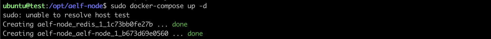
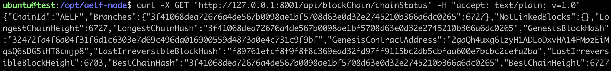

# Getting started with Google cloud 

To run an AElf node on Google cloud, follow these steps:

1. From the [Google Cloud Market Place](https://console.cloud.google.com/marketplace) search search for "aelf enterprise" and launch a VM instance using the image. 
2. Login launched vm instance via SSH. 
3. Next launch the chain. There's two ways to start the node:
    - run in the foreground: 
      - ```bash root@test:/# cd /opt/aelf-node && docker-compose up```
    - run in the background:
      - ```bash root@test:/# cd /opt/aelf-node && docker-compose up -d```

It will start redis and an aelf node.Once deployed go to the directory containing the docker compose file:

<p align="center">
    
</p>

Finally to verify that the node is correctly working, enter the following command: 

```bash 
curl -X GET "http://127.0.0.1:8001/api/blockChain/chainStatus" -H "accept: text/plain; v=1.0"
```

<p align="center">
    
</p>

If everything is working normally you should be able to see the chain increase by repeating the last command.