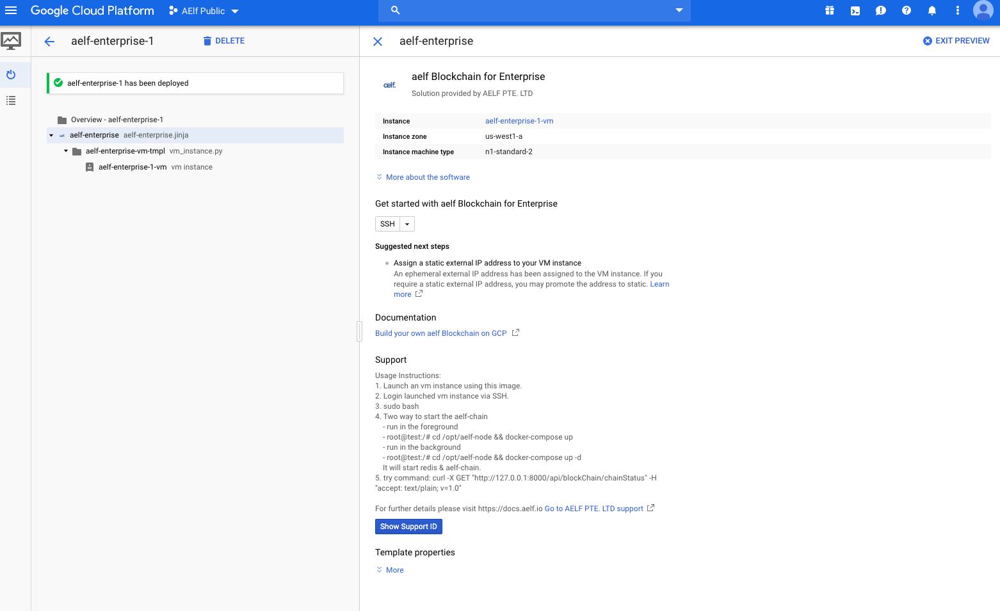

# Getting started with Google cloud 

This guide will run you through the steps required to run an AElf node on Google cloud (click the images for a more detailed view).

1. From the [Google Cloud Market Place](https://console.cloud.google.com/marketplace) search for "aelf enterprise", click the link, it will direct you to the following page.

<p align="center">
    
</p>

Click on the "LAUNCH ON COMPUTE ENGINE", this should give you the following deployment page:

<p align="center">
    
</p>

You can keep the default settings, they are sufficient to get started. If you're satisfied with the settings, just click "DEPLOY" (bottom left of the page).
This will bring you to the deployment page (wait a short moment for the instance to load), when finished you should see deployment information about the instance:

<p align="center">
    
</p>

2. Login launched vm instance via SSH: to start the easiest way is to login to the instance from the instance page:

<p align="center">
    
</p>

3. The previous step should open a shell to the deployed instance where you can run the chain itself. First you'll need to execute ``sudo bash`` to elevate your privileges.
Next, start the chain, there's two ways to do this (for this tutorial we'll use the second method):
 - either run it in the foreground: 
   - ```bash root@test:/# cd /opt/aelf-node && docker-compose up```
 - or run it in the background:
   - ```bash root@test:/# cd /opt/aelf-node && docker-compose up -d```

It will start redis and an AElf node.

  <p align="center">
      
  </p>

Finally to verify that the node is correctly working, enter the following command: 

```bash 
curl -X GET "http://127.0.0.1:8001/api/blockChain/chainStatus" -H "accept: text/plain; v=1.0"
```

  <p align="center">
      
  </p>

If everything is working normally you should be able to see the chain increase by repeating the last command.