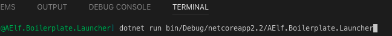
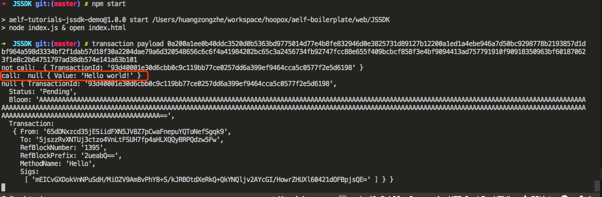
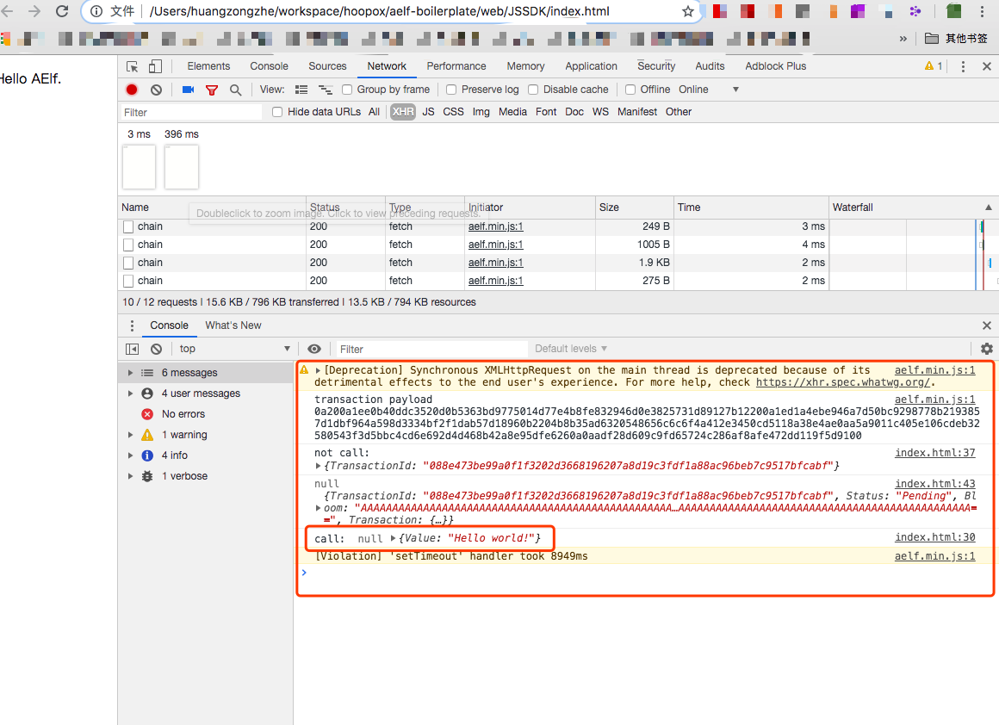
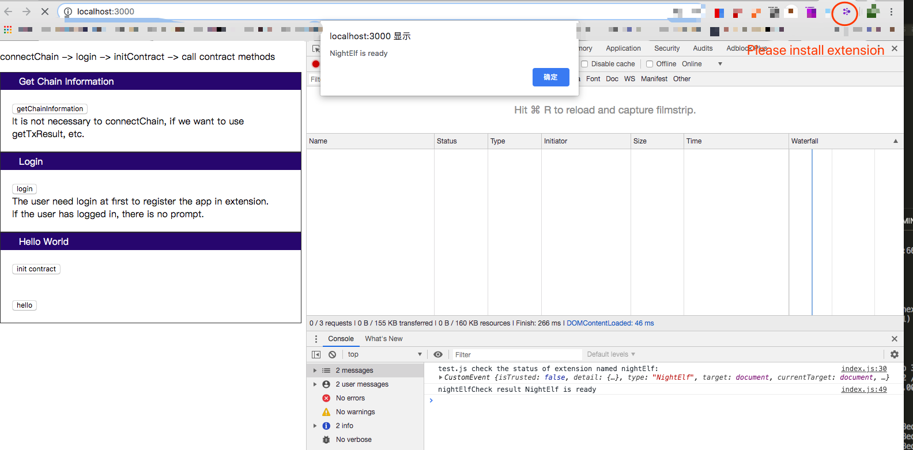

# Setup

You'll be guided through cloning the repository, running the example we provide as well as the unit tests. The first step you need to do is to follow the setup process in order to install all dependencies.

## Environment

#### Minimum requirement

If you don't have the following dependencies, please refer to your platforms installation guide:
- Git for version control, follow [these instructions](https://git-scm.com/book/en/v2/Getting-Started-Installing-Git).
- Dotnet core sdk for building and testing, you can [download it here](https://dotnet.microsoft.com/download).
- **if** you are using Mac you should [install Homebrew](https://brew.sh/).

#### IDE

Strictly speaking you don't need an IDE for this tutorial but it is highly recommended. If you don't already have one we recommend you try Visual Studio Code (vscode) with the C# extension:
- installation instructions [**here**](https://code.visualstudio.com/docs/setup/setup-overview).
- working with C# [**here**](https://code.visualstudio.com/docs/languages/csharp).

#### Clone the repository

Open a terminal in your system and clone the tutorial with the following command:

```bash
git clone https://github.com/AElfProject/aelf-boilerplate
```

This command will create a **aelf-boilerplate** folder with the code inside it.

## Build and run

#### Open the project

If not already done open vscode and open the **aelf-boilerplate** folder.

If asked to add some "required assets" say **yes**. There may also be some dependencies to restore: for all of them choose **Restore**.

<p align="center">
  
</p>

Open vscode's terminal and build the project with the following command. Note: you can find out more about vscode's terminal [**here**](https://code.visualstudio.com/docs/editor/integrated-terminal).

#### Install script

If you don't already have protobuf installed, run the following script:

```bash
todo add script
```

Note: you can also [manually install](https://github.com/protocolbuffers/protobuf/blob/master/src/README.md) if you prefer.

#### Build and run

```bash
cd aelf-boilerplate/chain/src/AElf.Boilerplate.Launcher/
dotnet build
```

<p align="center">
  
</p>

To actually run the node, use the following command.

```bash
dotnet run bin/Debug/netcoreapp2.2/AElf.Boilerplate.Launcher
```

At this point the smart contract has been deployed and is ready to use. You should see the node's logs. You can now stop the node by killing the process (usually **control-c** or **ctrl-c** in the terminal).

If you want to run the tests, simply navigate to the HelloWorldContract.Test folder. From here run:

```bash
cd ../../test/HelloWorldContract.Test/
dotnet test
```
The output should look somewhat like this:
```bash 
Total tests: 1. Passed: 1. Failed: 0. Skipped: 0.
```

### Next

You've just seen a simple example of a smart contract run with our Boilerplate tutorial. When launching (with dotnet run) the contract was automatically deployed and ready to interact with. You also discovered how to navigate to the test folder and run the tests.

Next you will see how AElf's js sdk is used to interact with the contract.

## Run the JS SDK Demo

To run this demo you'll need to install [Nodejs](https://nodejs.org/) first. ([Nodjs image in China](http://nodejs.cn/download/))

The following commands will navigate to the SDK's folder and demonstrate the capabilities of the js sdk, execute them in order:

```bash
cd ../../../web/JSSDK/
npm install
npm start
```

You should see the results in the terminal or in the browser dev tool.

### In the terminal

<p align="center">
  
</p>

### In the browser dev tool

<p align="center">
  
</p>

## Run the browser extension Demo

To use the browser extension you must follow the following instructions:

1.Install the extension.

click to install [dev version](https://chrome.google.com/webstore/detail/aelf-explorer-extension-d/mlmlhipeonlflbcclinpbmcjdnpnmkpf)

[extension repo](https://github.com/hzz780/aelf-web-extension)

2.Next go into the extensions folder and run the app with the following commands:

```bash
cd ../browserExtension/
npm install
npm start
```

To see the plugin in action you can navigate to the following address in your browser: [http://localhost:3000](http://localhost:3000)

Please open dev tool to see the results.

<p align="center">
  
</p>
