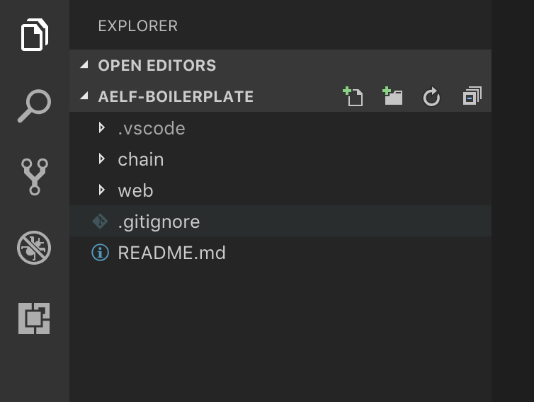

# Smart Contract

This article will guide you through how to use **AElf Boilerplate** project to implement and test a smart contract. This guide assumes you have completed the previous [Setup](setup.md) tutorial.

## Introduction

### Setup

To easily follow this tutorial you will need to open the the **AElf Boilerplate** root folder in Visual Studio Code and also open the **Integrated Terminal**.

<p align="center">
  
</p>

In the previous image you can see that the repository is composed of a **chain** and a **web** folder. The following content will help you understand the content of the **chain** folder. Every path in the following tutorial will be relative to this folder.

### Folder structure

This section will introduce you to the structure of a smart contract developed with **Boilerplate** by introducing the *Hello World*  contract example. Here's an overview of the folders and files you will find in the **chain** folder:

- **protobuf**: contains some protobuf message definitions, some common to all contracts, some for specific contracts.
- scripts: build scripts - not important for this guide.
- **src**:
  - AElf.Boilerplate.Launcher: console project to launch the node.
  - AElf.Boilerplate.Mainchain: a library for the node.
  - **HelloWorldContract**: the implementation of the Hello World contract.
- **test**:
  - **HelloWorldContract.Test**: the tests for the Hello World contract.

This guide will focus on the **HelloWorldContract** and **HelloWorldContract.Test** folders since the code we will modify is located in these.

## Hello World contract

The following content will walk you through the basics of writing a smart contract. These files are already **included** in the source folder so there's no need to create these, for every source file that's presented, the path is given so you can easily navigate to the file using vscode's file explorer panel.

### Definition and implementation

**Definition**: in AElf, contracts are defined as services and are implemented using Protobuf. Let's take a look at the **hello_world.proto** file located in the **protobuf/** folder:

```protobuf
syntax = "proto3";

import "aelf_options.proto";
import "google/protobuf/empty.proto";

option csharp_namespace = "HelloWorldContract";

service HelloWorldContract {

    option (aelf.csharp_state) = "HelloWorldContractState";

    rpc Hello (google.protobuf.Empty) returns (HelloReturn) { }
}

message HelloReturn {
    string Value = 1;
}
```

It's a simple contract that defines one method **Hello** and one type **HelloReturn**. We won't go through every detail of the definition, for this you can check out the [Smart Contract section](../../Contract/main.md) of this GitBook.

Note: the definition contains **no logic**, at build time when running the ```dotnet build``` command this file is used to generate the C# classes that will be used to implement the service.

**Implementation**: the implementation of the contract is located in the **src/HelloWorldContract/** folder, it contains two important files: **HelloWorldContract.cs** and **HelloWorldContractState.cs** that implement respectively the contract's **implementation** and its **state**.

```csharp
using Google.Protobuf.WellKnownTypes;

namespace HelloWorldContract
{
    public partial class HelloWorldContract : HelloWorldContractContainer.HelloWorldContractBase
    {
        public override HelloReturn Hello(Empty input)
        {
            return new HelloReturn {Value = "Hello world!"};
        }
    }
}
```

The above code, represents the implementation of the **Hello** method of the smart contract. It returns a **HelloReturn** object that holds an "Hello world!" string.

```csharp
using AElf.Sdk.CSharp.State;
namespace HelloWorldContract
{
    public class HelloWorldContractState : ContractState
    {
    }
}
```

This class represents the state of the contract. It is empty now, but you'll find out how to add some code in here in **Adding some methods** (below).

### Testing

Now lets look at the test :

```csharp
public class HelloWorldContractTest : HelloWorldContractTestBase
{
    [Fact]
    public async Task HelloCall_ReturnsHelloWorldMessage()
    {
        var result = await HelloWorldContractStub.Hello.CallAsync(new Empty());
        result.Value.ShouldBe("Hello world!");
    }
}
```

This is a simple test that uses AElf's test framework to validate that the method does what it's supposed to - in this case return an "Hello world!" string.

## Adding some methods

The following content will guide you through adding some methods and state to the Hello World contract.

### Modify the definition

Add the following definitions to the **hello_world.proto** right after the **Hello** rpc method:

```protobuf
rpc Visit (Visitor) returns (google.protobuf.Empty) { }
rpc GetVisitors (google.protobuf.Empty) returns (VisitorList) { }
```

and the following two message types, after the **HelloReturn** message:

```protobuf
message Visitor {
    string Name = 1;
}

message VisitorList {
    repeated string Names = 1;
}
```

The next step is to build the project. This has the side effect of generating the updated C# code.

Note: assuming you're at the root of AElf Boilerplate's clone, execute the following command to generate the protobuf messages and service based on the definitions we just added. If not already done open vscode's **Terminal**.

```bash
cd chain/src/HelloWorldContract/
dotnet build
```

If everything went well you should see the build log show ```Build succeeded.```

### Implement the logic and state

The first step is to add some state to our state definition. Open the **src/HelloWorldContract/HelloWorldContractState.cs** and add the following property to the **HelloWorldContractState** class:

```csharp
public SingletonState<VisitorList> Visitors { get; set; }
```

Override the service/contract methods previously added to the definition to **src/HelloWorldContract/HelloWorldContract.cs**:

```csharp
public override Empty Visit(Visitor visitor)
{
    if (State.Visitors.Value == null)
        State.Visitors.Value = new VisitorList();
            
    State.Visitors.Value.Names.Add(visitor.Name);
    
    return new Empty();
}

public override VisitorList GetVisitors(Empty input)
{
    return State.Visitors.Value;
}

```

The **Visit** logic will add the names of the visitors to the contracts state and the **GetVisitors** method will return the list of all visitors that have visited the contract. Build with the following command:

```bash
dotnet build
```

### Test the new logic

Now we're going to add a test to verify the behavior of our new contract methods. With the test framework you can test your contract without running the node and test your scenarios programmatically.

In the **Integrated Terminal** navigate to the test folder: 

```bash
cd ../../test/HelloWorldContract.Test/
```

Add the following test to **HelloWorldContractTest.cs** located in the **test/HelloWorldContract.Test/** folder:

```csharp
[Fact]
public async Task VisitCall_AddsVisitorToVisitorList()
{
    await HelloWorldContractStub.Visit.SendAsync(new Visitor { Name = "Jon Snow"});

    var result = await HelloWorldContractStub.GetVisitors.CallAsync(new Empty());
    result.ShouldBe(new VisitorList { Names = { "Jon Snow" }});
}
```

This test will first use **SendAsync** to call the **Visit** method on the contract. Then we call the **GetVisitors** method to validate that the previous name has been recorded. Launch the test with the following method:

```bash
dotnet test
```

You should see the following: 

```bash
Total tests: 2. Passed: 2. Failed: 0. Skipped: 0.
Test Run Successful.
```

That's more or less everything. We recommend you write the contract in a test driven way, when you are ready you can run the launcher project and you will be able to call the contract through the RPC to start integration testing with some external client (or the CLI if you don't plan on building some sort of dApp).

The next section will show you how to interact with the smart contract through the Javascript SDK.