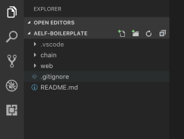

# Smart Contract

This article will guide you through how to use **AElf Boilerplate** project to implement and test a smart contract. This guide assumes you have completed the previous [Setup](setup.md) tutorial.

## Introduction

### Setup

To easily follow this tutorial you will need to open the the **AElf Boilerplate** root folder in Visual Studio Code and also open the **Integrated Terminal**.

<p align="center">
  
</p>

In the previous image you can see that the repository is composed of a **chain** and a **web** folder. The following content will help you understand the content of the **chain** folder. Every path in the following tutorial will be relative to this folder.

### Folder structure

This section will introduce you to the structure of a smart contract developed with **Boilerplate** by introducing the *Hello World*  contract example. Here's an overview of the folders and files you will find in the **chain** folder:

- **protobuf**: contains some protobuf message definitions, some common to all contracts, some for specific contracts.
- scripts: build scripts - not important for this guide.
- **src**:
  - AElf.Boilerplate.Launcher: console project to launch the node.
  - AElf.Boilerplate.Mainchain: a library for the node.
  - **HelloWorldContract**: the implementation of the Hello World contract.
- **test**:
  - **HelloWorldContract.Test**: the tests for the Hello World contract.

This guide will focus on the **HelloWorldContract** and **HelloWorldContract.Test** folders since the code we will modify is located in these.


```protobuf
syntax = "proto3";

import "aelf_options.proto";
import "google/protobuf/empty.proto";

option csharp_namespace = "HelloWorldContract";

service HelloWorldContract {

    option (aelf.csharp_state) = "HelloWorldContractState";

    rpc Hello (google.protobuf.Empty) returns (HelloReturn) { }
}

message HelloReturn {
    string Value = 1;
}
```

It's a simple contract that defines one method **Hello** and one type **HelloReturn**.


**Implementation**: the implementation of the contract is located in the **src/HelloWorldContract/** folder, it contains two important files: **HelloWorldContract.cs** and **HelloWorldContractState.cs** that implement respectively the contract's **implementation** and its **state**.

```csharp
using Google.Protobuf.WellKnownTypes;

namespace HelloWorldContract
{
    public partial class HelloWorldContract : HelloWorldContractContainer.HelloWorldContractBase
    {
        public override HelloReturn Hello(Empty input)
        {
            return new HelloReturn {Value = "Hello world!"};
        }
    }
}
```

The above code, represents the implementation of the **Hello** method of the smart contract. It returns a **HelloReturn** object that holds an "Hello world!" string.

```csharp
using AElf.Sdk.CSharp.State;
namespace HelloWorldContract
{
    public class HelloWorldContractState : ContractState
    {
    }
}
```

This class represents the state of the contract. It is empty now, but you'll find out how to add some code in here in **Adding some methods** (below).

### Testing

Now lets look at the test :

```csharp
public class HelloWorldContractTest : HelloWorldContractTestBase
{
    [Fact]
    public async Task HelloCall_ReturnsHelloWorldMessage()
    {
        var result = await HelloWorldContractStub.Hello.CallAsync(new Empty());
        result.Value.ShouldBe("Hello world!");
    }
}
```

This is a simple test that uses AElf's test framework to validate that the method does what it's supposed to - in this case return an "Hello world!" string.

## Greeter contract

The following content will walk you through the basics of writing a smart contract. You can find the example on the Github repo.

### Defining a contract

The first step when writing a smart contract on AElf is to define the methods and types of your contract. AElf defines smart contracts as services and are implemented using gRPC and Protobuf. The definition contains **no logic**, at build time this file is used to generate the C# classes that will be used to implement the service logic.

We recommend putting the contract's definition in Boilerplate's the **protobuf** folder. We recommend you name the contract with the following syntax **contractname_contract.proto**:

<!-- 
Boilerplate
## chain 
### protobuf
#### MyContract.proto
#### AnotherContract.proto
#### ...
-->

```
Boilerplate
└── chain
    └── protobuf
        ├── my_contract.proto
        ├── another_contract.proto
        └── ...
```

**Note:** this folder already contains a certain amount of contract definitions. Some are from examples included in Boilerplate and also system contracts. You'll notice it also contains AElf Contract Standard definitions that are also defined the same way as contracts.  
Lastly it also contains **options.proto** and **core.proto** that contains fundamental types for developing smart contracts, more on this later. 

**Best practice:**
- place your contract definition in Boilerplate's protobuf folder.
- name your contract with **contractname_contract.proto**, all lower case.

Now let's take a look a the definition itself:

``` Protobuf
syntax = "proto3";

import "aelf/options.proto";

import "google/protobuf/empty.proto";
import "google/protobuf/timestamp.proto";
import "google/protobuf/wrappers.proto";

option csharp_namespace = "AElf.Contracts.HelloWorld";

service HelloWorldContract { 
    option (aelf.csharp_state) = "AElf.Contracts.HelloWorld.HelloWorldContractState";

    // Actions
    rpc Greet (google.protobuf.Empty) returns (google.protobuf.StringValue) { }
    rpc GreetTo (google.protobuf.StringValue) returns (GreetToOutput) { }
    
    // Views
    rpc GetGreetedList (google.protobuf.Empty) returns (GreetedList) {
        option (aelf.is_view) = true;
    }
}

message GreetToOutput {
    string name = 1;
    google.protobuf.Timestamp greet_time = 2;
}

message GreetedList {
    repeated string value = 1;
}

```

Above is the full definition of the contract, it is mainly composed of three parts:
- imports: the dependencies of your contract.
- service definition: the methods of your contract.
- types: some custom defined types used by the contract.

#### Syntax, imports and namespace

```Protobuf 
syntax = "proto3";

import "aelf/options.proto";

import "google/protobuf/empty.proto";
import "google/protobuf/timestamp.proto";
import "google/protobuf/wrappers.proto";

option csharp_namespace = "AElf.Contracts.HelloWorld";
```

The first line specifies the syntax that this protobuf file uses, we recommend you always use **proto3** for your contracts. Next you'll notice that this contract specifies some imports, let's analyze them briefly:
- **aelf/options.proto** : contracts can use AElf specific options, this file contains the definitions. One example is the **is_view** options that we will use later.
- **empty.proto, timestamp.proto and wrappers.proto** : these are all definitions imported from Protobuf's library. They are usefull for defining things like an empty return value, time and wrappers around some common types such as string. 

The last line specifies an option that determines the namespace of the generated code. Here the generated code will be in the ```Aelf.Contracts.HelloWorld``` namespace.


#### The service definition


```Protobuf
service HelloWorldContract { 
    option (aelf.csharp_state) = "AElf.Contracts.HelloWorld.HelloWorldContractState";

    // Actions
    rpc Greet (google.protobuf.Empty) returns (google.protobuf.StringValue) { }
    rpc GreetTo (google.protobuf.StringValue) returns (GreetToOutput) { }
    
    // Views
    rpc GetGreetedList (google.protobuf.Empty) returns (GreetedList) {
        option (aelf.is_view) = true;
    }
}
```

The first line here uses the ```aelf.csharp_state``` option to specify the name (full name) of the state class. This means that the state of the contract should be defined in the ```HelloWorldContractState``` class under the ```Aelf.Contracts.HelloWorld``` namespace.

Next, two **action** methods are defined: ```Greet``` and ```GreetTo```. A service method is defined by three things: the **method name**, the **input type** and the **output type**. For example ```Greet``` requires that the input type is ```google.protobuf.Empty``` that is used to specify that this method takes no arguments and the output type will be a google.protobuf.StringValue which is a traditional string. As you can see with the ```GreetTo``` method, you can use custom types as input and output of contract methods.

The service also defines a **view** method, that is, a method used only to query the contracts state and that has no side effect on the state. For example, the definition of ```GetGreetedList``` uses the **aelf.is_view** option to make it a view method.

**Best practice:**
- use **google.protobuf.Empty** to specify that a method takes no arguments (import ```google/protobuf/empty.proto```).
- use **google.protobuf.StringValue** to use a string (import ```google/protobuf/wrappers.proto```).
- use the **aelf.is_view** option to create a view method (import ```aelf/options.proto```).
- use the **aelf.csharp_state** to specify the namespace of your contracts state (import ```aelf/options.proto```).

#### Custom types

```Protobuf
message GreetToOutput {
    string name = 1;
    google.protobuf.Timestamp greet_time = 2;
}

message GreetedList {
    repeated string value = 1;
}
```

The protobuf file also includes the definition of two custom types. The **GreetToOutput** is the type returned by the ```GreetTo``` method and ```GreetedList``` is the return type of the ```GetGreetedList``` view method. You'll notice the **repeated** keyword the the ```GreetedList``` message. This is protobuf syntax to represent a collection.

**Best practice:**
- use **google.protobuf.Timestamp** to represent a point in time (import ```google/protobuf/timestamp.proto```).
- use **repeated** to represent a collection of items of the same type.

## Implementation

Now let's take a look at the implementation of the contract methods defined above. This section explains how to extend the generated code and implement the logic in you smart contract that will modify the state.

Below are the files that contain the implementation of the smart contract (logic and state implementation):

**Method implementation:**
```csharp 
using Google.Protobuf.WellKnownTypes;

namespace AElf.Contracts.HelloWorld
{
    public class HelloWorldContract : HelloWorldContractContainer.HelloWorldContractBase 
    {
        public override StringValue Greet(Empty input)
        {
            Context.LogDebug(() => "Hello World!");
            return new StringValue {Value = "Hello World!"};
        }

        public override GreetToOutput GreetTo(StringValue input)
        {
            // Should not greet to empty string or white space.
            Assert(!string.IsNullOrWhiteSpace(input.Value), "Invalid name.");

            // State.GreetedList.Value is null if not initialized.
            var greetList = State.GreetedList.Value ?? new GreetedList();

            // Add input.Value to State.GreetedList.Value if it's new to this list.
            if (!greetList.Value.Contains(input.Value))
            {
                greetList.Value.Add(input.Value);
            }

            // Update State.GreetedList.Value by setting it's value directly.
            State.GreetedList.Value = greetList;

            Context.LogDebug(() => $"Hello {input.Value}!");

            return new GreetToOutput
            {
                GreetTime = Context.CurrentBlockTime,
                Name = input.Value
            };
        }

        public override GreetedList GetGreetedList(Empty input)
        {
            return State.GreetedList.Value ?? new GreetedList();
        }
    }
}
```

**State implementation:**

```csharp
using AElf.Sdk.CSharp.State;
 
 namespace AElf.Contracts.HelloWorld
 {
    public class HelloWorldContractState : ContractState
    {
        public SingletonState<GreetedList> GreetedList { get; set; }
    }
 }
```

#### Asserting 

