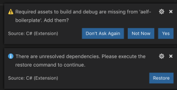

# Setup

This article will get you started with AElf's Boilerplate project. You will learn the following items:
- setting up the basic environment for developing contracts.
- downloading **AElf Boilerplate**'s code and setting up Visual Studio Code.
- running a template HelloWorld contract.
- Boilerplate's structure.

## Environment

#### IDE

Strictly speaking you don't need an IDE for this tutorial but it is highly recommended. If you don't already have one you can try Visual Studio Code (vscode) with the C# extension:
- installation instructions for vscode [**here**](https://code.visualstudio.com/docs/setup/setup-overview).
- working with C# extension [**here**](https://code.visualstudio.com/docs/languages/csharp).

#### Clone the repository

Open a terminal in your system and clone the tutorial with the following command:

```bash
git clone https://github.com/AElfProject/aelf-boilerplate
```

This command will create a **aelf-boilerplate** folder with the code inside it.

## Build and run the Hello World

#### Open the project

If not already done open vscode and open the **aelf-boilerplate** folder. If asked to add some "required assets" say **yes**. There may also be some dependencies to restore: for all of them choose **Restore**.

<p align="center">
  
</p>

Open vscode's **Integrated Terminal** and build the project with the following command. Note: you can find out more about vscode's terminal [**here**](https://code.visualstudio.com/docs/editor/integrated-terminal).

#### Install script

If you don't already have protobuf installed, run the following script from withing the **aelf-boilerplate** folder:

On Mac or Linux:
```bash
sh chain/scripts/install_protobuf.sh
```
On Windows
```bash
# open a PowerShell console as administrator
chain/scripts/install_dependency.ps1
```


If you prefer or have problems, you can refer to the following guide to [**manually install**](https://github.com/protocolbuffers/protobuf/blob/master/src/README.md) protobuf on your system.



#### Build and run

```bash
# enter the Launcher folder and build 
cd chain/src/AElf.Boilerplate.Launcher/
dotnet build

# run the Boilerplate 
dotnet run bin/Debug/netcoreapp3.0/AElf.Boilerplate.Launcher
```


 When running the Boilerplate, you might see some errors related to an incorrect password, to solve this you need to backup your `data-dir/keys/` folder and start with an empty folder.
 

At this point the smart contract has been deployed and is ready to use. You should see the node's logs. You can now stop the node by killing the process (usually **control-c** or **ctrl-c** in the terminal).

If you want to run the tests, simply navigate to the HelloWorldContract.Test folder. From here run:

```bash
cd ../../test/AElf.Contracts.HelloWorldContract.Test/
dotnet test
```
The output should look somewhat like this:
```bash 
Test Run Successful.
Total tests: 1
     Passed: 1
 Total time: 2.8865 Seconds
```

At this point you have successfully downloaded and built Boilerplate. You have also run the HelloWorld contract that is included in Boilerplate.

The next section of this article explains more about how Boilerplate works.

## More on Boilerplate

Boilerplate is an environment that is used to develop smart contracts and dApps. After writing and testing your contract on Boilerplate you can deploy it to a running AElf chain. 

Internally Boilerplate will run an AElf node that will automatically have your contract deployed on it.

Boilerplate is composed of two root folders: **chain** and **web**. This series of tutorial articles focuses on contract development so we'll only go into the details of the **chain** part of Boilerplate. Here is a brief overview of the folders:

<!-- 
## chain  // root of the contract development folder
### src 
### contract 
#### AElf.Contracts.HelloWorldContract
##### AElf.Contracts.HelloWorldContract.csproj
##### HelloWorldContract.cs
##### HelloWorldContractState.cs
##### ...
### protobuf 
#### hello_world_contract.proto
#### ...
### test 
#### AElf.Contracts.HelloWorldContract.Test 
##### AElf.Contracts.HelloWorldContract.Test.csproj
##### HelloWorldContractTest.cs
### ...
-->

```
.
└── chain 
    ├── src 
    ├── contract
    │   └── AElf.Contracts.HelloWorldContract
    │       ├── AElf.Contracts.HelloWorldContract.csproj
    │       ├── HelloWorldContract.cs
    │       ├── HelloWorldContractState.cs
    │       └── ...
    ├── protobuf
    │   ├── hello_world_contract.proto
    │   └── ...
    ├── test 
    │   └── AElf.Contracts.HelloWorldContract.Test
    │       ├── AElf.Contracts.HelloWorldContract.Test.csproj
    │       └── HelloWorldContractTest.cs
    └── ...
```

The hello world contract and its tests are split between the following folders:
- **contract**: this folder contains the csharp projects (.csproj) along with the contract implementation (.cs files).
- **protobuf**: contains the .proto definition of the contract.
- **test**: contains the test project and files.

You can use this layout as a template for your future smart contracts, before you do we recommend you follow through all the articles of this series.

## Next 

You've just seen a short introduction on how to run a smart contract that is already included in Boilerplate.

The next article will give you more complete smart contract and extra content on how to organize your code.